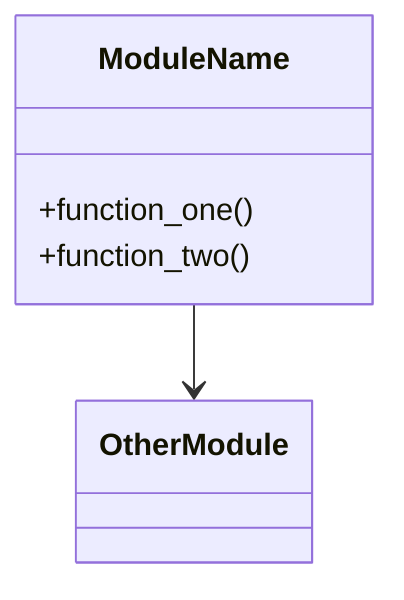

Created: 2026 June 02

# Audit Loop — Operational Guide

---

## Table of Contents

[1.0 Purpose](<#1.0 purpose>)
[2.0 Pre-Audit Steps](<#2.0 pre-audit steps>)
[2.1 Generate the UML Map](<#2.1 generate the uml map>)
[2.2 Generate audit-index.md](<#2.2 generate audit-index.md>)
[2.3 Configure config.yaml](<#2.3 configure config.yaml>)
[3.0 Author the T04 Brief](<#3.0 author the t04 brief>)
[4.0 Launch](<#4.0 launch>)
[5.0 Monitoring](<#5.0 monitoring>)
[6.0 Interpreting audit-report.md](<#6.0 interpreting audit-report.md>)
[7.0 Post-Run Workflow](<#7.0 post-run workflow>)
[8.0 Termination Reference](<#8.0 termination reference>)
[Version History](<#version history>)

---

## 1.0 Purpose

This guide is an operational reference for the Strategic Domain when running a codebase quality audit against a downstream project. The audit loop uses `audit-work.yaml` and `audit-review.yaml` recipes. No source file in the target codebase is written. Findings are accumulated in `ai/state/ralph/audit-report.md`.

[Return to Table of Contents](<#table of contents>)

---

## 2.0 Pre-Audit Steps

The Strategic Domain performs all preparation steps before launching the AEL. These steps are human-approved before proceeding.

### 2.1 Generate the UML Map

The Strategic Domain reads the target `src/` tree using the Filesystem MCP and mcp-grep, then produces a Mermaid class diagram covering modules, classes, and key functions. This is saved as `ai/state/ralph/audit-uml.md`.

The UML serves two purposes:
- Orients the worker each iteration without requiring it to re-traverse the codebase
- Provides the reviewer with a coverage ground truth independent of the index

Minimum content for `audit-uml.md`:

```markdown
# Codebase UML — <project name>

Generated: <date>

## Module Map



## File List

- `src/module_a.py` — <brief description>
- `src/module_b.py` — <brief description>
```
```

Present `audit-uml.md` to the human for review before proceeding.

### 2.2 Generate audit-index.md

From the UML, derive an ordered list of audit items — one entry per significant function or class. Save as `ai/state/ralph/audit-index.md`.

Format — one item per line, unchecked:

```markdown
## Audit Index

- [ ] src/orchestrator.py :: run_loop
- [ ] src/orchestrator.py :: run_phase
- [ ] src/orchestrator.py :: main_async
- [ ] src/orchestrator.py :: extract_tactical_brief
- [ ] src/mcp_client.py :: MCPClient.connect
- [ ] src/mcp_client.py :: MCPClient.call_tool
- [ ] src/parser.py :: parse_tool_calls
- [ ] src/budget.py :: resolve_context_window
```

Order items from most complex to least. Present the index to the human for review before proceeding.

### 2.3 Configure config.yaml

Set `max_iterations` to at least the number of items in `audit-index.md`. Add margin for REVISE cycles:

```yaml
loop:
  max_iterations: 300    # items × ~1.5 to allow for revise cycles
  phase_max_iterations: 20
```

[Return to Table of Contents](<#table of contents>)

---

## 3.0 Author the T04 Brief

The `tactical_brief` in the T04 prompt must specify:

- Absolute path to the target `src/` directory
- Read-only constraint (explicit)
- State directory path
- Audit scope (all criteria, or a subset)

Example `tactical_brief`:

```yaml
tactical_brief: |
  Read-only audit of /path/to/project/src/.
  State directory: /path/to/project/ai/state/ralph/
  DO NOT write to any file in src/.
  Audit criteria: style, complexity, error-handling, security, conformance, dead-code.
  One item per iteration as listed in audit-index.md.
  Append all findings to audit-report.md in the required format.
```

Verify `tactical_brief` is non-empty and in a `yaml` fenced block before issuing the AEL command (P09 §1.10.2).

[Return to Table of Contents](<#table of contents>)

---

## 4.0 Launch

From the project root, after human approval of the T04 prompt:

```bash
# With wall-clock time limit (recommended for long runs)
python ai/ael/src/orchestrator.py --mode loop \
  --task ai/workspace/prompt/<uuid>-audit.md \
  --duration 12

# Without time limit (runs until coverage complete or max_iterations)
python ai/ael/src/orchestrator.py --mode loop \
  --task ai/workspace/prompt/<uuid>-audit.md
```

The `--duration` value is in hours. The loop exits cleanly at the limit; partial results in `audit-report.md` are valid and usable.

[Return to Table of Contents](<#table of contents>)

---

## 5.0 Monitoring

The Strategic Domain may monitor progress at any time by reading state files directly:

| File | What it shows |
|---|---|
| `ai/state/ralph/audit-index.md` | Coverage: count `[x]` vs `[ ]` items |
| `ai/state/ralph/audit-report.md` | Findings accumulated so far |
| `ai/state/ralph/work-summary.txt` | Most recent worker iteration summary |
| `ai/state/ralph/iteration.txt` | Current outer loop iteration number |
| `ai/state/ralph/ael_<timestamp>.LOG` | Full debug log |

The AEL TUI displays iteration progress, context budget, and tool calls in the terminal during the run.

[Return to Table of Contents](<#table of contents>)

---

## 6.0 Interpreting audit-report.md

Each entry follows this structure:

```markdown
---
## src/module.py :: ClassName.method_name  [iteration N]
- **Type:** <criterion>
- **Location:** line <N> (or range <N>–<M>)
- **Description:** <precise, actionable observation>
- **Severity:** <low | medium | high>
```

Severity guidance:

| Severity | Meaning | Action |
|---|---|---|
| high | Security risk, data loss potential, or critical conformance violation | Create T03 issue immediately |
| medium | Degraded quality; correctness or maintainability concern | Schedule for next iteration |
| low | Style or documentation gap | Discretionary |

Items with no findings are recorded as:

```markdown
---
## src/module.py :: function_name  [iteration N]
- No findings.
```

A missing entry for an item means the worker did not reach it — check `audit-index.md` for remaining `[ ]` items.

[Return to Table of Contents](<#table of contents>)

---

## 7.0 Post-Run Workflow

**7.1 Review findings**

Read `audit-report.md` in full. Group findings by severity.

**7.2 Promote high-severity findings**

For each high-severity finding, create a T03 issue via P04. Reference the audit report path in the issue. The issue enters the standard P04 → P03 → T04 → AEL remediation workflow.

**7.3 Archive the audit report**

```bash
cp ai/state/ralph/audit-report.md ai/workspace/audit/audit-<uuid>-<name>.md
```

The UUID is the same UUID used for the T04 audit prompt. Name the file descriptively (e.g. `audit-a1b2c3d4-framework-src-2026-06.md`).

**7.4 Reset AEL state**

```bash
python ai/ael/src/orchestrator.py --mode reset
```

**7.5 Close the audit**

When remediation of all critical and high-severity findings is complete, close the audit document per P08 §1.9.8:

```bash
mv ai/workspace/audit/audit-<uuid>-<name>.md ai/workspace/audit/closed/
```

[Return to Table of Contents](<#table of contents>)

---

## 8.0 Termination Reference

| Condition | State file written | Meaning |
|---|---|---|
| All items `[x]`, reviewer issues SHIP | `.ralph-complete` = `COMPLETE: iteration N` | Normal completion |
| `--duration` limit reached | `.ralph-complete` = `DURATION_LIMIT: iteration N` | Time-bounded exit; results valid |
| `max_iterations` exhausted | None | Partial run; check coverage manually |
| Worker writes RALPH-BLOCKED.md | `RALPH-BLOCKED.md` | Review blocker; address manually |
| Context budget abort | None | Reduce `tactical_brief` size and restart |

[Return to Table of Contents](<#table of contents>)

---

## Version History

| Version | Date | Description |
|---|---|---|
| 1.0 | 2026-06-02 | Initial document |
| 1.1 | 2026-06-14 | Relocated paths under ai/: state → ai/state/ralph/, workspace/audit → ai/workspace/audit, workspace/prompt → ai/workspace/prompt |
| 1.2 | 2026-06-16 | Updated §7.5 cross-reference: P08 §1.9.7 → §1.9.8, following governance.md merge of duplicate Audit Closure sections |

---

Copyright (c) 2026 William Watson. MIT License.
