# LLM Orchestration Framework

---

## Table of Contents

[Protocols](<#1.0 protocols>)
  - [P00: Governance (start here)](<#1.1 p00 governance (start here)>)
  - [P01: Project Initialization (Execute once)](<#1.2 p01 project initialization (execute once)>)
  - [P02: Design](<#1.3 p02 design>)
  - [P03: Change](<#1.4 p03 change>)
  - [P04: Issue](<#1.5 p04 issue>)
  - [P05: Trace](<#1.6 p05 trace>)
  - [P06: Test](<#1.7 p06 test>)
  - [P07: Quality](<#1.8 p07 quality>)
  - [P08: Audit](<#1.9 p08 audit>)
  - [P09: Prompt](<#1.10 p09 prompt>)
  - [P10: Requirements](<#1.11 p10 requirements>)
  
[Templates](<#2.0 templates>)
  - [T01: Design](templates/T01-design.md)
  - [T02: Change](templates/T02-change.md)
  - [T03: Issue](templates/T03-issue.md)
  - [T04: Prompt](templates/T04-prompt.md)
  - [T05: Test](templates/T05-test.md)
  - [T06: Result](templates/T06-result.md)
  - [T07: Requirements](templates/T07-requirements.md)
  
[Workflow](<#2.0 workflow>)

[Version History](<#version history>)

---
###### Governance Prime Directive: Follow workflow [flowchart](<#3.0 framework execution flowchart>)
---
## 1.0 Protocols (Directives)

#### 1.1 P00 Governance (start here)

  - 1.1.1 Purpose
    - Python based software engineering, architecture and development
  - 1.1.2 Scope
    - Agnostic plan, control and initiation of software generation
  - 1.1.3 Framework Practice
    - This governance framework defines software development processes and workflows
    - Claude Desktop/Claude Code separation applies to software creation, not to generated application runtime
    - Generated software/applications (outputs) are independent of framework architecture
    - Framework controls: how we build software
    - Framework does not control: how the built software operates
    - Example: \<project name\> uses this framework for development but is a standalone Python application at runtime
  - 1.1.4 Architecture
    - Claude Desktop (domain 1): Plan and control: design, change, test and launching of code generation
    - Claude Code (domain 2): Execute: code generation
  - 1.1.5 Forbidden
    - Both domains: Unrequested creation, addition, removal or change of source code and documents is forbidden
  - 1.1.6 Constraints
    - Claude Desktop: Does not exceed language model context resource budget when communicating with Claude Code
  - 1.1.7 Control
    - Claude Desktop: Strategic coordination and validation authority
    - Claude Desktop: Analyzes requirements and formulates design specifications
    - Claude Desktop: Creates T04 prompts with complete technical context
    - Claude Desktop: Validates Claude Code implementation for protocol compliance
    - Claude Desktop: Coordinates quality assurance and integration verification
    - Claude Code: Tactical implementation with project awareness
    - Claude Code: Generates source code with MCP filesystem access
    - Claude Code: Performs direct file operations in src/ directory
    - Claude Code: Validates protocol compliance through direct file access
    - Claude Code: Coordinates multi-file implementations and dependencies

  - 1.1.8 Communication
    - Both Claude Desktop and Claude Code have MCP filesystem access to project
    - Communication uses filesystem-based message passing (semaphores)
    - Claude Desktop: Reads template from ai/templates/T04-prompt.md
    - Claude Desktop: Uses T04 template to create code generation or debug prompts for Claude Code
    - Claude Desktop: Embeds complete Tier 3 component design specifications and schema within prompt documents
    - Claude Desktop: Ensures prompt documents are self-contained requiring no external file references
    - Claude Desktop: Saves T04 prompt to workspace/prompt/prompt-\<uuid\>-\<name\>.md
    - Claude Desktop: Provides ready-to-execute command in conversation after human approval
    - Human: Executes provided command to invoke Claude Code with T04 prompt
    - Claude Code: Reads T04 prompt from workspace/prompt/
    - Claude Code: Analyzes project structure and existing code via MCP filesystem access
    - Claude Code: Generates code, saves directly to src/ per T04 specifications
    - Human: Notifies Claude Desktop when code generation complete
    - Claude Desktop: Reviews generated code, proceeds with audit
  - 1.1.9 Quality
    - Human review and approval of design, change and initiation of code generation is required
    - Claude Desktop: Provides ready-to-execute command after human approval
    - Human: Invokes Claude Code with provided command
    - Human: Notifies Claude Desktop when Claude Code completes
    - Claude Desktop: Reviews generated code before proceeding
  - 1.1.10 Documents
    - Master documents named: \<document class\>-0000-master_\<document name\>.md
    - Claude Desktop: Generates 8-character UUID (first 8 hex digits of UUID v4) for each new document
    - Claude Desktop: Naming format: \<document class\>-\<uuid\>-\<document name\>.md
    - Claude Desktop: Design documents follow tier naming convention: master_, domain_, component_ prefixes
    - Claude Desktop: Insures related documents are Obsidian cross linked
    - Document classes that require a master document are: design, audit, trace and test
    - All document classes (issue, change, prompt, test, result) contain internal iteration field starting at 1
    - Iteration increments when document enters new cycle after failed verification
    - Git commit required after iteration field modification
    - Filesystem contains only current iteration; GitHub history preserves prior iterations
    - Coupled documents maintain synchronized iteration numbers via explicit UUID references
  - 1.1.11 Configuration Management
    - GitHub repository is authoritative source for all project artifacts
    - Human: Tags design document commits when approved as baseline for code generation via GitHub Desktop (History → right-click commit → Create Tag → Push Tags)
    - Claude Desktop: Performs configuration audit verifying generated code matches approved design baseline commits
    - Claude Desktop: Uses config-audit template from workspace/audit/config-audit-template.md
    - Claude Desktop: Verifies code matches tagged design baseline specifications
    - Claude Desktop: Documents findings in config-audit-NNNN-YYYY-MM-DD.md
    - Claude Desktop: Stores configuration audits in workspace/audit/
    - Critical deviations: Creates issues via P04 for remediation
  - 1.1.12 Versioning
    - All versioning is handled via GitHub
    - Project uses Semantic Versioning per https://semver.org
    - Format: MAJOR.MINOR.PATCH (e.g., 1.0.0, 1.2.3)
    - MAJOR: Incompatible API changes or major functionality changes
    - MINOR: Backwards-compatible functionality additions
    - PATCH: Backwards-compatible bug fixes
    - Pre-release versions: MAJOR.MINOR.PATCH-alpha.N, -beta.N, -rc.N (e.g., 1.0.0-alpha.1)
    - Initial development: 0.y.z (MAJOR version zero for initial development)
    - Git tags format: vMAJOR.MINOR.PATCH (e.g., v1.0.0, v0.1.0)
    - Release notes filename: RELEASE_NOTES_vMAJOR.MINOR.PATCH.md
  - 1.1.13 Document Lifecycle Management
    - 1.1.13.1 Active State
      - Active documents reside in workspace/\<class\>/
      - Active documents are mutable during iteration cycles
      - Iteration field increments with each debug/refinement cycle
      - Git commit required after each iteration increment
    - 1.1.13.2 Closed State
      - Upon human acceptance, documents moved to workspace/\<class\>/closed/
      - Closed documents are immutable
      - Closed documents preserve final iteration number
      - Access: Read-only reference for future work
    - 1.1.13.3 Closure Criteria
      - Issue: Resolved and verified, corresponding change implemented and tested
      - Change: Implemented, tested, design updated, human accepted
      - Prompt: Code generated successfully, human confirmed
      - Test: Executed with passing results, result document created
      - Result: Tests passed, no issues created, acceptance confirmed
      - Audit: All critical findings resolved, high-priority findings addressed or mitigated, human approved
    - 1.1.13.4 Archival Procedure
      - Human initiates closure after acceptance
      - Claude Desktop verifies closure criteria met
      - Claude Desktop moves coupled document set to respective closed/ subfolders
      - Git commit records closure transition
      - Closed documents referenced but not modified
    - 1.1.13.5 Closed Subfolder Structure
      - workspace/issues/closed/
      - workspace/change/closed/
      - workspace/prompt/closed/
      - workspace/audit/closed/
      - workspace/test/closed/
      - workspace/test/result/closed/
    - 1.1.13.6 Access Constraints
      - Closed documents: Read-only access for reference
      - No modifications permitted to closed documents
      - New work requires new document with new sequence number
      - Reopening closed work: Create new issue referencing closed documents
  - 1.1.14 Logging Standards
    - Generated applications implement environment-based log level control
    - Debug mode enables verbose logging for development and testing
    - Normal mode restricts logging to informational events only
    - Flat file format recommended: timestamp level logger message
    - Centralized log location per application requirements
    - Log rotation policy prevents disk exhaustion
    - Test environments use debug mode for comprehensive logging
    - Production environments use normal mode for operational efficiency
    - Log artifacts preserved for failure analysis
  - 1.1.15 Knowledge Base
    - Claude Desktop: Consults workspace/knowledge/ before creating documents or code
    - Claude Code: Consults workspace/knowledge/ before implementing changes
    - Both domains: Add newly discovered patterns and solutions to knowledge base
    - Knowledge documents contain: problem statements, solutions, examples, rationale
    - Knowledge base prevents repeated problem-solving across development cycles
  - 1.1.16 Logging Standards
    - Generated applications implement environment-based log level control
    - Debug mode enables verbose logging for development and testing
    - Normal mode restricts logging to informational events only
    - Flat file format recommended: timestamp level logger message
    - Centralized log location per application requirements
    - Log rotation policy prevents disk exhaustion
    - Test environments use debug mode for comprehensive logging
    - Production environments use normal mode for operational efficiency
    - Log artifacts preserved for failure analysis
  - 1.1.17 Templates
    - Templates T01-T06 are external documents in ai/templates/ directory
    - Template files:
      - ai/templates/T01-design.md
      - ai/templates/T02-change.md
      - ai/templates/T03-issue.md
      - ai/templates/T04-prompt.md
      - ai/templates/T05-test.md
      - ai/templates/T06-result.md
    - Claude Desktop: Read template from ai/templates/ before creating documents
    - Claude Code: Read templates when referenced in prompt documents
    - Templates contain YAML structure and JSON Schema validation rules

[Return to Table of Contents](<#table of contents>)

#### 1.2 P01 Project Initialization (Execute once)
  - 1.2.1 Project folders
    - Create (see 1.2.6 Project folder structure)
  - 1.2.2 GitHub documents
    - Create .gitignore in project root:
```
.DS_Store
**/.DS_Store
.obsidian/
*.log
**/*.log
10000
**/logs
.zsh_history
coverage.xml
test.txt
**/tmp
deprecated/
workspace/admin/
workspace/ai/
workspace/proposal/
workspace/proposal/closed
venv/
.venv/
*.pyc
__pycache__/
.pytest_cache/
dist/
build/
*.egg-info/
```

  - 1.2.3 README
    - Create initial skeleton 'README.md' document in each folder
  - 1.2.4 Copy folder ai/ to <project name\>/ai
  - 1.2.5 Traceability Matrix
     - Create skeleton trace-0000-master_traceability-matrix.md in workspace/trace/
  - 1.2.6 Project folder structure
    - Note: This structure applies to projects using the framework, not to the LLM-Governance-and-Orchestration repository itself
    - The governance framework repository contains only ai/, doc/, and templates/ directories
    - Layout
```
    └── <project name>/
        ├── ai/                       # Operational rules
        │   └── governance.md
        ├── venv/                     # Python virtual environment (excluded from git)
        ├── dist/                     # Python build artefacts (excluded from git)
        ├── workspace/                # Execution space
        │   ├── admin/                # Administrative reports (excluded from git)
        │   ├── requirements/
        │   │   └── closed/
        │   ├── design/
        │   ├── change/
        │   │   └── closed/
        │   ├── knowledge/            # Institutional knowledge
        │   ├── issues/
        │   │   └── closed/
        │   ├── proposal/             # (excluded from git)
        │   │   └── closed/
        │   ├── prompt/
        │   │   └── closed/
        │   ├── trace/
        │   ├── audit/
        │   │   └── closed/
        │   ├── test/
        │   │   ├── closed/
        │   │   └── result/
        │   │       └── closed/
        │   └── ai/                   # Optional: (excluded from git)
        ├── docs/                     # Technical Documents
        ├── tests/                    # Test files (root level)
        ├── src/                      # Source code
        └── deprecated/               # Archive (excluded from git)
```

  - 1.2.7 Python Virtual Environment Setup (Human executes)
    - Human: virtual environment setup instructions for when project initialization completes
```
# Create virtual environment in project root
cd <project name>

python3 -m venv venv

# Activate virtual environment
source venv/bin/activate

# Install project dependencies
pip install -e .[dev]

# Verify installation
pip list
```
  - 1.2.8 Python documents
    - Create pyproject.toml in project root:
```
[project]
name = "\<project-name\>"
version = "0.1.0"
description = "<project description>"
authors = [{name = "<author name>"}]
license = {text = "MIT"}
requires-python = ">=3.9"
dependencies = [
]

[project.optional-dependencies]
dev = [
    "pytest>=7.0.0",
    "pytest-asyncio>=0.21.0",
    "pytest-cov>=4.0.0",
]

[build-system]
requires = ["setuptools>=61.0"]
build-backend = "setuptools.build_meta"

[tool.pytest.ini_options]
asyncio_mode = "auto"
testpaths = ["tests"]
python_files = ["test_*.py"]
python_classes = ["Test*"]
python_functions = ["test_*"]

[tool.coverage.run]
source = ["src"]
omit = ["*/tests/*"]

[tool.coverage.report]
exclude_lines = [
    "pragma: no cover",
    "def __repr__",
    "raise AssertionError",
    "raise NotImplementedError",
]
```

[Return to Table of Contents](<#table of contents>)

#### 1.3 P02 Design
  - 1.3.1 Tier 1: System Architecture
    - Claude Desktop: Reads template from ai/templates/T01-design.md
    - Claude Desktop: Creates design-0000-master_\<project\>.md from human requirements using T01 template
    - Claude Desktop: Defines system architecture, technology stack, cross-cutting concerns
    - Claude Desktop: Includes system-level Mermaid diagrams (architecture, component interaction, state machine, data flow)
    - Claude Desktop: Clearly designates document as master design within document content
  - 1.3.2 Tier 1 Review
    - Claude Desktop: Presents master design document for human approval
    - Claude Desktop: Documents review findings, required changes, approval decision
    - Claude Desktop: Proceeds with Tier 2 decomposition only after approval recorded
  - 1.3.3 Tier 2: Domain Decomposition
    - Claude Desktop: Reads template from ai/templates/T01-design.md
    - Claude Desktop: Decomposes master into functional domains using T01 template
    - Claude Desktop: Creates design-\<uuid\>-domain_\<name\>.md for each domain
    - Claude Desktop: Each domain defines: boundaries, interfaces, domain patterns, responsibilities
    - Claude Desktop: Includes domain-level Mermaid diagrams as needed
  - 1.3.4 Tier 2 Review
    - Claude Desktop: Presents domain design documents for human approval
    - Claude Desktop: Documents review findings, required changes, approval decision
    - Claude Desktop: Proceeds with Tier 3 decomposition only after approval recorded
  - 1.3.5 Tier 3: Component Decomposition
    - Claude Desktop: Reads template from ai/templates/T01-design.md
    - Claude Desktop: Decomposes each domain into components using T01 template
    - Claude Desktop: Creates design-\<uuid\>-component_\<domain\>_\<name\>.md for each component
    - Claude Desktop: Each component defines: implementation details, interfaces, processing logic, error handling
    - Claude Desktop: Includes component-level Mermaid diagrams as needed
  - 1.3.6 Tier 3 Review
    - Claude Desktop: Presents component design documents for human approval
    - Claude Desktop: Documents review findings, required changes, approval decision
    - Claude Desktop: Proceeds with T04 prompt creation only after approval recorded
  - 1.3.7 Design Hierarchy Naming Convention
    - Tier 1: design-0000-master_\<project\>.md (single master document)
    - Tier 2: design-\<uuid\>-domain_\<name\>.md (one per domain)
    - Tier 3: design-\<uuid\>-component_\<domain\>_\<name\>.md
  - 1.3.8 Cross-Linking Requirements
    - Claude Desktop: Master lists all Tier 2 domain document references
    - Claude Desktop: Each domain lists: master parent reference, all Tier 3 component children references
    - Claude Desktop: Each component lists: domain parent reference, generated code file paths
    - Claude Desktop: Uses Obsidian internal link syntax for all cross-references
  - 1.3.9 Context Window Constraints
    - Claude Desktop: Ensures design documents at each tier do not exceed Claude Code context window
    - Claude Desktop: T04 prompts embed only Tier 3 component designs relevant to code generation task
  - 1.3.10 Design Verification
    - Claude Desktop: Validates design completeness at each tier before proceeding to next tier
    - Claude Desktop: Verifies all functional requirements have corresponding design coverage
    - Claude Desktop: Confirms all non-functional requirements addressed across design hierarchy
  - 1.3.11 Requirements Traceability
    - Claude Desktop: Assigns unique identifier to each functional and non-functional requirement
    - Claude Desktop: Maps requirements through design tiers: requirement → master → domain → component
    - Claude Desktop: Maintains bidirectional links in traceability matrix
  - 1.3.12 Requirements Validation
    - Claude Desktop: Verifies design hierarchy satisfies all stated requirements before baseline
    - Claude Desktop: Documents validation results in master design document
    - Claude Desktop: Resolves discrepancies before proceeding to code generation
  - 1.3.13 Document Storage
    - Claude Desktop: Saves all design documents in workspace/design
  - 1.3.14 Visual Documentation Requirements
    - Claude Desktop: Embeds Mermaid diagrams directly within design documents at all tiers
    - Tier 1 Master: System architecture, overall component relationships, system-level state machines
    - Tier 2 Domain: Domain boundaries, domain internal structure, domain interfaces
    - Tier 3 Component: Component-specific flows, detailed state machines, data transformations
    - Claude Desktop: All diagrams use Mermaid syntax within markdown code blocks
    - Claude Desktop: Each diagram includes: purpose statement, legend, cross-references
    - Claude Desktop: Updates diagrams when design modifications require visual clarification
    - Claude Desktop: Maintains diagram consistency with textual design specifications

[Return to Table of Contents](<#table of contents>)

#### 1.4 P03 Change
  - 1.4.1 Change document creation
    - Claude Desktop: Reads template from ai/templates/T02-change.md
    - Claude Desktop: Creates change documents exclusively from issue documents using T02 template and saves them in folder workspace/change
    - Claude Desktop: For human-requested source code changes, first creates issue document via P04, then creates change document referencing that issue
    - Exception: Non-source-code changes (workspace/ documents per 1.4.10) may be implemented directly after human approval without issue/change documents
  - 1.4.2 Document coupling
    - Claude Desktop: Ensures one-to-one coupling between issue and change documents
    - Claude Desktop: Every source code change document must reference exactly one source issue document via UUID
    - Claude Desktop: Every resolved source code issue must reference exactly one change document via UUID
    - Claude Desktop: Prohibits multiple change documents addressing same issue or multiple issues addressed by same change
    - Claude Desktop: Change references source issue UUID in coupled_docs.issue_ref field
    - Claude Desktop: Change iteration number matches source issue iteration number at creation
    - Claude Desktop: When issue iteration increments, corresponding change iteration increments synchronously
    - Claude Desktop: Verifies iteration synchronization before workflow transitions
  - 1.4.3 Design document updates
    - Claude Desktop: Updates all relevant design documents after implementation
  - 1.4.4 Design document cross-linking
    - Claude Desktop: Insures all design document updates contain change references and links to their source change document
  - 1.4.5 Change Review
    - Claude Desktop: Performs impact analysis before change approval
    - Claude Desktop: Evaluates effects on dependent components, interfaces, data structures
    - Claude Desktop: Documents impact analysis results in change document
  - 1.4.6 Requirements Change Management
    - Claude Desktop: Links requirement changes to affected design elements
    - Claude Desktop: Performs impact analysis when requirements change
    - Claude Desktop: Updates requirement traceability matrix after changes
  - 1.4.7 Maintenance Classification
    - Claude Desktop: Categorizes changes: corrective, adaptive, perfective, preventive
    - Claude Desktop: Records classification in change document metadata
    - Claude Desktop: Tracks change type distribution for process metrics
  - 1.4.8 Change Impact Analysis
    - Claude Desktop: Evaluates change effects on system integrity, performance, security
    - Claude Desktop: Identifies all components requiring modification
    - Claude Desktop: Documents cascading effects in change document
  - 1.4.9 Maintenance Documentation
    - Claude Desktop: Updates all affected documentation when changes implemented
    - Claude Desktop: Maintains documentation currency with code state
    - Claude Desktop: Cross-links updated documents to source change document
  - 1.4.10 Documentation domain
    - Change documentation is only required for source code changes in src/. Change documentation to documents in the workspace/ is not required and can be made directly after human approval.

[Return to Table of Contents](<#table of contents>)

#### 1.5 P04 Issue
  - 1.5.1 Issue creation from test results
    - Claude Desktop: Reads template from ai/templates/T03-issue.md
    - Claude Desktop: Creates issue documents from errors reported in workspace/test/result using T03 template and saves them in folder workspace/issues
  - 1.5.2 Reserved for future use
    - Claude Desktop: Reserved for future use
  - 1.5.3 Debug workflow
    - Claude Code: Debugs issues submitted from Claude Code and returns change proposal to Claude Desktop
  - 1.5.4 Issue updates
    - Claude Desktop: Reads template from ai/templates/T03-issue.md
    - Claude Desktop: Updates issue documents from bugs using T03 template and saves them in folder workspace/issues
  - 1.5.5 Non-Conformance Reporting
    - Claude Desktop: Documents instances where generated code deviates from design specifications
    - Claude Desktop: Records deviation type, severity, affected components
    - Claude Desktop: Tracks non-conformance trends for process improvement
  - 1.5.6 Post-Implementation Review
    - Claude Desktop: Evaluates code generation effectiveness after issue resolution
    - Claude Desktop: Documents lessons learned
    - Claude Desktop: Provides protocol improvement recommendations for human review (protocols immutable, human-modified only)
  - 1.5.7 Issue-Change Coupling
    - Claude Desktop: Updates issue document with change_ref field (UUID) when change created
    - Claude Desktop: Sets issue status to "resolved" when corresponding change status becomes "implemented"
    - Claude Desktop: Verifies bidirectional linkage exists: issue.change_ref ↔ change.source.reference
    - Claude Desktop: Prevents issue closure without corresponding change document for source code issues
    - Claude Desktop: issue.iteration must equal change.iteration throughout cycle
    - Claude Desktop: When debugging requires new iteration, both documents increment together
    - Claude Desktop: Git commit captures synchronized iteration state
    - Claude Desktop: Validates iteration match before proceeding
    - Note: One-to-one coupling does not prevent modification of paired issue/change documents during debugging iterations

[Return to Table of Contents](<#table of contents>)

#### 1.6 P05 Trace
  - 1.6.1 Traceability Matrix Management
    - Claude Desktop: Maintains traceability matrix in workspace/trace/trace-0000_master-traceability-matrix.md
    - Claude Desktop: Updates matrix when requirements, designs, code, or tests modified
  - 1.6.2 Traceability Verification
    - Claude Desktop: Verifies bidirectional links exist: requirements ↔ design ↔ code ↔ test (navigable forward and backward)
    - Claude Desktop: Identifies and resolves traceability gaps
    - Claude Desktop: Generates traceability reports on demand
  - 1.6.3 Requirements Traceability
    - Claude Desktop: Maintains traceability matrix linking requirements through implementation
    - Claude Desktop: Updates matrix when designs, code, or tests modified
    - Claude Desktop: Ensures orphaned requirements or implementations identified
  - 1.6.4 Traceability Matrix Structure
    - Claude Desktop: Maintains single traceability matrix in workspace/trace/trace-0000-master_traceability-matrix.md
    - Required sections:
      - Functional Requirements: ID, Requirement, Design, Code, Test, Status
      - Non-Functional Requirements: ID, Requirement, Target, Design, Code, Test, Status
      - Component Mapping: Component → Requirements → Design → Source → Test
      - Design Document Cross-Reference: Design Doc → Requirements → Code → Tests
      - Test Coverage: Test File → Requirements Verified → Code Coverage
      - Bidirectional Navigation: Forward (Req→Design→Code→Test) and Backward (Test→Code→Design→Req)
    - Claude Desktop: Updates matrix when requirements, designs, code, or tests change

[Return to Table of Contents](<#table of contents>)

#### 1.7 P06 Test
  - 1.7.1 Purpose
  - 1.7.2 Test documentation
    - Claude Desktop: Reads template from ai/templates/T05-test.md
    - Claude Desktop: Creates test documents from source code generated by Claude Code using T05 template and saves them in folder workspace/test
  - 1.7.3 Test Script Creation
    - Claude Desktop: Automatic precursor to test execution
    - Claude Desktop: Generates executable test scripts from T05 test documentation in tests/
    - Claude Desktop: Creates unit tests for components in subdirectories (tests/\<component\>/)
    - Claude Desktop: Uses pytest or unittest framework per pyproject.toml configuration
    - Claude Desktop: Names test files with test_*.py convention
    - Claude Desktop: Links test scripts to test documentation via T05 references
    - Workflow: T05 test doc creation → pytest file generation → test execution
  - 1.7.4 Test Planning
    - Claude Desktop: Creates comprehensive test strategy before code generation
    - Claude Desktop: Defines test scope, approach, resources, schedule
    - Claude Desktop: Identifies test types: unit, integration, system, acceptance
  - 1.7.5 Test Case Specification
    - Claude Desktop: Structures test cases: preconditions, inputs, expected outputs, postconditions
    - Claude Desktop: Links test cases to requirements and design elements
    - Claude Desktop: Includes positive, negative, boundary, edge cases
  - 1.7.6 Test Results Documentation
    - Claude Desktop: Records test execution results in standardized format
    - Claude Desktop: Captures: pass/fail status, defects found, coverage achieved
    - Claude Desktop: Links failed tests to issue documents
  - 1.7.7 Test Organization
    - Claude Desktop: Maintains hierarchical test structure in tests/
    - Claude Desktop: Separates permanent unit tests from ephemeral validation scripts
    - Claude Desktop: Organizes unit tests by component in subdirectories
    - Claude Desktop: Places fix validation scripts at tests/ root level
  - 1.7.8 Test Isolation
    - Claude Desktop: Uses temporary environments (tempfile, shutil) for test execution
    - Claude Desktop: Ensures tests create/destroy controlled test environments
    - Claude Desktop: Prevents test pollution through environment isolation
    - Claude Desktop: Enables parallel test execution through isolation
  - 1.7.9 Dependency Mocking
    - Claude Desktop: Uses unittest.mock to isolate component dependencies
    - Claude Desktop: Mocks external services, file systems, network calls
    - Claude Desktop: Verifies interface contracts without external dependencies
    - Claude Desktop: Documents mocking strategy in test documentation
  - 1.7.10 Regression Testing
    - Claude Desktop: Creates targeted validation scripts for specific fixes
    - Claude Desktop: Implements progressive validation: minimal → integration → full suite
    - Claude Desktop: Documents validation scripts with fix references
    - Claude Desktop: Removes validation scripts after fix verification
  - 1.7.11 Test Lifecycle Management
    - Claude Desktop: Distinguishes permanent regression suite from temporary validation
    - Claude Desktop: Maintains permanent tests in tests/\<component\>/ subdirectories
    - Claude Desktop: Archives or removes ephemeral validation scripts post-verification
    - Claude Desktop: Updates test documentation to reflect lifecycle status
  - 1.7.12 Test-Prompt Coupling
    - Test references source prompt UUID in coupled_docs.prompt_ref field
    - Test iteration number matches source prompt iteration number
    - Iteration synchronization maintained through debug cycles
    - Claude Desktop verifies coupling before test execution
  - 1.7.13 Test Result Lifecycle
    - Results named: result-<uuid>-<n>.md in workspace/test/result/
    - Result references parent test UUID in coupled_docs.test_ref field
    - Result iteration matches parent test iteration
    - Failed results trigger issue creation (new UUID assigned)
    - Passed results enable document closure workflow
    - Result documents moved to workspace/test/result/closed/ upon acceptance
  - 1.7.14 Distribution Creation (Human executes)
    - Human: Distribution build when code generation complete and tests pass
```
cd <project name>

# Clean previous build artifacts:
rm -rf dist/ build/ *.egg-info/

# Build distribution
python -m build

# Verify build artifacts
ls -lh dist/

# Test installation in clean environment
pip install dist/*.whl
```
  - 1.7.15 Progressive Validation Strategy
    - Claude Desktop: Implements graduated validation during debug cycles
    - Targeted validation: Execute minimal test to verify specific fix
    - Integration validation: Execute tests for dependent components
    - Regression validation: Execute full test suite before closure
    - Ephemeral scripts: Create temporary validation at tests/ root
    - Permanent tests: Maintain regression suite in component subdirectories
    - Script lifecycle: Archive or remove validation scripts post-verification
    - Validation sequence mandatory before document closure
  - 1.7.16 Test Type Selection
    - Unit tests: All component implementations (mandatory)
    - Integration tests: Component boundary interactions (as needed)
    - System tests: Full application deployment (pre-release)
    - Acceptance tests: Requirement validation (milestone-based)
    - Regression tests: All unit/integration tests (permanent)
    - Performance tests: NFR validation (periodic benchmarking)
    - Claude Desktop: Selects appropriate test type based on requirements and architecture
    - Test documentation specifies type in test_info.type field
  - 1.7.17 Test Execution Platforms
    - Unit tests: Development platform with comprehensive mocking
    - Integration tests: Target deployment platform with actual subsystems
    - System tests: Target deployment platform exclusively
    - Acceptance tests: Target deployment platform with stakeholder validation
    - Regression tests: Development platform (primary), target platform (validation)
    - Performance tests: Target deployment platform for accurate measurements
    - Mocking requirements:
      - Development platform: Mock all external dependencies and system services
      - Target platform: Use actual system services where integration testing required
    - Validation workflow:
      - All code changes: Unit tests on development platform
      - Pre-release: Full test suite on target deployment platform
      - Performance benchmarks: Target deployment platform measurements only
    - Platform specification:
      - Define specific development and target platforms in project design documents
      - Document platform-specific tooling and dependencies in component designs
      - Include platform requirements in test documentation
    - Cross-platform considerations:
      - Claude Desktop: Documents platform-specific limitations in test documentation
      - Mocking strategy must isolate tests from platform differences
      - Integration/system tests require target hardware availability

[Return to Table of Contents](<#table of contents>)

#### 1.8 P07 Quality
  - 1.8.1 Purpose
  - 1.8.2 Code Validation
    - Claude Desktop: Verifies generated code implements all design requirements
    - Claude Desktop: Validates against design specifications, interface contracts, data schemas
    - Claude Desktop: Documents validation results, discrepancies found

[Return to Table of Contents](<#table of contents>)

#### 1.9 P08 Audit

  - 1.9.1 Purpose
    - Systematic verification of ongoing governance compliance
    - Detection of protocol drift, documentation gaps, and process deviations
    - Establishment of quality baseline for continuous improvement
  - 1.9.2 Audit Triggers
    - Milestone-based: Upon completion of major development phases
    - Human-requested: Ad-hoc audits when compliance concerns arise
    - Baseline: After initial code generation before production deployment
  - 1.9.3 Audit Scope
    - Protocol compliance: All protocols P00-P09
    - Document compliance: Naming, formatting, cross-linking, version histories
    - Code quality: Thread safety, error handling, documentation standards
    - Traceability: Requirement ↔ design ↔ code ↔ test linkages
    - Configuration management: Code vs. baseline verification
  - 1.9.4 Audit Procedure
    - Claude Desktop: Conducts systematic review of source code against governance requirements
    - Claude Desktop: Documents findings with severity classification (critical, high, medium, low)
    - Claude Desktop: Provides evidence for each finding (file paths, line numbers, specific violations)
    - Claude Desktop: Calculates compliance metrics (percentage, deficiency counts by severity)
  - 1.9.5 Audit Deliverables
    - Claude Desktop: Creates audit report following naming format: audit-<uuid>-<audit name>.md
    - Claude Desktop: Stores audit reports in workspace/audit/ folder
    - Audit report structure:
    - Executive summary with compliance status and critical issue count
    - Protocol-by-protocol compliance assessment
    - Document compliance review
    - Code quality assessment
    - Critical issues section with detailed findings
    - High/medium/low priority issues sections
    - Compliance summary with metrics
    - Recommendations for remediation
    - Positive findings (strengths identification)
  - 1.9.6 Remediation Process
    - Claude Desktop: Converts critical and high-priority audit findings to issue documents via P04
    - Claude Desktop: References source code audit report in issue documents
    - Claude Desktop: Issue resolution follows standard P04 → P03 → implementation workflow
    - Claude Desktop: Tracks remediation progress in audit report updates
  - 1.9.7 Audit Closure
    - Claude Desktop: Conducts follow-up audit after remediation completed
    - Claude Desktop: Verifies all critical issues resolved
    - Claude Desktop: Documents closure with final compliance metrics
    - Human: Approves audit closure and authorizes proceeding to next phase
  - 1.9.8 Audit Trail
    - Claude Desktop: Maintains chronological audit history
    - Claude Desktop: Links related audits (initial → follow-up → closure)
    - Claude Desktop: Preserves audit reports for process improvement analysis
  - 1.9.9 Audit Closure
    - 1.9.9.1 Closure Criteria
      - All critical findings fully resolved
      - All high-priority findings addressed or mitigated with documented acceptance
      - Completion documented in audit report
      - Human approval obtained
    - 1.9.9.2 Closure Process
      - Claude Desktop: Verifies all closure criteria satisfied
      - Claude Desktop: Documents closure status with final compliance metrics
      - Claude Desktop: Records closure date and approver
      - Human: Reviews closure documentation
      - Human: Approves audit closure or identifies remaining work
    - 1.9.9.3 Post-Closure Archival
      - Claude Desktop: Moves closed audit report to workspace/audit/closed/
      - Claude Desktop: Updates audit traceability links in master traceability matrix
      - Claude Desktop: Preserves read-only access for future reference
    - 1.9.9.4 Reopening Closed Audits
      - Prohibited: Closed audits are immutable
      - New findings: Create new audit with reference to closed audit
      - Follow-up verification: Covered by new audit cycle

[Return to Table of Contents](<#table of contents>)

#### 1.10 P09 Prompt
  - 1.10.1 Purpose
    - Manage creation and lifecycle of T04 prompt documents
    - Facilitate Claude Desktop → Claude Code code generation communication
  - 1.10.2 Prompt Creation
    - Prompt documents are always Claude Code specific.
    - Claude Desktop: Reads template from ai/templates/T04-prompt.md
    - Claude Desktop: Creates prompt documents from design and change documents using T04 template
    - Claude Desktop: Saves prompts with naming format prompt-<uuid>-<name>.md in workspace/prompt/
    - Claude Desktop: Rewrites prompt documents in place when revisions required
    - Claude Desktop: Embeds complete design specifications and schema within prompt documents
    - Claude Desktop: Ensures prompt documents are self-contained requiring no external file references
    - Claude Desktop: Prompt references source change UUID in coupled_docs.change_ref field
    - Claude Desktop: Prompt iteration number matches source change iteration number
    - Claude Desktop: Iteration synchronization maintained through debug cycles
    - Claude Desktop: Verifies coupling before prompt creation
    - GitHub version control maintains complete revision history
  - 1.10.3 Human Handoff
    - Claude Desktop: After human approval of T04 prompt, provides ready-to-execute command in conversation
    - Command format includes:
      - Governance document location for context
      - Design document locations for context
      - Prompt document path for implementation
    - Claude Desktop: Must specify complete absolute paths to all referenced documents
    - Human: Starts Claude Code in project root directory
    - Human: Pastes provided command into Claude Code
    - Human: Notifies Claude Desktop when Claude Code execution completes
    - Example command structure:

```text
  - For reference and context, governance is in '/path/to/project/ai/governance.md' and design documents are in '/path/to/project/workspace/design'
  -  Implement prompt '/path/to/project/workspace/prompt/prompt-NNNN-<name>.md'.
```

  - 1.10.4 Prompt Revision
    - Claude Desktop: Rewrites existing prompt documents when changes needed
    - Claude Desktop: Documents revision rationale in prompt version_history section
    - GitHub commits provide complete change tracking and rollback capability

[Return to Table of Contents](<#table of contents>)

#### 1.11 P10 Requirements
  - 1.11.1 Purpose
    - Systematic requirements capture and validation before design
    - Establishes baseline for design decomposition and traceability
  - 1.11.2 Requirements Capture
    - Claude Desktop: Reads template from ai/templates/T07-requirements.md
    - Claude Desktop: Assists human through requirements elicitation
    - Claude Desktop: Prompts for functional, non-functional, architectural requirements
    - Claude Desktop: Validates completeness, clarity, testability
    - Claude Desktop: Identifies conflicts and dependencies
    - Claude Desktop: Creates requirements-0000-master_<project>.md using T07 template
    - Claude Desktop: Saves in workspace/requirements/
  - 1.11.3 Requirements Validation
    - Claude Desktop: Verifies each requirement has objective acceptance criteria
    - Claude Desktop: Ensures requirements are testable and unambiguous
    - Claude Desktop: Documents validation results in validation section
    - Human: Reviews and approves requirements baseline
  - 1.11.4 Requirements Baseline
    - Human: Approves requirements document
    - Claude Desktop: Establishes baseline for design phase
    - Claude Desktop: Initializes traceability matrix with requirements
  - 1.11.5 Requirements Lifecycle
    - Active: workspace/requirements/requirements-0000-master_<project>.md
    - Closed: workspace/requirements/closed/ after human acceptance
    - Reopening: Move from closed/ to active, proceed with change workflow
    - No iteration numbering - git history tracks all changes
  - 1.11.6 Requirements Change Management
    - Changes trigger P03 Change workflow
    - Claude Desktop: Performs impact analysis across design/code/test
    - Claude Desktop: Updates traceability matrix
    - Human: Approves changes

[Return to Table of Contents](<#table of contents>)

## 2.0 Workflow

```mermaid
flowchart TD
    Init[P01: Project Initialization] --> Start([Human: Initiate Requirements])
    Start --> D1_Elicit[Claude Desktop: Requirements Elicitation P10]
    
    D1_Elicit --> H_Req{Human: Review Requirements}
    H_Req -->|Revise| D1_Elicit
    H_Req -->|Approve| D1_Baseline[Claude Desktop: Baseline Requirements]
    D1_Baseline --> D1_Design[Claude Desktop: Create master design T01]
    
    D1_Design --> H1{Human: Review<br/>master design}
    H1 -->|Revise| D1_Design
    H1 -->|Approve| D1_Decompose[Claude Desktop: Decompose to<br/>design elements T01]
    
    D1_Decompose --> H2{Human: Review<br/>design elements}
    H2 -->|Revise| D1_Decompose
    H2 -->|Approve| Trace1[Claude Desktop: Update<br/>traceability matrix P05]
    
    Trace1 --> D1_Baseline[Human: Tag baseline<br/>in GitHub]
    
    D1_Baseline --> D1_Prompt[Claude Desktop: Create T04 prompt<br/>with design + schema]
    
    D1_Prompt --> H3{Human: Approve<br/>code generation}
    H3 -->|Revise| D1_Prompt
    H3 -->|Approve| D1_Instruct[Claude Desktop: Create<br/>ready-to-execute command]
    
    D1_Instruct --> H_Invoke[Human: Invoke Claude Code]
    H_Invoke --> D2_Read[Claude Code: Read T04]
    D2_Read --> D2_Generate[Claude Code: Generate code]
    D2_Generate --> D2_Save[Claude Code: Save to src/]
    D2_Save --> H_Notify[Human: Notify Claude Desktop]
    H_Notify --> D1_Review[Claude Desktop: Review<br/>generated code]
    
    D1_Review --> Trace2[Claude Desktop: Update<br/>traceability matrix P05]
    Trace2 --> D1_Audit[Claude Desktop: Config audit<br/>code vs baseline]
    D1_Audit --> D1_Test_Doc[Claude Desktop: Create test doc T05]

    D1_Test_Doc --> D1_Generate_Tests[Claude Desktop: Generate pytest files from T05]
    D1_Generate_Tests --> H_Execute[Human: Execute tests]
    H_Execute --> D1_Review_Results[Claude Desktop: Review test results]
    D1_Review_Results --> Trace3[Claude Desktop: Update<br/>traceability matrix P05]
    Trace3 --> Test_Result{Tests pass?}
    
    Test_Result -->|Fail| D1_Issue[Claude Desktop: Create issue T03]
    D1_Issue --> Issue_Type{Issue type?}
    
    Issue_Type -->|Bug| D1_Change[Claude Desktop: Create change T02]
    D1_Change --> H4{Human: Review<br/>change}
    H4 -->|Revise| D1_Change
    H4 -->|Approve| D1_Debug_Prompt[Claude Desktop: Create debug<br/>prompt T04]
    
    D1_Debug_Prompt --> H5{Human: Approve<br/>debug}
    H5 -->|Revise| D1_Debug_Prompt
    H5 -->|Approve| D1_Debug_Instruct[Claude Desktop: Create<br/>ready-to-execute command]
    D1_Debug_Instruct --> H_Invoke
    
    Issue_Type -->|Design flaw| D1_Design_Change[Claude Desktop: Create change T02]
    D1_Design_Change --> H6{Human: Review<br/>change}
    H6 -->|Revise| D1_Design_Change
    H6 -->|Approve| D1_Update_Design[Claude Desktop: Update design]
    D1_Update_Design --> Trace4[Claude Desktop: Update<br/>traceability matrix P05]
    Trace4 --> D1_Prompt
    
    Test_Result -->|Pass| Progressive{Progressive<br/>validation<br/>complete?}
    
    Progressive -->|Targeted only| Integration_Val[Claude Desktop: Execute<br/>integration validation]
    Integration_Val --> Integration_Result{Integration<br/>tests pass?}
    Integration_Result -->|Fail| D1_Issue
    Integration_Result -->|Pass| Regression_Val
    
    Progressive -->|Integration done| Regression_Val[Claude Desktop: Execute<br/>full regression suite]
    Regression_Val --> Regression_Result{Regression<br/>tests pass?}
    Regression_Result -->|Fail| D1_Issue
    Regression_Result -->|Pass| H7
    
    Progressive -->|Full regression| H7{Human: Accept<br/>deliverable?}
    H7 -->|Reject| D1_Issue
    H7 -->|Accept| D1_Close[Claude Desktop: Close documents<br/>Move to closed/<br/>Git commit]
    D1_Close --> Complete([Complete])
```



[Return to Table of Contents](<#table of contents>)

---

## Version History

| Version | Date       | Description |
| ------- | ---------- | ----------- |
| 1.0     | 2025-10-30 | Initial enumeration |
| 1.1     | 2025-11-03 | Added T02 Change template and schema |
| 1.2     | 2025-11-03 | Added T03 Issue template and schema |
| 1.3     | 2025-11-03 | Added T04 Prompt template and schema |
| 1.4     | 2025-11-06 | Integrated IEEE/ISO standards-based directives |
| 1.5     | 2025-11-06 | Added T05 Test template and schema |
| 1.6     | 2025-11-06 | Replaced flowchart with revised version |
| 1.7     | 2025-11-06 | Enhanced T04 Prompt template |
| 1.8     | 2025-11-11 | Added P01 initialization to flowchart |
| 1.9     | 2025-11-11 | Added .gitignore specification |
| 2.0     | 2025-11-11 | Added pyproject.toml skeleton |
| 2.1     | 2025-11-12 | Specified GitHub Desktop tagging |
| 2.2     | 2025-11-12 | Added Claude Code Configuration |
| 2.3     | 2025-11-13 | Added tests/ subfolder |
| 2.4     | 2025-11-13 | Enhanced P06 Test |
| 2.5     | 2025-11-13 | Added audit/ subfolder |
| 2.6     | 2025-11-13 | Added P08 Audit protocol |
| 2.7     | 2025-11-13 | Added audit document class |
| 2.8     | 2025-11-13 | Added Framework Application clarification |
| 2.9     | 2025-11-14 | Added traceability matrix skeleton |
| 3.0     | 2025-11-14 | Replaced MCP with filesystem communication |
| 3.1     | 2025-11-14 | Added P09 Prompt protocol |
| 3.2     | 2025-11-16 | Removed prompt iteration numbering |
| 3.3     | 2025-11-19 | Enhanced P00 Control and Communication |
| 3.4     | 2025-11-20 | Restructured instruction document directives |
| 3.5     | 2025-11-20 | Enhanced Configuration Management |
| 3.6     | 2025-11-21 | Enforced one-to-one issue-change coupling |
| 3.7     | 2025-11-26 | Restructured P02 Design into three-tier hierarchy |
| 3.8     | 2025-11-28 | Implemented iteration-based document coupling |
| 3.9     | 2025-11-28 | Added Python virtual environment support |
| 4.0     | 2025-11-28 | Integrated traceability matrix updates |
| 4.1     | 2025-11-28 | Added P08 Audit Closure |
| 4.2     | 2025-11-30 | Enhanced P06 Test with progressive validation |
| 4.3     | 2025-12-03 | Added workspace/proposal/ directory |
| 4.4     | 2025-12-03 | Added Logging Standards |
| 4.5     | 2025-12-04 | Simplified human handoff mechanism |
| 4.6     | 2025-12-04 | Added Knowledge Base |
| 4.7     | 2025-12-10 | Enhanced Human Handoff |
| 4.8     | 2025-12-11 | Enhanced Test Script Creation |
| 4.9     | 2025-12-11 | Test directory relocation |
| 5.0     | 2025-12-11 | Added document closure node |
| 5.1     | 2025-12-12 | Removed platform-specific assumptions |
| 5.2     | 2025-12-12 | Enhanced T01 Design template |
| 5.3     | 2025-12-12 | Template externalization |
| 5.4     | 2025-12-13 | Clarified P01 folder structure |
| 5.5     | 2025-12-13 | Added P00 Templates section |
| 5.6     | 2025-12-13 | Added P10 Requirements protocol |

---
[Return to Table of Contents](<#table of contents>)

---

Copyright (c) 2025 William Watson. This work is licensed under the MIT License.
