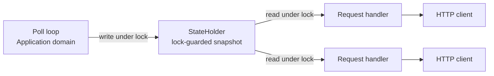
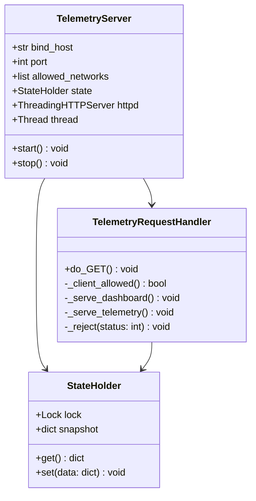
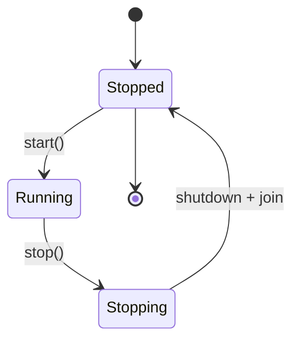

# Component Design: TelemetryServer

Created: 2026 June 26

**Document Type:** Tier 3 Component Design  
**Document ID:** design-9b7e2c4a-component_presentation_server  
**Parent:** [design-af5c3d4e-domain_presentation.md](<design-af5c3d4e-domain_presentation.md>)  
**Status:** Active  

---

## Table of Contents

- [Component Information](<#component information>)
- [Purpose](<#purpose>)
- [Implementation](<#implementation>)
- [Concurrency Model](<#concurrency model>)
- [Class Design](<#class design>)
- [Routes](<#routes>)
- [Security](<#security>)
- [Lifecycle and Shutdown](<#lifecycle and shutdown>)
- [Interfaces](<#interfaces>)
- [Output Format](<#output format>)
- [Error Handling](<#error handling>)
- [Configuration](<#configuration>)
- [Design Element Cross-References](<#design element cross-references>)
- [Version History](<#version history>)

---

## Component Information

```yaml
component_info:
  name: "TelemetryServer"
  domain: "Presentation"
  version: "1.2"
  date: "2026-07-07"
  status: "Active"
  source_file: "src/solax_modbus/presentation/server.py"
  static_asset: "src/solax_modbus/presentation/templates/dashboard.html"
```

[Return to Table of Contents](<#table of contents>)

---

## Purpose

Serve live single-inverter telemetry over HTTP to local-network clients. The server reads the most recent polled telemetry from shared state populated by the polling loop; it does not communicate with the inverter directly. Activation is on by default; disable with `--no-serve`.

### Responsibilities

| Responsibility | Description |
|----------------|-------------|
| JSON endpoint | Serve current telemetry snapshot as JSON |
| History endpoint | Serve downsampled rollup series as JSON from the SQLite store (change-a2d5f7c9) |
| Dashboard | Serve a static HTML client that fetches the JSON and history endpoints |
| Access control | Reject requests from source IPs outside the configured allowlist |
| State access | Read most recent telemetry snapshot from shared state (read-only) |
| History access | Read rollup series from the TimeSeriesStore (read-only) |
| Lifecycle | Provide explicit start and stop for coordination by the Application domain |

### Design Principles

| Principle | Implementation |
|-----------|----------------|
| Standard library only | `http.server`, `json`, `ipaddress`, `threading`; no external dependencies |
| Read-only | Serves last-known state; never polls the inverter |
| Isolation | Server failure must not stop the polling loop |
| Defense-in-depth | Source-IP allowlist supplements network isolation; it is not authentication |

[Return to Table of Contents](<#table of contents>)

---

## Implementation

### File Location

```
src/solax_modbus/presentation/server.py
src/solax_modbus/presentation/templates/dashboard.html
```

`dashboard.html` is non-Python package data. It must be declared under
`[tool.setuptools.package-data]` in `pyproject.toml`, or it is silently
omitted from the built wheel and `_serve_dashboard()` fails at runtime
with "Dashboard template not found" on any wheel-installed deployment
(source-checkout runs are unaffected). Declared 2026-07-02.

### Dependencies

```yaml
dependencies:
  external: []
  internal:
    - "Application shared state (StateHolder)"
    - "TimeSeriesStore (read-only, for /api/history) - change-a2d5f7c9"
  standard_library:
    - "http.server (ThreadingHTTPServer, BaseHTTPRequestHandler)"
    - "json"
    - "ipaddress"
    - "threading"
    - "pathlib"
```

[Return to Table of Contents](<#table of contents>)

---

## Concurrency Model

A background-poll-and-serve model. The polling loop is the sole producer of telemetry; HTTP request handlers are read-only consumers.



**Purpose:** Decouple inverter access from HTTP traffic. The poll loop owns the inverter at a fixed cadence; the server only reads the last-known snapshot. This prevents HTTP request volume from driving inverter polling below the protocol minimum interval (FR-001).

**Properties:**
- One producer (poll thread), N consumers (handler threads).
- Single lock guards the shared snapshot.
- `ThreadingHTTPServer` serves each request on its own thread.
- Handlers never block on inverter I/O.

[Return to Table of Contents](<#table of contents>)

---

## Class Design

### Class Diagram



`StateHolder` is owned by the Application domain and passed to `TelemetryServer`. The handler reads the snapshot via the shared `StateHolder`; it does not hold inverter references.

### Constructor

```python
def __init__(
    self,
    state: StateHolder,
    bind_host: str = "0.0.0.0",
    port: int = DEFAULT_HTTP_PORT,
    allowed_networks: list = None
):
    """
    Initialize the telemetry server.

    Args:
        state: Shared, lock-guarded telemetry snapshot holder.
        bind_host: Interface to bind (default all interfaces).
        port: TCP port (non-privileged default).
        allowed_networks: Permitted source ranges
            (None = DEFAULT_ALLOWED_NETWORKS).
    """
```

[Return to Table of Contents](<#table of contents>)

---

## Routes

| Route | Method | Response | Content-Type |
|-------|--------|----------|--------------|
| `/` | GET | Static dashboard HTML | text/html |
| `/api/telemetry` | GET | Current telemetry snapshot | application/json |
| `/api/history` | GET | Downsampled rollup series (all four primary metrics) | application/json |
| any other path | GET | 404 Not Found | text/plain |
| any path, disallowed source IP | GET | 403 Forbidden | text/plain |

The dashboard is served once and polls `/api/telemetry` on a client-side interval using `fetch()`, updating the DOM without a full-page reload. It fetches `/api/history` less frequently and renders inline SVG sparklines client-side.

### /api/history (change-a2d5f7c9)

Returns rollup series for the four primary metrics (`pv_power`, `battery_soc`,
`battery_power`, `house_load`) over the rollup window (30 days). Each point
carries `bucket_ts`, `avg`, `min`, and `max`. The handler reads via the
TimeSeriesStore `query_history()` method; it does not query SQLite directly.
When the store is unavailable or empty, the endpoint returns an empty object
per metric with HTTP 200. The route is subject to the same source-IP allowlist
as the other routes.

[Return to Table of Contents](<#table of contents>)

---

## Security

The server binds all interfaces to support headless deployment. The source-IP allowlist is a secondary control. The primary control is network isolation, governed by NFR-006: the HTTP port is confined to the trusted monitoring network exactly as the Modbus port is.

### Source-IP Allowlist

```yaml
default_allowed_networks:
  - "10.0.0.0/8"        # RFC 1918
  - "172.16.0.0/12"     # RFC 1918
  - "192.168.0.0/16"    # RFC 1918
  - "169.254.0.0/16"    # link-local (USB-gadget direct path)
```

Each request's source address (`client_address[0]`) is parsed with `ipaddress` and tested for membership in the configured networks. Non-members receive 403.

### Limits

| Property | Statement |
|----------|-----------|
| Not authentication | The allowlist trusts the entire permitted range; it does not identify users |
| Trusts in-range hosts | A compromised host within the range passes the filter |
| IPv4 only | IPv6 is out of scope; the server binds IPv4 |
| Assumption | Acceptable only under NFR-006 network isolation. On an untrusted flat network, bind a specific interface or add authentication (deferred hardening path) |

[Return to Table of Contents](<#table of contents>)

---

## Lifecycle and Shutdown

The server runs in a dedicated thread. The Application domain owns invocation and shutdown sequencing; `TelemetryServer` exposes only `start()` and `stop()`.



### Sequence

1. `start()` — instantiate `ThreadingHTTPServer((bind_host, port), handler)`; spawn a thread running `serve_forever()`.
2. `stop()` — call `httpd.shutdown()` (from a thread other than the serving thread), then `httpd.server_close()`, then join the server thread with a timeout.
3. Application coordinator — on shutdown signal (e.g. KeyboardInterrupt): stop the poll loop, call `TelemetryServer.stop()`, join both threads in order.

### Rationale

Two threads plus a blocking server are the most error-prone element of this design. Explicit ordered shutdown prevents hung processes and orphaned sockets on restart. `serve_forever()` must be stopped via `shutdown()` from a separate thread; calling it from the serving thread deadlocks.

[Return to Table of Contents](<#table of contents>)

---

## Interfaces

### Public Methods

#### start()

```python
def start(self) -> None:
    """
    Bind the server and begin serving on a background thread.

    Raises:
        OSError: Port unavailable. Logged; the polling loop continues.
    """
```

#### stop()

```python
def stop(self) -> None:
    """
    Stop serving and release the socket.

    Calls httpd.shutdown() then httpd.server_close(), then joins
    the server thread. Idempotent; safe if not started.
    """
```

### StateHolder

```python
def get(self) -> Dict[str, Any]:
    """Return the most recent telemetry snapshot (copy) under lock."""

def set(self, data: Dict[str, Any]) -> None:
    """Replace the telemetry snapshot under lock. Called by the poll loop."""
```

### History Access (change-a2d5f7c9)

The handler reads history via the injected TimeSeriesStore:

```python
def query_history(self, metric: str, window_seconds: int) -> list:
    """Return rollup series {bucket_ts, avg, min, max} for one metric."""
```

The store is passed to the server by the Application domain (as StateHolder is)
and attached to the handler context alongside `state`.

[Return to Table of Contents](<#table of contents>)

---

## Output Format

### JSON (`/api/telemetry`)

The payload is the telemetry dictionary produced by `poll_inverter()`, serialized as JSON. Example (abbreviated):

```json
{
  "timestamp": "2026-06-26T14:30:45",
  "run_mode": "Normal",
  "grid_voltage_r": 230.1,
  "pv1_power": 3274,
  "battery_soc": 75,
  "battery_power": -538,
  "feed_in_power": 244,
  "energy_today": 12.5,
  "energy_total": 1234.5
}
```

When no snapshot is available yet, the endpoint returns an empty object with a status field.

### Dashboard (`/`)

```
+------------------------------------------+
|        Solax Inverter Telemetry          |
|        2026-06-26 14:30:45               |
+------------------------------------------+
|  System: Normal                          |
|  Grid:    230.1 V   244 W (export)       |
|  Solar:   3274 W                         |
|  Battery: 75%   -538 W (discharging)     |
|  Today:   12.5 kWh   Total: 1234.5 kWh   |
+------------------------------------------+
```

[Return to Table of Contents](<#table of contents>)

---

## Error Handling

| Condition | Handling |
|-----------|----------|
| Port unavailable on bind | Log `OSError`; server does not start; polling continues |
| Disallowed source IP | Respond 403; log source address |
| Unknown route | Respond 404 |
| Handler exception | Respond 500; log with context; server continues |
| JSON serialization failure | Respond 500; log offending snapshot keys |
| Empty/absent snapshot | Respond 200 with empty object and status field |

[Return to Table of Contents](<#table of contents>)

---

## Configuration

Parameters are supplied by the Application domain via command-line flags.

| Flag | Maps to | Default |
|------|---------|---------|
| `--no-serve` | Disable the server | enabled by default |
| `--http-port` | `port` | 8181 (`DEFAULT_HTTP_PORT`) |
| `--allow` | `allowed_networks` (override) | DEFAULT_ALLOWED_NETWORKS |
| `--db-path` | SQLite store path (for /api/history) | (Application domain default) |

[Return to Table of Contents](<#table of contents>)

---

## Design Element Cross-References

### Parent Documents

- Domain: [design-af5c3d4e-domain_presentation.md](<design-af5c3d4e-domain_presentation.md>)
- Master: [design-solax-modbus-master.md](<design-solax-modbus-master.md>)

### Sibling Components (Presentation Domain)

| Component | Document | Status |
|-----------|----------|--------|
| InverterDisplay | [design-d3c4d5e6-component_presentation_console.md](<design-d3c4d5e6-component_presentation_console.md>) | Active |
| HTMLRenderer | [design-d9e0f1a2-component_presentation_html.md](<design-d9e0f1a2-component_presentation_html.md>) | Superseded |

### Related Documents

- Application domain (state ownership, thread lifecycle): [design-bf6d4e5f-domain_application.md](<design-bf6d4e5f-domain_application.md>)
- Requirement: FR-018 (HTTP Telemetry Server), FR-019 (Historical Telemetry Endpoint), NFR-006 (network security) in [requirements-solax-modbus-master.md](<../requirements/requirements-solax-modbus-master.md>)
- History source: [design-b7c8d9e0-component_data_storage.md](<design-b7c8d9e0-component_data_storage.md>) (TimeSeriesStore, SQLite)

### Source Code

| Item | Location |
|------|----------|
| Module | src/solax_modbus/presentation/server.py |
| Static asset | src/solax_modbus/presentation/templates/dashboard.html |

[Return to Table of Contents](<#table of contents>)

---

## Version History

| Version | Date | Changes |
|---------|------|---------|
| 1.0 | 2026-06-26 | Initial component design for the embedded HTTP telemetry server (TelemetryServer). |
| 1.1 | 2026-07-02 | Noted packaging requirement for dashboard.html (package-data declaration); root cause of a wheel-install runtime defect. No design/interface change. |
| 1.2 | 2026-07-07 | Serve-by-default: `--serve` replaced by `--no-serve` (Purpose and Configuration); default port 8080 -> 8181 via new `DEFAULT_HTTP_PORT` constant (Constructor, Configuration). See change-a7c3e9d2. |
| 1.3 | 2026-07-07 | Status Planned -> Active; removed stale (planned) annotations from File Location and Source Code (implementation confirmed in source). |
| 1.4 | 2026-07-16 | Added /api/history route serving downsampled rollup series for the four primary metrics from the TimeSeriesStore (SQLite), for client-side sparklines (change-a2d5f7c9, FR-019). Added TimeSeriesStore read dependency, history-access interface, and --db-path configuration. |

---

Copyright (c) 2025 William Watson. This work is licensed under the MIT License.
