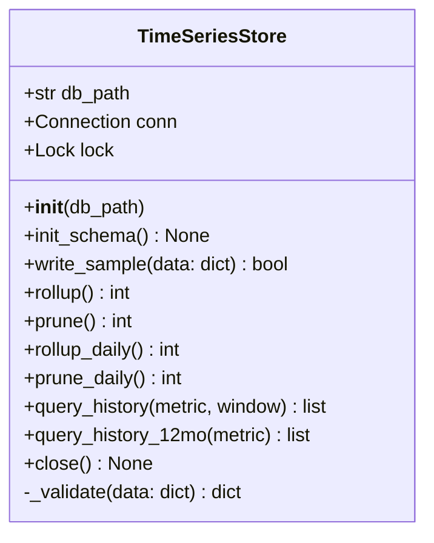

# Component Design: TimeSeriesStore

Created: 2025 December 30

**Document Type:** Tier 3 Component Design  
**Document ID:** design-b7c8d9e0-component_data_storage  
**Parent:** [design-9e4b2c3d-domain_data.md](<design-9e4b2c3d-domain_data.md>)  
**Status:** Planned  

---

## Table of Contents

- [1.0 Component Information](<#1.0 component information>)
- [2.0 Purpose](<#2.0 purpose>)
- [3.0 Implementation](<#3.0 implementation>)
- [4.0 Class Design](<#4.0 class design>)
- [5.0 Database Schema](<#5.0 database schema>)
- [6.0 Retention and Rollup](<#6.0 retention and rollup>)
- [7.0 Write-Path Validation](<#7.0 write-path validation>)
- [8.0 Interfaces](<#8.0 interfaces>)
- [9.0 Error Handling](<#9.0 error handling>)
- [10.0 Design Element Cross-References](<#10.0 design element cross-references>)
- [Version History](<#version history>)

---

## 1.0 Component Information

```yaml
component_info:
  name: "TimeSeriesStore"
  domain: "Data"
  version: "2.2"
  date: "2026-07-17"
  status: "Planned"
  source_file: "src/solax_modbus/data/storage.py"
```

[Return to Table of Contents](<#table of contents>)

---

## 2.0 Purpose

Local SQLite store for telemetry history. Records raw samples and two
downsampled rollup tiers (15-minute operational, daily long-range), prunes all
three by age, and serves history for trend visualisation. Uses the Python
standard library `sqlite3`; no external database or network dependency.

### 2.1 Responsibilities

| Responsibility | Description |
|----------------|-------------|
| Persistence | Write telemetry samples to a raw table |
| Downsampling | Aggregate raw samples into 15-minute rollup buckets (avg, min, max) |
| Long-range downsampling | Aggregate into daily rollup buckets (avg, min, max), retained a rolling trailing 12 months |
| Retention | Prune raw, rollup, and daily-rollup rows past their age windows |
| Query | Return rollup or daily-rollup series for the primary metrics |
| Write-path validation | Reject out-of-range values before insert |

### 2.2 Design Principles

| Principle | Implementation |
|-----------|----------------|
| Standard library only | `sqlite3`; no external dependency |
| Local file | Single database file on the deployment host |
| Non-blocking | Writes must not stall the polling loop |
| Bounded size | Age-based pruning keeps the file small |

[Return to Table of Contents](<#table of contents>)

---

## 3.0 Implementation

### 3.1 File Location

```
src/solax_modbus/data/storage.py (planned)
```

### 3.2 Dependencies

```yaml
dependencies:
  external: []
  internal:
    - "Telemetry dict from poll_inverter() (Protocol domain)"
  standard_library:
    - "sqlite3"
    - "time"
    - "logging"
    - "threading"
    - "typing"
```

[Return to Table of Contents](<#table of contents>)

---

## 4.0 Class Design

### 4.1 Class Diagram



### 4.2 Constructor

```python
def __init__(self, db_path: str = "solax_history.db"):
    """
    Open (or create) the SQLite store at db_path.

    Args:
        db_path: Path to the SQLite database file.

    Notes:
        Opens with check_same_thread=False and guards access with a lock,
        since the poll loop writes and HTTP handlers read. WAL journal mode
        is enabled for concurrent read during write.
    """
```

[Return to Table of Contents](<#table of contents>)

---

## 5.0 Database Schema

Three tables. `raw` holds recent full-resolution samples; `rollup` holds
15-minute downsampled aggregates for the 30-day operational view; `daily_rollup`
holds 1-day downsampled aggregates for the rolling trailing 12-month view.
Timestamps are integer epoch seconds. The store records **primitive**
measurements only; `house_load` is not stored, it is derived at display time
(see 5.1). This keeps history correctable if the derivation changes.

```sql
CREATE TABLE IF NOT EXISTS raw (
    ts               INTEGER NOT NULL,   -- epoch seconds
    pv_power         INTEGER,            -- total solar production (W, >= 0)
    battery_power    INTEGER,            -- signed: + charging, - discharging (W)
    battery_soc      INTEGER,            -- state of charge (%)
    grid_power_total INTEGER             -- signed sum of grid-port phase power (W)
);
CREATE INDEX IF NOT EXISTS idx_raw_ts ON raw(ts);

CREATE TABLE IF NOT EXISTS rollup (
    bucket_ts  INTEGER NOT NULL,      -- epoch seconds, 15-min bucket start
    metric     TEXT    NOT NULL,      -- 'pv_power' | 'battery_power' | 'battery_soc' | 'grid_power_total'
    avg        REAL,
    min        REAL,
    max        REAL,
    PRIMARY KEY (bucket_ts, metric)
);
CREATE INDEX IF NOT EXISTS idx_rollup_ts ON rollup(bucket_ts);

CREATE TABLE IF NOT EXISTS daily_rollup (
    bucket_ts  INTEGER NOT NULL,      -- epoch seconds, 1-day bucket start (UTC)
    metric     TEXT    NOT NULL,      -- 'pv_power' | 'battery_power' | 'battery_soc' | 'grid_power_total'
    avg        REAL,
    min        REAL,
    max        REAL,
    PRIMARY KEY (bucket_ts, metric)
);
CREATE INDEX IF NOT EXISTS idx_daily_rollup_ts ON daily_rollup(bucket_ts);
```

`daily_rollup` is schema-identical to `rollup`, distinguished only by bucket
width and retention. Aggregated from `rollup`, not from `raw` (see 6.1.1),
since `rollup` is always a superset of the most recent portion of the
12-month window at lower cost than re-scanning raw samples.

### 5.1 Metric Mapping and Derived House Load

| Stored metric | Source field(s) in telemetry dict |
|---------------|------------------------------------|
| `pv_power` | `pv1_power` + `pv2_power` |
| `battery_power` | `battery_power` (signed: + charging, - discharging) |
| `battery_soc` | `battery_soc` |
| `grid_power_total` | `grid_power_r` + `grid_power_s` + `grid_power_t` |

**House load is derived, not stored.** By conservation of energy:

```
house_load = pv_power - battery_power + grid_power_total
```

(`battery_power` positive when charging removes power from the house; grid
contribution added when present.) The dashboard computes this from the primitive
series. Storing primitives avoids baking an unverified derivation into pruned
history and lets the formula be corrected retroactively.

**Aggregation note.** The derivation is linear, so a derived `house_load`
*average* equals the same combination of the primitive averages (exact). The
derived *min/max* band does not compose exactly (min of a sum is not the sum of
mins); combining primitive min/max yields a conservative outer envelope, which
is acceptable for the dashboard's variability band.

> Derivation status: provisional. On a true off-grid island the grid port may
> read near zero and house consumption is served via an EPS/backup output not in
> the current register map. Validate the formula against emulator and live data
> before relying on the history (issue-a2d5f7c9 analysis).

[Return to Table of Contents](<#table of contents>)

---

## 6.0 Retention and Rollup

| Table | Resolution | Window | Aggregation |
|-------|------------|--------|-------------|
| raw | 1 minute | 24 hours | none (samples) |
| rollup | 15 minutes | 30 days | avg, min, max per metric |
| daily_rollup | 1 day | rolling trailing 365 days | avg, min, max per metric |

`daily_rollup`'s window is a rolling trailing window, not fixed calendar-year
buckets: at any moment it holds the last 365 days ending now, sliding forward
continuously. See FR-012 and FR-020.

### 6.1 Rollup Procedure

`rollup()` aggregates raw samples into 15-minute buckets per metric and upserts
into `rollup`. Bucket start is `ts - (ts % 900)`. Aggregation is deterministic
SQL:

```sql
INSERT INTO rollup (bucket_ts, metric, avg, min, max)
SELECT (ts - (ts % 900)) AS bucket_ts,
       'pv_power', AVG(pv_power), MIN(pv_power), MAX(pv_power)
FROM raw
WHERE ts >= :since
GROUP BY bucket_ts
ON CONFLICT(bucket_ts, metric) DO UPDATE SET
    avg = excluded.avg, min = excluded.min, max = excluded.max;
```

Repeated for each stored metric (`pv_power`, `battery_power`, `battery_soc`,
`grid_power_total`). Invoked on an interval by the Application domain (for
example every 15 minutes), or opportunistically after writes.

#### 6.1.1 Daily Rollup Procedure

`rollup_daily()` aggregates `rollup` rows (not `raw`) into 1-day buckets per
metric and upserts into `daily_rollup`. Bucket start is `bucket_ts -
(bucket_ts % 86400)`. Aggregation is deterministic SQL, structurally identical
to 6.1 but sourced from `rollup`:

```sql
INSERT INTO daily_rollup (bucket_ts, metric, avg, min, max)
SELECT (bucket_ts - (bucket_ts % 86400)) AS day_bucket_ts,
       metric, AVG(avg), MIN(min), MAX(max)
FROM rollup
WHERE bucket_ts >= :since AND metric = :metric
GROUP BY day_bucket_ts
ON CONFLICT(bucket_ts, metric) DO UPDATE SET
    avg = excluded.avg, min = excluded.min, max = excluded.max;
```

Averaging 15-minute averages to produce a daily average is exact only for
equally-weighted buckets, which holds here since every day contributes the
same number of 15-minute buckets under normal operation; a partially-covered
day (deployment start, downtime) averages over whatever buckets exist, a
known and accepted approximation consistent with the rollup tier's own
behaviour. Invoked by the Application domain on a coarser interval than 6.1
(for example daily), via an elapsed-time check in the poll loop (see
prompt-level detail).

**Correctness dependency:** `daily_rollup` accumulates incrementally, one
day's worth of `rollup` data at a time, and retains 365 days independently of
`rollup`'s own 30-day window. This is only correct if `rollup_daily()` runs at
least once per day, before that day's source rows age out of `rollup` via
`prune()` (30-day window). Both run inline in the same poll loop on their
respective elapsed-time checks, so this holds under normal operation; extended
downtime exceeding ~30 days would create a gap in `daily_rollup` for the
unrolled days.

### 6.2 Pruning

`prune()` deletes rows past the windows:

```sql
DELETE FROM raw    WHERE ts        < :now - 86400;      -- 24 hours
DELETE FROM rollup WHERE bucket_ts < :now - 2592000;    -- 30 days
```

`prune_daily()` deletes `daily_rollup` rows past the rolling trailing window:

```sql
DELETE FROM daily_rollup WHERE bucket_ts < :now - 31536000;   -- 365 days
```

### 6.3 Storage Estimate

| Table | Row rate | Rows retained | Approx size |
|-------|----------|---------------|-------------|
| raw | 1/min | ~1,440 | small (tens of KB) |
| rollup | 4/hr x 4 metrics | ~11,520 | small (hundreds of KB) |
| daily_rollup | 1/day x 4 metrics | ~1,460 | small (tens of KB) |

The steady-state file is bounded well under 1 GB (NFR-008).

[Return to Table of Contents](<#table of contents>)

---

## 7.0 Write-Path Validation

Minimal range validation is folded into `write_sample()` via `_validate()`.
It replaces the retired standalone DataValidator (quality scoring and
stuck-sensor detection are not carried forward).

| Field | Min | Max | Action on breach |
|-------|-----|-----|------------------|
| pv_power | 0 | 15000 | log warning, drop field (store NULL) |
| battery_power | -15000 | 15000 | log warning, drop field |
| battery_soc | 0 | 100 | log warning, drop field |
| grid_power_total | -15000 | 15000 | log warning, drop field |

Out-of-range fields are set NULL rather than discarding the whole sample.

[Return to Table of Contents](<#table of contents>)

---

## 8.0 Interfaces

### 8.1 Public Methods

#### init_schema()

```python
def init_schema(self) -> None:
    """Create tables and indexes if absent. Idempotent."""
```

#### write_sample()

```python
def write_sample(self, data: Dict[str, Any]) -> bool:
    """
    Validate and insert one telemetry sample into the raw table.

    Args:
        data: Telemetry dictionary from poll_inverter().

    Returns:
        True if a row was inserted, False on error.
    """
```

#### rollup()

```python
def rollup(self) -> int:
    """
    Aggregate recent raw samples into 15-minute rollup buckets.

    Returns:
        Number of buckets written or updated.
    """
```

#### prune()

```python
def prune(self) -> int:
    """
    Delete raw rows older than 24h and rollup rows older than 30d.

    Returns:
        Number of rows deleted.
    """
```

#### rollup_daily()

```python
def rollup_daily(self) -> int:
    """
    Aggregate rollup rows into 1-day daily_rollup buckets.

    Returns:
        Number of buckets written or updated.
    """
```

#### prune_daily()

```python
def prune_daily(self) -> int:
    """
    Delete daily_rollup rows older than the rolling trailing 365-day window.

    Returns:
        Number of rows deleted.
    """
```

#### query_history()

```python
def query_history(
    self,
    metric: str,
    window_seconds: int
) -> List[Dict[str, Any]]:
    """
    Return rollup series for one metric over a trailing window.

    Args:
        metric: One of pv_power, battery_power, battery_soc, grid_power_total.
        window_seconds: Trailing window (e.g. 30 days).

    Returns:
        List of {bucket_ts, avg, min, max} in chronological order.
    """
```

#### query_history_12mo()

```python
def query_history_12mo(self, metric: str) -> List[Dict[str, Any]]:
    """
    Return the daily_rollup series for one metric over the rolling trailing
    365-day window.

    Args:
        metric: One of pv_power, battery_power, battery_soc, grid_power_total.

    Returns:
        List of {bucket_ts, avg, min, max} in chronological order.
    """
```

#### close()

```python
def close(self) -> None:
    """Flush and close the SQLite connection. Idempotent."""
```

[Return to Table of Contents](<#table of contents>)

---

## 9.0 Error Handling

| Error | Handling |
|-------|----------|
| Database locked | Retry briefly; log on persistent failure; do not block poll loop |
| Disk full / write error | Log error, return False, continue polling |
| Out-of-range field | Log warning, store NULL for that field |
| Corrupt database file | Log error; operator intervention (no auto-recreate) |

### 9.1 Logging

```python
# DEBUG: write/rollup/prune row counts
# INFO: schema init, periodic rollup summary
# WARNING: out-of-range fields, transient lock retries
# ERROR: write failures, corrupt database
```

[Return to Table of Contents](<#table of contents>)

---

## 10.0 Design Element Cross-References

### 10.1 Parent Documents

- Domain: [design-9e4b2c3d-domain_data.md](<design-9e4b2c3d-domain_data.md>)
- Master: [design-solax-modbus-master.md](<design-solax-modbus-master.md>)

### 10.2 Sibling Components (Data Domain)

| Component | Document | Status |
|-----------|----------|--------|
| DataValidator | [design-a6b7c8d9-component_data_validator.md](<design-a6b7c8d9-component_data_validator.md>) | Retired |
| DataBuffer | [design-c8d9e0f1-component_data_buffer.md](<design-c8d9e0f1-component_data_buffer.md>) | Retired |

### 10.3 Related Documents

- History endpoints: [design-9b7e2c4a-component_presentation_server.md](<design-9b7e2c4a-component_presentation_server.md>) (Routes: /api/history, /api/history/12mo)
- Requirements: FR-010, FR-012, FR-019, FR-020, NFR-008 in [requirements-solax-modbus-master.md](<../requirements/requirements-solax-modbus-master.md>)
- Change: change-a2d5f7c9, change-b1c2d3e4

### 10.4 Source Code

| Item | Location |
|------|----------|
| Module | src/solax_modbus/data/storage.py (planned) |

[Return to Table of Contents](<#table of contents>)

---

## Version History

| Version | Date | Changes |
|---------|------|---------|
| 1.0 | 2025-12-30 | Initial component design for planned storage (InfluxDB). |
| 2.0 | 2026-07-16 | Superseded in place: InfluxDB replaced by local SQLite store (change-a2d5f7c9). New raw + rollup schema (avg/min/max), retention raw 1-min/24h and rollup 15-min/30d, folded write-path validation replacing the retired DataValidator, and a query_history interface for the /api/history endpoint. Removed InfluxDB connection config, tags, nanosecond precision, Flux downsampling, and buffer coupling. Added section numbering. |
| 2.1 | 2026-07-16 | Store primitives, not derived house_load (change-a2d5f7c9). raw/rollup metrics: pv_power, battery_power, battery_soc, grid_power_total. house_load derived at display (house_load = pv_power - battery_power + grid_power_total); documented linearity/min-max caveat and provisional-derivation warning. Updated schema, metric mapping (5.1), rollup metric list, write-path validation, and query_history metric enum. |
| 2.2 | 2026-07-17 | Added daily_rollup tier (change-b1c2d3e4): new table, retained a rolling trailing 365 days (not calendar-year), aggregated from rollup rather than raw. Added rollup_daily(), prune_daily(), query_history_12mo() to class design and interfaces. Updated 6.0 retention table, storage estimate (6.3), and cross-references (FR-020, /api/history/12mo). Documented the rollup-before-prune correctness dependency between the 15-min and daily tiers. |

---

Copyright (c) 2025 William Watson. This work is licensed under the MIT License.
