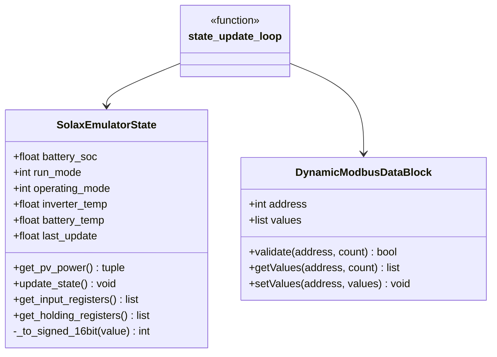
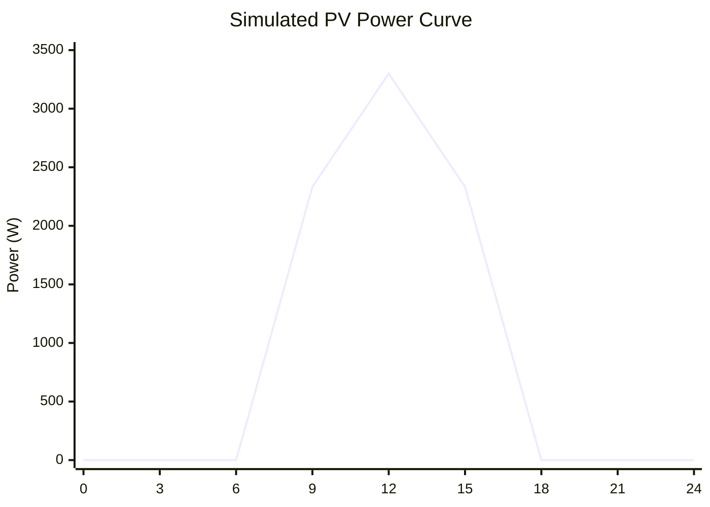
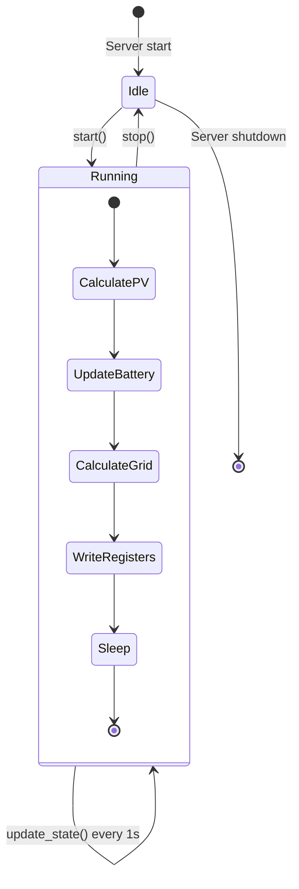

# Component Design: SolaxEmulator

Created: 2025 December 30

**Document Type:** Tier 3 Component Design  
**Document ID:** design-c2b3c4d5-component_protocol_emulator  
**Parent:** [design-8f3a1b2c-domain_protocol.md](<design-8f3a1b2c-domain_protocol.md>)  
**Status:** Implemented  

---

## Table of Contents

- [Component Information](<#component information>)
- [Purpose](<#purpose>)
- [Implementation](<#implementation>)
- [Class Design](<#class design>)
- [State Simulation](<#state simulation>)
- [Interfaces](<#interfaces>)
- [Usage](<#usage>)
- [Design Element Cross-References](<#design element cross-references>)
- [Version History](<#version history>)

---

## Component Information

```yaml
component_info:
  name: "SolaxEmulator"
  domain: "Protocol"
  version: "1.5"
  date: "2025-12-30"
  status: "Implemented"
  source_file: "src/tools/emulator/solax_emulator.py"
  platforms: "macOS, Linux"
```

[Return to Table of Contents](<#table of contents>)

---

## Purpose

Modbus TCP server emulating a Solax X3 Hybrid 6.0-D inverter for development and testing. Provides dynamic state simulation including time-based PV power curves and battery behavior.

### Responsibilities

| Responsibility | Description |
|----------------|-------------|
| Modbus server | Serve input and holding registers via TCP |
| PV simulation | Time-based power curve (peak at noon) |
| Battery simulation | Charge/discharge behavior modeling |
| State updates | Periodic register value updates |

### Use Cases

| Use Case | Description |
|----------|-------------|
| Offline development | Test client code without physical inverter |
| Integration testing | Automated test scenarios |
| Demonstration | Show system capabilities |
| Protocol validation | Verify register mappings |

[Return to Table of Contents](<#table of contents>)

---

## Implementation

### File Location

```
src/tools/emulator/solax_emulator.py
```

Located outside the `solax_modbus` package tree. The emulator has no import
dependency on `solax_modbus` (confirmed by source inspection: only stdlib and
`pymodbus` are imported) and no test or runtime code depends on it being
package-importable. Package membership was structural coincidence, not
functional coupling.

### Dependencies

```yaml
dependencies:
  external:
    - "pymodbus.server.StartTcpServer"
    - "pymodbus.datastore.ModbusSlaveContext"
    - "pymodbus.datastore.ModbusServerContext"
  internal: []
  standard_library:
    - "logging"
    - "threading"
    - "time"
    - "math"
    - "datetime"
```

[Return to Table of Contents](<#table of contents>)

---

## Class Design

### Class Diagram



`state_update_loop` runs in a daemon thread, calling `SolaxEmulatorState.update_state()` then writing register arrays into the `DynamicModbusDataBlock` instances each second. `SolaxEmulatorState` and `DynamicModbusDataBlock` are independent — the state object holds no reference to the data blocks.

[Return to Table of Contents](<#table of contents>)

---

## State Simulation

### Simulation Parameters

```python
SIMULATION_PARAMS = {
    'PV1_MAX_POWER': 3300,      # W - Peak PV string 1
    'PV2_MAX_POWER': 3300,      # W - Peak PV string 2
    'BATTERY_CAPACITY': 10000,   # Wh
    'BATTERY_VOLTAGE': 51.2,     # V nominal
    'GRID_VOLTAGE_NOMINAL': 230, # V
    'UPDATE_INTERVAL': 1.0,      # seconds
}
```

### PV Power Simulation

Time-based sine curve simulating solar production:

```python
def _calculate_pv_power(self, hour: float) -> float:
    """
    Calculate PV power based on time of day.
    
    Uses sine curve with peak at solar noon (12:00).
    Zero output before 6:00 and after 18:00.
    
    Args:
        hour: Current hour (0-24, fractional)
        
    Returns:
        Power in watts (0 to MAX_POWER)
    """
    if hour < 6 or hour > 18:
        return 0
    
    # Sine curve: 0 at 6:00, peak at 12:00, 0 at 18:00
    angle = (hour - 6) / 12 * math.pi
    return self.PV_MAX_POWER * math.sin(angle)
```

### PV Power Curve



### Battery Simulation

```python
def _update_battery(self):
    """
    Update battery state based on power balance.
    
    Logic:
    - If PV > load: charge battery (up to 100% SOC)
    - If PV < load: discharge battery (down to 10% SOC)
    - Battery power limited to ±3000W
    """
```

### State Machine



[Return to Table of Contents](<#table of contents>)

---

## Interfaces

### Register Interface

The emulator serves the same registers as the physical inverter:

| Register Group | Address | Count | Description |
|----------------|---------|-------|-------------|
| Grid Data | 0x006A | 12 | Simulated grid metrics |
| PV Voltage/Current | 0x0003 | 4 | Calculated from power |
| PV Power | 0x000A | 2 | Time-based simulation |
| Battery Data | 0x0014 | 9 | State-based simulation |
| Feed-in Power | 0x0046 | 2 | Calculated balance |
| Energy Today | 0x0050 | 1 | Accumulated |
| Energy Total | 0x0052 | 2 | Accumulated |
| Inverter Status | 0x0008 | 2 | Fixed + run mode |

### Starting the Server

```python
def run_emulator(host: str, port: int, unit_id: int):
    """
    Start the emulator server.

    host/port/unit_id are supplied via CLI flags (--host, --port,
    --unit-id), defaulting to module-level constants MODBUS_HOST
    ('0.0.0.0'), MODBUS_PORT (502), MODBUS_UNIT_ID (1) when omitted.

    Starts state_update_loop in a daemon thread, then blocks
    on StartTcpServer until Ctrl+C.
    """
```

[Return to Table of Contents](<#table of contents>)

---

## Usage

### Platform Support

The emulator is implemented in pure Python with no OS-specific dependencies; it
runs on macOS and Linux. Port 502 is a privileged port; `sudo` is required on
both platforms unless an alternative port is used via `--port`.

### Command Line

```bash
# sudo required for port 502
sudo python3 src/tools/emulator/solax_emulator.py

# Use a non-privileged port to avoid sudo
python3 src/tools/emulator/solax_emulator.py --port 5020
```

### Testing with Client

```bash
# Terminal 1
sudo python3 src/tools/emulator/solax_emulator.py

# Terminal 2
python -m solax_modbus.main 127.0.0.1
```

If using a non-privileged port:

```bash
# Terminal 1
python3 src/tools/emulator/solax_emulator.py --port 5020

# Terminal 2
python -m solax_modbus.main 127.0.0.1 --port 5020
```

[Return to Table of Contents](<#table of contents>)

---

## Design Element Cross-References

### Parent Documents

- Domain: [design-8f3a1b2c-domain_protocol.md](<design-8f3a1b2c-domain_protocol.md>)
- Master: [design-solax-modbus-master.md](<design-solax-modbus-master.md>)

### Sibling Components (Protocol Domain)

| Component | Document |
|-----------|----------|
| SolaxInverterClient | [design-c1a2b3d4-component_protocol_client.md](<design-c1a2b3d4-component_protocol_client.md>) |
| InverterController | design-XXXX-component_protocol_controller.md (planned) |

### Source Code

| Item | Location |
|------|----------|
| Module | src/tools/emulator/solax_emulator.py |

[Return to Table of Contents](<#table of contents>)

---

## Known Limitations

| ID | Limitation |
|----|------------|
| MP-001 | Emulator register addresses do not match client `REGISTER_MAPPINGS`. Client reads grid data from 0x006A; emulator populates 0x0000–0x0008. Integration testing against the emulator produces incorrect values. Resolution deferred. |
| MP-002 | ~~`run_emulator()` does not accept runtime host/port arguments.~~ Resolved: `--host`/`--port`/`--unit-id` CLI flags accepted; module constants are defaults only. Documentation corrected 2026-07-02. |
| MP-003 | Register array is 128 entries (0x00–0x7F) only. Registers above 0x7F are not served. |

[Return to Table of Contents](<#table of contents>)

---

## Version History

| Version | Date | Changes |
|---------|------|---------|
| 1.0 | 2025-12-30 | Initial component design documenting implemented emulator |
| 1.1 | 2026-03-13 | Corrected class diagram (relationships, accurate attributes/methods); corrected run_emulator() interface; corrected source path; added Known Limitations section (MP-001, MP-002, MP-003) |
| 1.2 | 2026-03-24 | Corrected platform scope: emulator runs on macOS and Linux (not Pi only). Updated Component Information, added Platform Support section, updated Usage commands to include sudo and non-privileged port alternative. |
| 1.3 | 2026-06-25 | Scoped emulator runtime to Linux only (reverses macOS scope from 1.2). Updated Component Information platforms field, Platform Support section, and Command Line comment. |
| 1.4 | 2026-07-02 | Corrected stale "Starting the Server" docstring (claimed module-constants-only configuration; source already accepts --host/--port/--unit-id). Marked MP-002 resolved. No source change; documentation was out of date relative to source. |
| 1.5 | 2026-07-03 | Reversed 1.3 Linux-only platform scope (no rationale was recorded for that change; contradicted by README.md 1.2 and docs/guide.md, and by source inspection showing no OS-specific dependencies). Restored macOS and Linux platform support. Relocated source file from src/solax_modbus/emulator/ to src/tools/emulator/, decoupling the emulator from the solax_modbus package: it has no import dependency on the package and nothing in the test suite requires it to be package-importable. Updated Component Information, File Location, Platform Support, Command Line, and Source Code references accordingly. |

---

Copyright (c) 2025 William Watson. This work is licensed under the MIT License.
