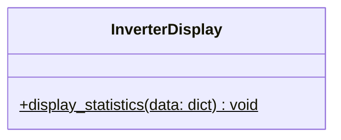

# Component Design: InverterDisplay

Created: 2025 December 30

**Document Type:** Tier 3 Component Design  
**Document ID:** design-d3c4d5e6-component_presentation_console  
**Parent:** [design-af5c3d4e-domain_presentation.md](<design-af5c3d4e-domain_presentation.md>)  
**Status:** Implemented  

---

## Table of Contents

- [Component Information](<#component information>)
- [Purpose](<#purpose>)
- [Implementation](<#implementation>)
- [Class Design](<#class design>)
- [Display Sections](<#display sections>)
- [Interfaces](<#interfaces>)
- [Usage](<#usage>)
- [Design Element Cross-References](<#design element cross-references>)
- [Version History](<#version history>)

---

## Component Information

```yaml
component_info:
  name: "InverterDisplay"
  domain: "Presentation"
  version: "1.0"
  date: "2025-12-30"
  status: "Implemented"
  source_file: "src/solax_modbus/main.py"
```

[Return to Table of Contents](<#table of contents>)

---

## Purpose

Format and display inverter telemetry to console output. Provides structured, human-readable presentation of polling data.

### Responsibilities

| Responsibility | Description |
|----------------|-------------|
| Data formatting | Apply units, precision, labels |
| Section organization | Group related metrics logically |
| Direction indicators | Show charge/discharge, import/export |
| Missing data handling | Display gracefully when data unavailable |

### Design Principles

| Principle | Implementation |
|-----------|----------------|
| Clarity | Clear section headers, aligned values |
| Completeness | All available metrics displayed |
| Robustness | Handle None values without crashing |

[Return to Table of Contents](<#table of contents>)

---

## Implementation

### File Location

```
src/solax_modbus/main.py (lines 221-310)
```

### Dependencies

```yaml
dependencies:
  external: []
  internal: []
  standard_library:
    - "datetime"
```

[Return to Table of Contents](<#table of contents>)

---

## Class Design

### Class Diagram



`display_statistics` is a static method. There are no private helper methods — all formatting is inline within the single public method.

[Return to Table of Contents](<#table of contents>)

---

## Display Sections

### Output Structure

```
========================================
     SOLAX INVERTER TELEMETRY
     2025-12-30 14:30:45
========================================

SYSTEM STATUS
  Run Mode:          Normal

GRID
  Voltage:           R: 230.1V  S: 229.8V  T: 230.3V
  Current:           R:   5.2A  S:   5.1A  T:   5.3A
  Power:             R: 1200W   S: 1170W   T: 1210W
  Frequency:         50.02 Hz

SOLAR PV GENERATION
  String 1:          385.2V × 8.5A = 3274W
  String 2:          0.0V × 0.0A = 0W
  Total PV Power:    3274W

BATTERY SYSTEM
  Voltage:           51.2V
  Current:           -10.5A (Discharging)
  Power:             -538W
  State of Charge:   75%
  Temperature:       22°C

POWER FLOW
  Grid:              Exporting 244W

ENERGY TOTALS
  Today:             12.5 kWh
  Total:             1234.5 kWh

INVERTER
  Temperature:       35°C

========================================
```

### Section Details

All sections are conditional — rendered only if the corresponding keys are present in the input dict.

| Section | Emoji | Key(s) Used |
|---------|-------|-------------|
| Header | — | `timestamp` |
| System Status | ⚡ | `run_mode` |
| Grid (Three-Phase AC) | 📊 | `grid_voltage_r`, `grid_current_r`, `grid_power_r`, `grid_frequency_r` (and S/T) |
| Solar PV Generation | ☀️ | `pv1_voltage`, `pv1_current`, `pv1_power`, `pv2_*` |
| Battery System | 🔋 | `battery_voltage`, `battery_current`, `battery_power`, `battery_soc`, `battery_temperature` |
| Power Flow | ⚡ | `feed_in_power` |
| Energy Totals | 📈 | `energy_today`, `energy_total` |
| Inverter | 🔧 | `inverter_temperature` |

[Return to Table of Contents](<#table of contents>)

---

## Interfaces

### Public Methods

#### display_statistics()

```python
@staticmethod
def display_statistics(data: Dict[str, Any]) -> None:
    """
    Format and print inverter telemetry to console.
    
    Args:
        data: Flat telemetry dictionary from SolaxInverterClient.poll_inverter().
              All keys optional; missing keys suppress the corresponding section.
              
    Prints:
        Formatted multi-section display to stdout.
    """
```

### Input Data Contract

Flat dictionary produced by `SolaxInverterClient.poll_inverter()`. All keys optional.

```python
{
    'timestamp': str,               # 'YYYY-MM-DD HH:MM:SS'
    'run_mode': str,                # e.g. 'Normal'
    'grid_voltage_r': float,        # V
    'grid_current_r': float,        # A (signed)
    'grid_power_r': int,            # W (signed)
    'grid_frequency_r': float,      # Hz
    'grid_voltage_s': float,
    'grid_current_s': float,
    'grid_power_s': int,
    'grid_frequency_s': float,
    'grid_voltage_t': float,
    'grid_current_t': float,
    'grid_power_t': int,
    'grid_frequency_t': float,
    'pv1_voltage': float,           # V
    'pv2_voltage': float,
    'pv1_current': float,           # A
    'pv2_current': float,
    'pv1_power': int,               # W
    'pv2_power': int,
    'battery_voltage': float,       # V
    'battery_current': float,       # A (positive=charge)
    'battery_power': int,           # W
    'battery_soc': int,             # 0-100
    'battery_temperature': int,     # °C
    'feed_in_power': int,           # W (positive=export)
    'energy_today': float,          # kWh
    'energy_total': float,          # kWh
    'inverter_temperature': int,    # °C
}
```

[Return to Table of Contents](<#table of contents>)

---

## Usage

### Basic Usage

```python
from solax_modbus.main import InverterDisplay, SolaxInverterClient

client = SolaxInverterClient(ip='192.168.1.100')
display = InverterDisplay()

if client.connect():
    data = client.poll_inverter()
    if data:
        display.display_statistics(data)
    client.disconnect()
```

### Polling Loop

```python
import time
from solax_modbus.main import InverterDisplay, SolaxInverterClient

while True:
    data = client.poll_inverter()
    if data:
        display.display_statistics(data)
    time.sleep(5)
```

[Return to Table of Contents](<#table of contents>)

---

## Design Element Cross-References

### Parent Documents

- Domain: [design-af5c3d4e-domain_presentation.md](<design-af5c3d4e-domain_presentation.md>)
- Master: [design-solax-modbus-master.md](<design-solax-modbus-master.md>)

### Sibling Components (Presentation Domain)

| Component | Document |
|-----------|----------|
| HTMLRenderer | design-XXXX-component_presentation_html.md (planned) |

### Dependencies

| Component | Dependency Type |
|-----------|-----------------|
| SolaxInverterClient | Provides input data |
| main | Orchestrates display calls |

### Source Code

| Item | Location |
|------|----------|
| Class | src/solax_modbus/main.py:221-310 |

[Return to Table of Contents](<#table of contents>)

---

## Version History

| Version | Date | Changes |
|---------|------|---------|
| 1.0 | 2025-12-30 | Initial component design documenting implemented class |
| 1.1 | 2026-03-13 | Corrected class diagram (static method only); removed non-existent private helpers; corrected input contract to flat dict; updated section detail table; updated usage imports |

---

Copyright (c) 2025 William Watson. This work is licensed under the MIT License.
