# Name Registry
# Solax-Modbus

Created: 2026 March 13

**Document Type:** Tier 1 Name Registry Master (Singleton)
**Status:** Active

---

## Table of Contents

- [1.0 Overview](<#10-overview>)
- [2.0 Class Diagram](<#20-class-diagram>)
- [3.0 Element Registry (YAML)](<#30-element-registry-yaml>)
- [4.0 Design Document Cross-References](<#40-design-document-cross-references>)
- [Version History](<#version-history>)

---

## 1.0 Overview

Canonical name registry for the `solax-modbus` project. Authoritative reference for all program element names across the design hierarchy.

**Status Legend:**
- `implemented` — element exists in source code
- `planned` — element defined in design, not yet implemented

[Return to Table of Contents](<#table-of-contents>)

---

## 2.0 Class Diagram

```mermaid
classDiagram
    %% ── Implemented ──────────────────────────────────────────

    class SolaxInverterClient {
        +str ip
        +int port
        +int unit_id
        +int max_retries
        +float retry_delay
        +dict REGISTER_MAPPINGS
        +dict RUN_MODES
        +connect() bool
        +disconnect() None
        +read_registers(address, count, description) list
        +poll_inverter() dict
        -_process_grid_data(regs) dict
        -_process_pv_data(vc_regs, power_regs) dict
        -_process_battery_data(regs) dict
        -_to_signed(value) int
        -_to_signed_32(low, high) int
        -_to_unsigned_32(low, high) int
    }

    class InverterDisplay {
        +display_statistics(data) None
    }

    class DynamicModbusDataBlock {
        +address
        +values
        +default_value
        +validate(address, count) bool
        +getValues(address, count) list
        +setValues(address, values) None
    }

    class SolaxEmulatorState {
        +int battery_soc
        +int run_mode
        +int operating_mode
        +float inverter_temp
        +float battery_temp
        +get_pv_power() Tuple
        +update_state() None
        +get_input_registers() list
        +get_holding_registers() list
        -_to_signed_16bit(value) int
    }

    DynamicModbusDataBlock --|> BaseModbusDataBlock

    %% ── Planned ──────────────────────────────────────────────

    class Measurement {
        <<dataclass>>
        +datetime timestamp
        +str inverter_id
    }

    class ValidationResult {
        <<dataclass>>
        +bool is_valid
        +list anomalies
        +float quality_score
    }

    class DataValidator {
        +validate_metrics(data) ValidationResult
        +check_range(value, min_val, max_val, field_name) str
    }

    class TimeSeriesStore {
        +write_measurement(measurement) bool
        +write_batch(measurements) int
        +query(start, end, inverter_id, fields) list
    }

    class DataBuffer {
        +enqueue(measurement) None
        +flush() int
        +size() int
    }

    class AlertManager {
        +evaluate_conditions(measurement) list
        +acknowledge_alert(alert_id) bool
        +get_active_alerts() list
    }

    class NotificationDispatcher {
        +send_email(alert) bool
        +send_sms(alert) bool
        +send_webhook(alert) bool
    }

    class HTMLRenderer {
        +render(data, output_path) bool
    }

    DataValidator --> ValidationResult
    DataValidator --> Measurement
    TimeSeriesStore --> Measurement
    TimeSeriesStore --> DataBuffer
    AlertManager --> NotificationDispatcher
```



[Return to Table of Contents](<#table-of-contents>)

---

## 3.0 Element Registry (YAML)

```yaml
naming_conventions:
  package:    "kebab-case for distribution (solax-modbus); snake_case for import (solax_modbus)"
  module:     "snake_case"
  class:      "PascalCase"
  function:   "snake_case"
  constant:   "UPPER_SNAKE_CASE"

packages:
  - name: "solax_modbus"
    distribution: "solax-modbus"
    path: "src/solax_modbus/"
    status: implemented

modules:
  - name: "solax_modbus"
    path: "src/solax_modbus/__init__.py"
    package: "solax_modbus"
    status: implemented
  - name: "solax_modbus.main"
    path: "src/solax_modbus/main.py"
    package: "solax_modbus"
    status: implemented
  - name: "solax_modbus.emulator.solax_emulator"
    path: "src/solax_modbus/emulator/solax_emulator.py"
    package: "solax_modbus"
    status: implemented
  - name: "solax_modbus.data.models"
    path: "src/solax_modbus/data/models.py"
    package: "solax_modbus"
    status: planned
  - name: "solax_modbus.data.validator"
    path: "src/solax_modbus/data/validator.py"
    package: "solax_modbus"
    status: planned
  - name: "solax_modbus.data.storage"
    path: "src/solax_modbus/data/storage.py"
    package: "solax_modbus"
    status: planned
  - name: "solax_modbus.data.buffer"
    path: "src/solax_modbus/data/buffer.py"
    package: "solax_modbus"
    status: planned
  - name: "solax_modbus.application.alerting"
    path: "src/solax_modbus/application/alerting.py"
    package: "solax_modbus"
    status: planned
  - name: "solax_modbus.application.notifications"
    path: "src/solax_modbus/application/notifications.py"
    package: "solax_modbus"
    status: planned
  - name: "solax_modbus.presentation.html"
    path: "src/solax_modbus/presentation/html.py"
    package: "solax_modbus"
    status: planned

classes:
  # ── Implemented ─────────────────────────────────────────────
  - name: "SolaxInverterClient"
    module: "solax_modbus.main"
    base_classes: []
    status: implemented
  - name: "InverterDisplay"
    module: "solax_modbus.main"
    base_classes: []
    status: implemented
  - name: "DynamicModbusDataBlock"
    module: "solax_modbus.emulator.solax_emulator"
    base_classes: ["BaseModbusDataBlock"]
    status: implemented
  - name: "SolaxEmulatorState"
    module: "solax_modbus.emulator.solax_emulator"
    base_classes: []
    status: implemented
  # ── Planned ─────────────────────────────────────────────────
  - name: "Measurement"
    module: "solax_modbus.data.models"
    base_classes: []
    status: planned
  - name: "ValidationResult"
    module: "solax_modbus.data.models"
    base_classes: []
    status: planned
  - name: "DataValidator"
    module: "solax_modbus.data.validator"
    base_classes: []
    status: planned
  - name: "TimeSeriesStore"
    module: "solax_modbus.data.storage"
    base_classes: []
    status: planned
  - name: "DataBuffer"
    module: "solax_modbus.data.buffer"
    base_classes: []
    status: planned
  - name: "AlertManager"
    module: "solax_modbus.application.alerting"
    base_classes: []
    status: planned
  - name: "NotificationDispatcher"
    module: "solax_modbus.application.notifications"
    base_classes: []
    status: planned
  - name: "HTMLRenderer"
    module: "solax_modbus.presentation.html"
    base_classes: []
    status: planned

functions:
  # ── solax_modbus.main :: SolaxInverterClient ─────────────────
  - name: "connect"
    module: "solax_modbus.main"
    class: "SolaxInverterClient"
    signature: "connect(self) -> bool"
    status: implemented
  - name: "disconnect"
    module: "solax_modbus.main"
    class: "SolaxInverterClient"
    signature: "disconnect(self) -> None"
    status: implemented
  - name: "read_registers"
    module: "solax_modbus.main"
    class: "SolaxInverterClient"
    signature: "read_registers(self, address: int, count: int, description: str) -> Optional[list]"
    status: implemented
  - name: "poll_inverter"
    module: "solax_modbus.main"
    class: "SolaxInverterClient"
    signature: "poll_inverter(self) -> Dict[str, Any]"
    status: implemented
  - name: "_process_grid_data"
    module: "solax_modbus.main"
    class: "SolaxInverterClient"
    signature: "_process_grid_data(self, regs: list) -> Dict[str, float]"
    status: implemented
  - name: "_process_pv_data"
    module: "solax_modbus.main"
    class: "SolaxInverterClient"
    signature: "_process_pv_data(self, vc_regs: list, power_regs: list) -> Dict[str, float]"
    status: implemented
  - name: "_process_battery_data"
    module: "solax_modbus.main"
    class: "SolaxInverterClient"
    signature: "_process_battery_data(self, regs: list) -> Dict[str, Any]"
    status: implemented
  - name: "_to_signed"
    module: "solax_modbus.main"
    class: "SolaxInverterClient"
    signature: "_to_signed(value: int) -> int"
    static: true
    status: implemented
  - name: "_to_signed_32"
    module: "solax_modbus.main"
    class: "SolaxInverterClient"
    signature: "_to_signed_32(low: int, high: int) -> int"
    static: true
    status: implemented
  - name: "_to_unsigned_32"
    module: "solax_modbus.main"
    class: "SolaxInverterClient"
    signature: "_to_unsigned_32(low: int, high: int) -> int"
    static: true
    status: implemented
  # ── solax_modbus.main :: InverterDisplay ─────────────────────
  - name: "display_statistics"
    module: "solax_modbus.main"
    class: "InverterDisplay"
    signature: "display_statistics(data: Dict[str, Any]) -> None"
    static: true
    status: implemented
  # ── solax_modbus.main (module level) ─────────────────────────
  - name: "main"
    module: "solax_modbus.main"
    class: null
    signature: "main() -> None"
    status: implemented
  # ── solax_modbus.emulator.solax_emulator :: DynamicModbusDataBlock ──
  - name: "validate"
    module: "solax_modbus.emulator.solax_emulator"
    class: "DynamicModbusDataBlock"
    signature: "validate(self, address: int, count: int = 1) -> bool"
    status: implemented
  - name: "getValues"
    module: "solax_modbus.emulator.solax_emulator"
    class: "DynamicModbusDataBlock"
    signature: "getValues(self, address: int, count: int = 1) -> list"
    status: implemented
  - name: "setValues"
    module: "solax_modbus.emulator.solax_emulator"
    class: "DynamicModbusDataBlock"
    signature: "setValues(self, address: int, values: list) -> None"
    status: implemented
  # ── solax_modbus.emulator.solax_emulator :: SolaxEmulatorState ──
  - name: "get_pv_power"
    module: "solax_modbus.emulator.solax_emulator"
    class: "SolaxEmulatorState"
    signature: "get_pv_power(self) -> Tuple[int, int]"
    status: implemented
  - name: "update_state"
    module: "solax_modbus.emulator.solax_emulator"
    class: "SolaxEmulatorState"
    signature: "update_state(self) -> None"
    status: implemented
  - name: "get_input_registers"
    module: "solax_modbus.emulator.solax_emulator"
    class: "SolaxEmulatorState"
    signature: "get_input_registers(self) -> list"
    status: implemented
  - name: "get_holding_registers"
    module: "solax_modbus.emulator.solax_emulator"
    class: "SolaxEmulatorState"
    signature: "get_holding_registers(self) -> list"
    status: implemented
  - name: "_to_signed_16bit"
    module: "solax_modbus.emulator.solax_emulator"
    class: "SolaxEmulatorState"
    signature: "_to_signed_16bit(value: int) -> int"
    static: true
    status: implemented
  # ── solax_modbus.emulator.solax_emulator (module level) ──────
  - name: "state_update_loop"
    module: "solax_modbus.emulator.solax_emulator"
    class: null
    signature: "state_update_loop(state: SolaxEmulatorState, input_block: DynamicModbusDataBlock, holding_block: DynamicModbusDataBlock) -> None"
    status: implemented
  - name: "run_emulator"
    module: "solax_modbus.emulator.solax_emulator"
    class: null
    signature: "run_emulator() -> None"
    status: implemented

constants:
  # ── solax_modbus (__init__.py) ────────────────────────────────
  - name: "__version__"
    module: "solax_modbus"
    type: "str"
    value: "'0.1.4'"
    status: implemented
  # ── solax_modbus.main (class-level) ──────────────────────────
  - name: "REGISTER_MAPPINGS"
    module: "solax_modbus.main"
    class: "SolaxInverterClient"
    type: "dict"
    status: implemented
  - name: "RUN_MODES"
    module: "solax_modbus.main"
    class: "SolaxInverterClient"
    type: "dict"
    status: implemented
  # ── solax_modbus.emulator.solax_emulator (module-level) ──────
  - name: "MODBUS_HOST"
    module: "solax_modbus.emulator.solax_emulator"
    type: "str"
    status: implemented
  - name: "MODBUS_PORT"
    module: "solax_modbus.emulator.solax_emulator"
    type: "int"
    status: implemented
  - name: "MODBUS_UNIT_ID"
    module: "solax_modbus.emulator.solax_emulator"
    type: "int"
    status: implemented
  - name: "PV1_MAX_POWER"
    module: "solax_modbus.emulator.solax_emulator"
    type: "int"
    status: implemented
  - name: "PV2_MAX_POWER"
    module: "solax_modbus.emulator.solax_emulator"
    type: "int"
    status: implemented
  - name: "BATTERY_CAPACITY"
    module: "solax_modbus.emulator.solax_emulator"
    type: "int"
    status: implemented
  - name: "BATTERY_VOLTAGE"
    module: "solax_modbus.emulator.solax_emulator"
    type: "float"
    status: implemented
  - name: "BATTERY_MAX_CHARGE_CURRENT"
    module: "solax_modbus.emulator.solax_emulator"
    type: "int"
    status: implemented
  - name: "BATTERY_MAX_DISCHARGE_CURRENT"
    module: "solax_modbus.emulator.solax_emulator"
    type: "int"
    status: implemented
  - name: "GRID_VOLTAGE_NOMINAL"
    module: "solax_modbus.emulator.solax_emulator"
    type: "float"
    status: implemented
  - name: "GRID_FREQUENCY"
    module: "solax_modbus.emulator.solax_emulator"
    type: "float"
    status: implemented
  - name: "INITIAL_BATTERY_SOC"
    module: "solax_modbus.emulator.solax_emulator"
    type: "int"
    status: implemented
  - name: "INITIAL_RUN_MODE"
    module: "solax_modbus.emulator.solax_emulator"
    type: "int"
    status: implemented
  - name: "INITIAL_OPERATING_MODE"
    module: "solax_modbus.emulator.solax_emulator"
    type: "int"
    status: implemented
  - name: "UPDATE_INTERVAL"
    module: "solax_modbus.emulator.solax_emulator"
    type: "float"
    status: implemented
  - name: "PV_VARIATION_FACTOR"
    module: "solax_modbus.emulator.solax_emulator"
    type: "float"
    status: implemented
  - name: "BATTERY_CHARGE_RATE"
    module: "solax_modbus.emulator.solax_emulator"
    type: "int"
    status: implemented
  - name: "BATTERY_DISCHARGE_RATE"
    module: "solax_modbus.emulator.solax_emulator"
    type: "int"
    status: implemented
```

[Return to Table of Contents](<#table-of-contents>)

---

## 4.0 Design Document Cross-References

| Tier | Document | Domain |
|------|----------|--------|
| 1 | [design-solax-modbus-master.md](<design-solax-modbus-master.md>) | Master |
| 2 | [design-8f3a1b2c-domain_protocol.md](<design-8f3a1b2c-domain_protocol.md>) | Protocol |
| 2 | [design-9e4b2c3d-domain_data.md](<design-9e4b2c3d-domain_data.md>) | Data |
| 2 | [design-af5c3d4e-domain_presentation.md](<design-af5c3d4e-domain_presentation.md>) | Presentation |
| 2 | [design-bf6d4e5f-domain_application.md](<design-bf6d4e5f-domain_application.md>) | Application |
| 3 | [design-c1a2b3d4-component_protocol_client.md](<design-c1a2b3d4-component_protocol_client.md>) | Protocol |
| 3 | [design-c2b3c4d5-component_protocol_emulator.md](<design-c2b3c4d5-component_protocol_emulator.md>) | Protocol |
| 3 | [design-a6b7c8d9-component_data_validator.md](<design-a6b7c8d9-component_data_validator.md>) | Data |
| 3 | [design-b7c8d9e0-component_data_storage.md](<design-b7c8d9e0-component_data_storage.md>) | Data |
| 3 | [design-c8d9e0f1-component_data_buffer.md](<design-c8d9e0f1-component_data_buffer.md>) | Data |
| 3 | [design-d3c4d5e6-component_presentation_console.md](<design-d3c4d5e6-component_presentation_console.md>) | Presentation |
| 3 | [design-d9e0f1a2-component_presentation_html.md](<design-d9e0f1a2-component_presentation_html.md>) | Presentation |
| 3 | [design-e4d5e6f7-component_application_main.md](<design-e4d5e6f7-component_application_main.md>) | Application |
| 3 | [design-e0f1a2b3-component_application_alerting.md](<design-e0f1a2b3-component_application_alerting.md>) | Application |

[Return to Table of Contents](<#table-of-contents>)

---

## Version History

| Version | Date | Changes |
|---------|------|---------|
| 1.0 | 2026-03-13 | Initial creation. Retrospective population from source code and all design tiers. Covers 4 implemented classes, 22 functions, 20 constants, and 8 planned classes. |

---

Copyright (c) 2025 William Watson. This work is licensed under the MIT License.
