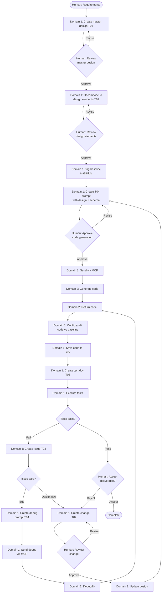

# LLM Orchestration Framework

---

## Table of Contents

[Protocols](<#1.0 protocols>)
  - [P00: Governance (start here)](<#1.1 p00 governance (start here)>)
  - [P01: Project Initialization](<#1.2 p01 project initialization (execute once)>)
  - [P02: Design](<#1.3 p02 design>)
  - [P03: Change](<#1.4 p03 change>)
  - [P04: Issue](<#1.5 p04 issue>)
  - [P05: Trace](<#1.6 p05 trace>)
  - [P06: Test](<#1.7 p06 test>)
  - [P07: Quality](<#1.8 p07 quality>)
  
[Templates](<#2.0 templates>)
  - [T01: Design](<#2.1 t01 design>)
  - [T02: Change](<#2.2 t02 change>)
  - [T03: Issue](<#2.3 t03 issue>)
  - [T04: Prompt](<#2.4 t04 prompt>)
  - [T05: Test](<#2.5 t05 test>)
  
[Framework execution flowchart](<#3.0 framework execution flowchart>)

[Version History](<#version history>)

---

## 1.0 Protocols

#### 1.1 P00 Governance (start here)
  - 1.1.1 Purpose
    - Python based software engineering, architecture and development
  - 1.1.2 Scope
    - Agnostic plan, control and initiation of software generation
  - 1.1.3 Architecture
    - Domain 1: Plan and control: design, change, test and launching of code generation
    - Domain 2: Execute: code generation
  - 1.1.4 Forbidden
    - Both domains: Unrequested creation, addition, removal or change of source code and documents is forbidden
  - 1.1.5 Constraints
    - Domain 1: Does not exceed language model token resource budget communicating with domain 2
  - 1.1.6 Control
    - Domain 1: Coordinates and controls domain 2 code generator
    - Domain 2: Does not have access to local folders and cannot save generated code
  - 1.1.7 Communication
    - Domain 1: Uses template [T04 Prompt](<#- t04 prompt>) to create code generation or debug prompts for domain 2 based on designs, changes and issues
    - Domain 1: Initiates Domain 2 code generation or debugging with prompt documents
    - Domain 1 and domain2 communicate directly via MCP tools such as (health_check, list_models, get_current_model and chat_completion) provided by an MCP server such  "lmstudio-mcp" for example
    - Domain 1: Embeds complete design specifications and schema within prompt documents
    - Domain 1: Ensures prompt documents are self-contained requiring no external file references
    - Domain 1: Communicates with Domain 2 via MCP tools (chat_completion)
    - Domain 2: Receives all specifications via MCP call, generates code
  - 1.1.8 Quality
    - Human review and approval of design, change and initiation of code generation is required
  - 1.1.9 Documents
    - Domain 1: Based on document class (design, change, issue, trace, test) adds a sequentially contiguous \<sequence number\> starting at 0001 to all created documents
    - Domain 1: Based on document class (design, change, issue, trace, test) follows naming format \<document class\>-\<sequence number\>-\<document name\>.md when creating documents
    - Domain 1: Insures related documents are Obsidian cross linked
  - 1.1.10 Prime directive
    - Domain 1: Follow workflow [framework execution flowchart](<#Framework execution flowchart>)
  - 1.1.11 Configuration Management
    - Domain 1: Maintains GitHub repository as authoritative source for all project artifacts
    - Domain 1: Tags design document commits when approved as baseline for code generation
    - Domain 1: Performs configuration audit verifying generated code matches approved design baseline commits
  - 1.1.12 Token Budget Management
    - Domain 1: Monitors token usage when communicating with Domain 2
    - Domain 1: Ensures prompt documents remain within Domain 2 context window limits
    - Domain 1: Tracks token consumption per code generation cycle

[Return to Table of Contents](<#table of contents>)

#### 1.2 P01 Project Initialization (Execute once)
  - 1.2.1 Project folders
    - Create if does not exist (see Project folder structure)
  - 1.2.2 GitHub documents
    - Create if does not exist
  - 1.2.3 README
    - Create initial skeleton 'README.md' document in each folder
  - 1.2.4 Copy this document (governance.md) into \<project name>/governance
  - 1.2.4 Project folder structure
    - Layout
```text
    └── <project name>/
		├── governance/           # Operational rules
        │   └── governance.md 
        ├── workspace/            # Execution space
        │   ├── design/
        │   ├── change/
        │   ├── issues/
        │   ├── trace/
        │   └── test/
        │       └── result/
        ├── docs/                 # Technical Documents
        ├── src/                  # Source code
        └── deprecated/           # Archive
            ├── governance/
            ├── workspace/
            │   ├── design/
            │   ├── change/
            │   ├── issue/
            │   ├── trace/
            │   └── test/
            │       └── result/
            ├── docs/
            └── src/
```

[Return to Table of Contents](<#table of contents>)

#### 1.3 P02 Design
  - 1.3.1 Domain 1: Creates master design document named \<design\>-\<0000\>-\<document name\>.md from human software specifications and requirements (there is only one master design document) using template [T01 Design](<#- t01 design>)
  - 1.3.2 Domain 1: Deconstructs the master design document into cross linked design element (modules) documents according to functionality using template [T01 Design](<#- t01 design>)
  - 1.3.3 Domain 1: Insures design element documents do not exceed domain 2 context window
  - 1.3.4 Domain 1: Insures the master  design document  is clearly designated within as the master design document.
  - 1.3.5 Design Verification
    - Domain 1: Validates design completeness before creating T04 prompt
    - Domain 1: Verifies all functional requirements have corresponding design elements
    - Domain 1: Confirms all non-functional requirements addressed in design specifications
  - 1.3.6 Design Review
    - Domain 1: Presents master design document for human approval before decomposition into functional modules
    - Domain 1: Documents review findings, required changes, approval decision
    - Domain 1: Proceeds with module decomposition only after approval recorded
  - 1.3.7 Requirements Traceability
    - Domain 1: Assigns unique identifier to each functional and non-functional requirement
    - Domain 1: Maps requirements to design elements using traceability matrix
    - Domain 1: Maintains bidirectional links enabling navigation: requirement ↔ design ↔ code ↔ test (forward and backward)
  - 1.3.8 Requirements Validation
    - Domain 1: Verifies design satisfies all stated requirements before baseline
    - Domain 1: Documents validation results in design document
    - Domain 1: Resolves discrepancies before proceeding to code generation

[Return to Table of Contents](<#table of contents>)

#### 1.4 P03 Change
  - 1.4.1 Domain 1: Creates change documents from issue documents and human change requests using template [T02 Change](<#- t02 change>) and saves them in folder workspace/change
  - 1.4.2 Domian 1: Insures created change documents are linked to thier source issue document
  - 1.4.3 Domain 1: Updates all relevant design documents after implementation
  - 1.4.4 Domain 1: Insures all design document updates contain change references and links to their source change document
  - 1.4.5 Change Review
    - Domain 1: Performs impact analysis before change approval
    - Domain 1: Evaluates effects on dependent components, interfaces, data structures
    - Domain 1: Documents impact analysis results in change document
  - 1.4.6 Requirements Change Management
    - Domain 1: Links requirement changes to affected design elements
    - Domain 1: Performs impact analysis when requirements change
    - Domain 1: Updates requirement traceability matrix after changes
  - 1.4.7 Maintenance Classification
    - Domain 1: Categorizes changes: corrective, adaptive, perfective, preventive
    - Domain 1: Records classification in change document metadata
    - Domain 1: Tracks change type distribution for process metrics
  - 1.4.8 Change Impact Analysis
    - Domain 1: Evaluates change effects on system integrity, performance, security
    - Domain 1: Identifies all components requiring modification
    - Domain 1: Documents cascading effects in change document
  - 1.4.9 Maintenance Documentation
    - Domain 1: Updates all affected documentation when changes implemented
    - Domain 1: Maintains documentation currency with code state
    - Domain 1: Cross-links updated documents to source change document

[Return to Table of Contents](<#table of contents>)

#### 1.5 P04 Issue
  - 1.5.1 Domain 1: Creates issue documents from errors reported in workspace/test/result using template [T03 Issue](<#- t03 issue>) and saves them in folder workspace/issue
  - 1.5.2 Domain 1: Reserved for future use
  - 1.5.3 Domain 2: Debugs issues submitted from domain 2 and returns change proposal to domain 1
  - 1.5.4 Domain 1: Updates issue documents from bugs and  using template [T03 Issue](<#- t03 issue>) and saves them in folder workspace/issue
  - 1.5.5 Non-Conformance Reporting
    - Domain 1: Documents instances where generated code deviates from design specifications
    - Domain 1: Records deviation type, severity, affected components
    - Domain 1: Tracks non-conformance trends for process improvement
  - 1.5.6 Post-Implementation Review
    - Domain 1: Evaluates code generation effectiveness after issue resolution
    - Domain 1: Documents lessons learned
    - Domain 1: Provides protocol improvement recommendations for human review (protocols immutable, human-modified only)

[Return to Table of Contents](<#table of contents>)

#### 1.6 P05 trace
  - 1.6.1 Domain 1: Creates prompt documents from design and change documents using [T04 Prompt](<#- t04 prompt>) and saves them with the naming format prompt-\<sequence number\>-\<prompt name\>.md in folder workspace/trace
  - 1.6.2 Traceability Verification
    - Domain 1: Verifies bidirectional links exist: requirements ↔ design ↔ code ↔ test (navigable forward and backward)
    - Domain 1: Identifies and resolves traceability gaps
    - Domain 1: Generates traceability reports on demand
  - 1.6.3 Requirements Traceability
    - Domain 1: Maintains traceability matrix linking requirements through implementation
    - Domain 1: Updates matrix when designs, code, or tests modified
    - Domain 1: Ensures orphaned requirements or implementations identified

[Return to Table of Contents](<#table of contents>)

#### 1.7 P06 test
  - 1.7.1 Domain 1: Creates test documents from source code generated by domain 2 using template [T05 Test](<#- t05 test>) and saves them in folder workspace/test
  - 1.7.2 Test Planning
    - Domain 1: Creates comprehensive test strategy before code generation
    - Domain 1: Defines test scope, approach, resources, schedule
    - Domain 1: Identifies test types: unit, integration, system, acceptance
  - 1.7.3 Test Case Specification
    - Domain 1: Structures test cases: preconditions, inputs, expected outputs, postconditions
    - Domain 1: Links test cases to requirements and design elements
    - Domain 1: Includes positive, negative, boundary, edge cases
  - 1.7.4 Test Results Documentation
    - Domain 1: Records test execution results in standardized format
    - Domain 1: Captures: pass/fail status, defects found, coverage achieved
    - Domain 1: Links failed tests to issue documents

[Return to Table of Contents](<#table of contents>)

#### 1.8 P07 Quality
  - 1.8.1 Code Validation
    - Domain 1: Verifies generated code implements all design requirements
    - Domain 1: Validates against design specifications, interface contracts, data schemas
    - Domain 1: Documents validation results, discrepancies found

[Return to Table of Contents](<#table of contents>)

## 2.0 Templates

####  2.1 T01 Design
```yaml
# T01 Design Template v1.0 - YAML Format
# Optimized for LM code generation context efficiency

project_info:
  name: ""
  version: ""
  date: ""
  author: ""

scope:
  purpose: ""
  in_scope:
    - ""
  out_scope:
    - ""
  terminology:
    - term: ""
      definition: ""

system_overview:
  description: ""
  context_flow: ""  # e.g., "ExternalSystem → Component → Output"
  primary_functions:
    - ""

design_constraints:
  technical:
    - ""
  implementation:
    language: ""
    framework: ""
    libraries:
      - ""
    standards:
      - ""
  performance_targets:
    - metric: ""
      value: ""

architecture:
  pattern: ""  # e.g., "layered", "pipeline", "microservices"
  component_relationships: ""  # e.g., "A → B → C"
  technology_stack:
    language: ""
    framework: ""
    libraries:
      - ""
    data_store: ""
  directory_structure:
    - ""

components:
  - name: ""
    purpose: ""
    responsibilities:
      - ""
    inputs:
      - field: ""
        type: ""
        description: ""
    outputs:
      - field: ""
        type: ""
        description: ""
    key_elements:
      - name: ""  # class/function name
        type: ""  # "class" or "function"
        purpose: ""
    dependencies:
      internal:
        - ""
      external:
        - ""
    processing_logic:
      - ""
    error_conditions:
      - condition: ""
        handling: ""

data_design:
  entities:
    - name: ""
      purpose: ""
      attributes:
        - name: ""
          type: ""
          constraints: ""
      relationships:
        - target: ""
          type: ""  # e.g., "one-to-many", "many-to-many"
  storage:
    - name: ""  # table/collection name
      fields:
        - name: ""
          type: ""
          constraints: ""
      indexes:
        - ""
  validation_rules:
    - ""

interfaces:
  internal:
    - name: ""
      purpose: ""
      signature: ""  # function/method signature with types
      parameters:
        - name: ""
          type: ""
          description: ""
      returns:
        type: ""
        description: ""
      raises:
        - exception: ""
          condition: ""
  external:
    - name: ""
      protocol: ""  # API, message queue, file, etc.
      data_format: ""  # JSON, XML, binary, etc.
      specification: ""  # endpoint, schema, etc.

error_handling:
  exception_hierarchy:
    base: ""
    specific:
      - ""
  strategy:
    validation_errors: ""
    runtime_errors: ""
    external_failures: ""
  logging:
    levels:
      - ""
    required_info:
      - ""
    format: ""

nonfunctional_requirements:
  performance:
    - metric: ""
      target: ""
  security:
    authentication: ""
    authorization: ""
    data_protection:
      - ""
  reliability:
    error_recovery: ""
    fault_tolerance:
      - ""
  maintainability:
    code_organization:
      - ""
    documentation:
      - ""
    testing:
      coverage_target: ""
      approaches:
        - ""

version_history:
  - version: ""
    date: ""
    author: ""
    changes:
      - ""

metadata:
  copyright: "Copyright (c) 2025 William Watson. This work is licensed under the MIT License."
  template_version: "1.0"
  schema_type: "t01_design"
```

[Return to Table of Contents](<#table of contents>)

```yaml
# T01 Design Schema v1.0
$schema: http://json-schema.org/draft-07/schema#
type: object
required:
  - project_info
  - scope
  - system_overview
  - architecture
  - components

properties:
  project_info:
    type: object
    required:
      - name
      - version
      - date
    properties:
      name:
        type: string
      version:
        type: string
      date:
        type: string
      author:
        type: string
  
  scope:
    type: object
    required:
      - purpose
    properties:
      purpose:
        type: string
      in_scope:
        type: array
        items:
          type: string
      out_scope:
        type: array
        items:
          type: string
      terminology:
        type: array
        items:
          type: object
          properties:
            term:
              type: string
            definition:
              type: string
  
  system_overview:
    type: object
    required:
      - description
    properties:
      description:
        type: string
      context_flow:
        type: string
      primary_functions:
        type: array
        items:
          type: string
  
  design_constraints:
    type: object
    properties:
      technical:
        type: array
        items:
          type: string
      implementation:
        type: object
        properties:
          language:
            type: string
          framework:
            type: string
          libraries:
            type: array
            items:
              type: string
          standards:
            type: array
            items:
              type: string
      performance_targets:
        type: array
        items:
          type: object
          properties:
            metric:
              type: string
            value:
              type: string
  
  architecture:
    type: object
    required:
      - pattern
      - technology_stack
    properties:
      pattern:
        type: string
      component_relationships:
        type: string
      technology_stack:
        type: object
        properties:
          language:
            type: string
          framework:
            type: string
          libraries:
            type: array
            items:
              type: string
          data_store:
            type: string
      directory_structure:
        type: array
        items:
          type: string
  
  components:
    type: array
    items:
      type: object
      required:
        - name
        - purpose
      properties:
        name:
          type: string
        purpose:
          type: string
        responsibilities:
          type: array
          items:
            type: string
        inputs:
          type: array
          items:
            type: object
            properties:
              field:
                type: string
              type:
                type: string
              description:
                type: string
        outputs:
          type: array
          items:
            type: object
            properties:
              field:
                type: string
              type:
                type: string
              description:
                type: string
        key_elements:
          type: array
          items:
            type: object
            properties:
              name:
                type: string
              type:
                type: string
                enum:
                  - class
                  - function
              purpose:
                type: string
        dependencies:
          type: object
          properties:
            internal:
              type: array
              items:
                type: string
            external:
              type: array
              items:
                type: string
        processing_logic:
          type: array
          items:
            type: string
        error_conditions:
          type: array
          items:
            type: object
            properties:
              condition:
                type: string
              handling:
                type: string
  
  data_design:
    type: object
    properties:
      entities:
        type: array
        items:
          type: object
          properties:
            name:
              type: string
            purpose:
              type: string
            attributes:
              type: array
              items:
                type: object
                properties:
                  name:
                    type: string
                  type:
                    type: string
                  constraints:
                    type: string
            relationships:
              type: array
              items:
                type: object
                properties:
                  target:
                    type: string
                  type:
                    type: string
      storage:
        type: array
        items:
          type: object
          properties:
            name:
              type: string
            fields:
              type: array
              items:
                type: object
                properties:
                  name:
                    type: string
                  type:
                    type: string
                  constraints:
                    type: string
            indexes:
              type: array
              items:
                type: string
      validation_rules:
        type: array
        items:
          type: string
  
  interfaces:
    type: object
    properties:
      internal:
        type: array
        items:
          type: object
          properties:
            name:
              type: string
            purpose:
              type: string
            signature:
              type: string
            parameters:
              type: array
              items:
                type: object
                properties:
                  name:
                    type: string
                  type:
                    type: string
                  description:
                    type: string
            returns:
              type: object
              properties:
                type:
                  type: string
                description:
                  type: string
            raises:
              type: array
              items:
                type: object
                properties:
                  exception:
                    type: string
                  condition:
                    type: string
      external:
        type: array
        items:
          type: object
          properties:
            name:
              type: string
            protocol:
              type: string
            data_format:
              type: string
            specification:
              type: string
  
  error_handling:
    type: object
    properties:
      exception_hierarchy:
        type: object
        properties:
          base:
            type: string
          specific:
            type: array
            items:
              type: string
      strategy:
        type: object
        properties:
          validation_errors:
            type: string
          runtime_errors:
            type: string
          external_failures:
            type: string
      logging:
        type: object
        properties:
          levels:
            type: array
            items:
              type: string
          required_info:
            type: array
            items:
              type: string
          format:
            type: string
  
  nonfunctional_requirements:
    type: object
    properties:
      performance:
        type: array
        items:
          type: object
          properties:
            metric:
              type: string
            target:
              type: string
      security:
        type: object
        properties:
          authentication:
            type: string
          authorization:
            type: string
          data_protection:
            type: array
            items:
              type: string
      reliability:
        type: object
        properties:
          error_recovery:
            type: string
          fault_tolerance:
            type: array
            items:
              type: string
      maintainability:
        type: object
        properties:
          code_organization:
            type: array
            items:
              type: string
          documentation:
            type: array
            items:
              type: string
          testing:
            type: object
            properties:
              coverage_target:
                type: string
              approaches:
                type: array
                items:
                  type: string
  
  version_history:
    type: array
    items:
      type: object
      properties:
        version:
          type: string
        date:
          type: string
        author:
          type: string
        changes:
          type: array
          items:
            type: string
  
  metadata:
    type: object
    required:
      - template_version
      - schema_type
    properties:
      copyright:
        type: string
      template_version:
        type: string
      schema_type:
        type: string
        enum:
          - t01_design
```

[Return to Table of Contents](<#table of contents>)

####  2.2 T02 Change
```yaml
# T02 Change Template v1.0 - YAML Format
# Optimized for LM code generation context efficiency

change_info:
  id: ""  # change-NNNN format
  title: ""
  date: ""
  author: ""
  status: ""  # proposed, approved, implemented, verified, rejected
  priority: ""  # critical, high, medium, low

source:
  type: ""  # issue, human_request, enhancement, refactor
  reference: ""  # Link to source issue or request
  description: ""

scope:
  summary: ""
  affected_components:
    - name: ""
      file_path: ""
      change_type: ""  # add, modify, delete, refactor
  affected_designs:
    - design_ref: ""
      sections: 
        - ""
  out_of_scope:
    - ""

rational:
  problem_statement: ""
  proposed_solution: ""
  alternatives_considered:
    - option: ""
      reason_rejected: ""
  benefits:
    - ""
  risks:
    - risk: ""
      mitigation: ""

technical_details:
  current_behavior: ""
  proposed_behavior: ""
  implementation_approach: ""
  code_changes:
    - component: ""
      file: ""
      change_summary: ""
      functions_affected:
        - ""
      classes_affected:
        - ""
  data_changes:
    - entity: ""
      change_type: ""  # schema, validation, migration
      details: ""
  interface_changes:
    - interface: ""
      change_type: ""  # signature, contract, protocol
      details: ""
      backward_compatible: ""  # yes, no, n/a

dependencies:
  internal:
    - component: ""
      impact: ""
  external:
    - library: ""
      version_change: ""
      impact: ""
  required_changes:
    - change_ref: ""
      relationship: ""  # blocks, blocked_by, related

testing_requirements:
  test_approach: ""
  test_cases:
    - scenario: ""
      expected_result: ""
  regression_scope:
    - ""
  validation_criteria:
    - ""

implementation:
  effort_estimate: ""  # hours, days
  implementation_steps:
    - step: ""
      owner: ""
  rollback_procedure: ""
  deployment_notes: ""

verification:
  implemented_date: ""
  implemented_by: ""
  verification_date: ""
  verified_by: ""
  test_results: ""
  issues_found:
    - issue_ref: ""

traceability:
  design_updates:
    - design_ref: ""
      sections_updated:
        - ""
      update_date: ""
  related_changes:
    - change_ref: ""
      relationship: ""
  related_issues:
    - issue_ref: ""
      relationship: ""

notes: ""

version_history:
  - version: ""
    date: ""
    author: ""
    changes:
      - ""

metadata:
  copyright: "Copyright (c) 2025 William Watson. This work is licensed under the MIT License."
  template_version: "1.0"
  schema_type: "t02_change"
```

[Return to Table of Contents](<#table of contents>)

```yaml
# T02 Change Schema v1.0
$schema: http://json-schema.org/draft-07/schema#
type: object
required:
  - change_info
  - source
  - scope
  - rational
  - technical_details

properties:
  change_info:
    type: object
    required:
      - id
      - title
      - date
      - status
    properties:
      id:
        type: string
        pattern: "^change-[0-9]{4}$"
      title:
        type: string
      date:
        type: string
      author:
        type: string
      status:
        type: string
        enum:
          - proposed
          - approved
          - implemented
          - verified
          - rejected
      priority:
        type: string
        enum:
          - critical
          - high
          - medium
          - low
  
  source:
    type: object
    required:
      - type
      - description
    properties:
      type:
        type: string
        enum:
          - issue
          - human_request
          - enhancement
          - refactor
      reference:
        type: string
      description:
        type: string
  
  scope:
    type: object
    required:
      - summary
      - affected_components
    properties:
      summary:
        type: string
      affected_components:
        type: array
        items:
          type: object
          properties:
            name:
              type: string
            file_path:
              type: string
            change_type:
              type: string
              enum:
                - add
                - modify
                - delete
                - refactor
      affected_designs:
        type: array
        items:
          type: object
          properties:
            design_ref:
              type: string
            sections:
              type: array
              items:
                type: string
      out_of_scope:
        type: array
        items:
          type: string
  
  rational:
    type: object
    required:
      - problem_statement
      - proposed_solution
    properties:
      problem_statement:
        type: string
      proposed_solution:
        type: string
      alternatives_considered:
        type: array
        items:
          type: object
          properties:
            option:
              type: string
            reason_rejected:
              type: string
      benefits:
        type: array
        items:
          type: string
      risks:
        type: array
        items:
          type: object
          properties:
            risk:
              type: string
            mitigation:
              type: string
  
  technical_details:
    type: object
    required:
      - current_behavior
      - proposed_behavior
      - implementation_approach
    properties:
      current_behavior:
        type: string
      proposed_behavior:
        type: string
      implementation_approach:
        type: string
      code_changes:
        type: array
        items:
          type: object
          properties:
            component:
              type: string
            file:
              type: string
            change_summary:
              type: string
            functions_affected:
              type: array
              items:
                type: string
            classes_affected:
              type: array
              items:
                type: string
      data_changes:
        type: array
        items:
          type: object
          properties:
            entity:
              type: string
            change_type:
              type: string
            details:
              type: string
      interface_changes:
        type: array
        items:
          type: object
          properties:
            interface:
              type: string
            change_type:
              type: string
            details:
              type: string
            backward_compatible:
              type: string
  
  dependencies:
    type: object
    properties:
      internal:
        type: array
        items:
          type: object
          properties:
            component:
              type: string
            impact:
              type: string
      external:
        type: array
        items:
          type: object
          properties:
            library:
              type: string
            version_change:
              type: string
            impact:
              type: string
      required_changes:
        type: array
        items:
          type: object
          properties:
            change_ref:
              type: string
            relationship:
              type: string
  
  testing_requirements:
    type: object
    properties:
      test_approach:
        type: string
      test_cases:
        type: array
        items:
          type: object
          properties:
            scenario:
              type: string
            expected_result:
              type: string
      regression_scope:
        type: array
        items:
          type: string
      validation_criteria:
        type: array
        items:
          type: string
  
  implementation:
    type: object
    properties:
      effort_estimate:
        type: string
      implementation_steps:
        type: array
        items:
          type: object
          properties:
            step:
              type: string
            owner:
              type: string
      rollback_procedure:
        type: string
      deployment_notes:
        type: string
  
  verification:
    type: object
    properties:
      implemented_date:
        type: string
      implemented_by:
        type: string
      verification_date:
        type: string
      verified_by:
        type: string
      test_results:
        type: string
      issues_found:
        type: array
        items:
          type: object
          properties:
            issue_ref:
              type: string
  
  traceability:
    type: object
    properties:
      design_updates:
        type: array
        items:
          type: object
          properties:
            design_ref:
              type: string
            sections_updated:
              type: array
              items:
                type: string
            update_date:
              type: string
      related_changes:
        type: array
        items:
          type: object
          properties:
            change_ref:
              type: string
            relationship:
              type: string
      related_issues:
        type: array
        items:
          type: object
          properties:
            issue_ref:
              type: string
            relationship:
              type: string
  
  notes:
    type: string
  
  version_history:
    type: array
    items:
      type: object
      properties:
        version:
          type: string
        date:
          type: string
        author:
          type: string
        changes:
          type: array
          items:
            type: string
  
  metadata:
    type: object
    required:
      - template_version
      - schema_type
    properties:
      copyright:
        type: string
      template_version:
        type: string
      schema_type:
        type: string
        enum:
          - t02_change
```

[Return to Table of Contents](<#table of contents>)

####  2.3 T03 Issue
```yaml
# T03 Issue Template v1.0 - YAML Format
# Optimized for LM code generation context efficiency

issue_info:
  id: ""  # issue-NNNN format
  title: ""
  date: ""
  reporter: ""
  status: ""  # open, investigating, resolved, verified, closed, deferred
  severity: ""  # critical, high, medium, low
  type: ""  # bug, defect, error, performance, security

source:
  origin: ""  # test_result, user_report, code_review, monitoring
  test_ref: ""  # Link to test result if applicable
  description: ""

affected_scope:
  components:
    - name: ""
      file_path: ""
  designs:
    - design_ref: ""
  version: ""  # Code version where issue found

reproduction:
  steps:
    - ""
  frequency: ""  # always, intermittent, once
  preconditions: ""
  test_data: ""
  error_output: ""  # Error messages, stack traces

behavior:
  expected: ""
  actual: ""
  impact: ""  # Functional impact description
  workaround: ""  # Available workaround if any

environment:
  python_version: ""
  os: ""
  dependencies:
    - library: ""
      version: ""
  domain: ""  # domain_1, domain_2

analysis:
  root_cause: ""
  technical_notes: ""
  related_issues:
    - issue_ref: ""
      relationship: ""  # duplicate, related, blocks, blocked_by

resolution:
  assigned_to: ""
  target_date: ""
  approach: ""
  change_ref: ""  # Link to change document
  resolved_date: ""
  resolved_by: ""
  fix_description: ""

verification:
  verified_date: ""
  verified_by: ""
  test_results: ""
  closure_notes: ""

traceability:
  design_refs:
    - ""
  change_refs:
    - ""
  test_refs:
    - ""

notes: ""

version_history:
  - version: ""
    date: ""
    author: ""
    changes:
      - ""

metadata:
  copyright: "Copyright (c) 2025 William Watson. This work is licensed under the MIT License."
  template_version: "1.0"
  schema_type: "t03_issue"
```

[Return to Table of Contents](<#table of contents>)

```yaml
# T03 Issue Schema v1.0
$schema: http://json-schema.org/draft-07/schema#
type: object
required:
  - issue_info
  - source
  - affected_scope
  - behavior

properties:
  issue_info:
    type: object
    required:
      - id
      - title
      - date
      - status
      - severity
      - type
    properties:
      id:
        type: string
        pattern: "^issue-[0-9]{4}$"
      title:
        type: string
      date:
        type: string
      reporter:
        type: string
      status:
        type: string
        enum:
          - open
          - investigating
          - resolved
          - verified
          - closed
          - deferred
      severity:
        type: string
        enum:
          - critical
          - high
          - medium
          - low
      type:
        type: string
        enum:
          - bug
          - defect
          - error
          - performance
          - security
  
  source:
    type: object
    required:
      - origin
      - description
    properties:
      origin:
        type: string
        enum:
          - test_result
          - user_report
          - code_review
          - monitoring
      test_ref:
        type: string
      description:
        type: string
  
  affected_scope:
    type: object
    required:
      - components
    properties:
      components:
        type: array
        items:
          type: object
          properties:
            name:
              type: string
            file_path:
              type: string
      designs:
        type: array
        items:
          type: object
          properties:
            design_ref:
              type: string
      version:
        type: string
  
  reproduction:
    type: object
    properties:
      steps:
        type: array
        items:
          type: string
      frequency:
        type: string
        enum:
          - always
          - intermittent
          - once
      preconditions:
        type: string
      test_data:
        type: string
      error_output:
        type: string
  
  behavior:
    type: object
    required:
      - expected
      - actual
    properties:
      expected:
        type: string
      actual:
        type: string
      impact:
        type: string
      workaround:
        type: string
  
  environment:
    type: object
    properties:
      python_version:
        type: string
      os:
        type: string
      dependencies:
        type: array
        items:
          type: object
          properties:
            library:
              type: string
            version:
              type: string
      domain:
        type: string
        enum:
          - domain_1
          - domain_2
  
  analysis:
    type: object
    properties:
      root_cause:
        type: string
      technical_notes:
        type: string
      related_issues:
        type: array
        items:
          type: object
          properties:
            issue_ref:
              type: string
            relationship:
              type: string
  
  resolution:
    type: object
    properties:
      assigned_to:
        type: string
      target_date:
        type: string
      approach:
        type: string
      change_ref:
        type: string
      resolved_date:
        type: string
      resolved_by:
        type: string
      fix_description:
        type: string
  
  verification:
    type: object
    properties:
      verified_date:
        type: string
      verified_by:
        type: string
      test_results:
        type: string
      closure_notes:
        type: string
  
  traceability:
    type: object
    properties:
      design_refs:
        type: array
        items:
          type: string
      change_refs:
        type: array
        items:
          type: string
      test_refs:
        type: array
        items:
          type: string
  
  notes:
    type: string
  
  version_history:
    type: array
    items:
      type: object
      properties:
        version:
          type: string
        date:
          type: string
        author:
          type: string
        changes:
          type: array
          items:
            type: string
  
  metadata:
    type: object
    required:
      - template_version
      - schema_type
    properties:
      copyright:
        type: string
      template_version:
        type: string
      schema_type:
        type: string
        enum:
          - t03_issue
```

[Return to Table of Contents](<#table of contents>)

#### 2.4 T04 Prompt
```yaml
# T04 Prompt Template v1.0 - YAML Format
# Optimized for Domain 1 → Domain 2 MCP communication
# Designed for minimal token usage while maintaining completeness

prompt_info:
  id: ""  # prompt-NNNN format
  task_type: ""  # code_generation, debug, refactor, optimization
  source_ref: ""  # design-NNNN or change-NNNN
  date: ""
  priority: ""  # critical, high, medium, low

mcp_config:
  model: ""  # Target model identifier
  temperature: 0.2  # 0.1-0.3 for code generation
  max_tokens: 4096
  system_prompt: |
    Expert Python developer. Generate production-quality code following specifications.
    
    OUTPUT FORMAT REQUIREMENTS:
    - Return code only, no explanations or commentary
    - Include brief integration instructions after code
    - No markdown code blocks unless explicitly requested
    - No conversational text or preamble
    - Domain 1 handles all integration logic

context:
  purpose: ""  # What this code accomplishes
  integration: ""  # How it fits in project
  constraints:
    - ""  # Technical limitations

specification:
  description: ""
  requirements:
    functional:
      - ""
    technical:
      language: "Python"
      version: ""
      standards:
        - "Thread-safe if concurrent access"
        - "Comprehensive error handling"
        - "Debug logging with traceback"
        - "Professional docstrings"
  performance:
    - target: ""
      metric: ""  # time, memory, throughput

design:
  architecture: ""  # Pattern or approach
  components:
    - name: ""
      type: ""  # class, function, module
      purpose: ""
      interface:
        inputs:
          - name: ""
            type: ""
            description: ""
        outputs:
          type: ""
          description: ""
        raises:
          - ""
      logic:
        - ""  # Implementation steps
  dependencies:
    internal:
      - ""
    external:
      - ""

data_schema:
  entities:
    - name: ""
      attributes:
        - name: ""
          type: ""
          constraints: ""
      validation:
        - ""

error_handling:
  strategy: ""  # How errors are handled
  exceptions:
    - exception: ""
      condition: ""
      handling: ""
  logging:
    level: ""  # DEBUG, INFO, WARNING, ERROR
    format: ""

testing:
  unit_tests:
    - scenario: ""
      expected: ""
  edge_cases:
    - ""
  validation:
    - ""

output_format:
  structure: "code_only"  # code_only, code_with_comments, full_explanation
  integration_notes: "brief"  # none, brief, detailed
  constraints:
    - "No explanatory prose"
    - "No conversational preamble"
    - "Integration instructions: 2-3 lines maximum"
    - "Domain 1 performs integration; Domain 2 provides code only"

deliverable:
  format_requirements:
    - "Return raw code without markdown blocks"
    - "Add integration notes after code (max 3 lines)"
    - "No additional commentary or explanations"
    - "Format: <code>\n\nINTEGRATION: <brief instructions>"
  files:
    - path: ""
      content: ""  # code, test, config
  documentation:
    - "Integration instructions only"

success_criteria:
  - ""

notes: ""

metadata:
  copyright: "Copyright (c) 2025 William Watson. This work is licensed under the MIT License."
  template_version: "1.0"
  schema_type: "t04_prompt"
```

[Return to Table of Contents](<#table of contents>)

```yaml
# T04 Prompt Schema v1.0
$schema: http://json-schema.org/draft-07/schema#
type: object
required:
  - prompt_info
  - mcp_config
  - specification
  - design
  - deliverable

properties:
  prompt_info:
    type: object
    required:
      - id
      - task_type
      - source_ref
      - date
    properties:
      id:
        type: string
        pattern: "^prompt-[0-9]{4}$"
      task_type:
        type: string
        enum:
          - code_generation
          - debug
          - refactor
          - optimization
      source_ref:
        type: string
      date:
        type: string
      priority:
        type: string
        enum:
          - critical
          - high
          - medium
          - low
  
  mcp_config:
    type: object
    required:
      - model
    properties:
      model:
        type: string
      temperature:
        type: number
        minimum: 0.0
        maximum: 1.0
      max_tokens:
        type: integer
      system_prompt:
        type: string
  
  context:
    type: object
    properties:
      purpose:
        type: string
      integration:
        type: string
      constraints:
        type: array
        items:
          type: string
  
  specification:
    type: object
    required:
      - description
      - requirements
    properties:
      description:
        type: string
      requirements:
        type: object
        properties:
          functional:
            type: array
            items:
              type: string
          technical:
            type: object
            properties:
              language:
                type: string
              version:
                type: string
              standards:
                type: array
                items:
                  type: string
      performance:
        type: array
        items:
          type: object
          properties:
            target:
              type: string
            metric:
              type: string
  
  design:
    type: object
    required:
      - components
    properties:
      architecture:
        type: string
      components:
        type: array
        items:
          type: object
          properties:
            name:
              type: string
            type:
              type: string
            purpose:
              type: string
            interface:
              type: object
              properties:
                inputs:
                  type: array
                  items:
                    type: object
                    properties:
                      name:
                        type: string
                      type:
                        type: string
                      description:
                        type: string
                outputs:
                  type: object
                  properties:
                    type:
                      type: string
                    description:
                      type: string
                raises:
                  type: array
                  items:
                    type: string
            logic:
              type: array
              items:
                type: string
      dependencies:
        type: object
        properties:
          internal:
            type: array
            items:
              type: string
          external:
            type: array
            items:
              type: string
  
  data_schema:
    type: object
    properties:
      entities:
        type: array
        items:
          type: object
          properties:
            name:
              type: string
            attributes:
              type: array
              items:
                type: object
                properties:
                  name:
                    type: string
                  type:
                    type: string
                  constraints:
                    type: string
            validation:
              type: array
              items:
                type: string
  
  error_handling:
    type: object
    properties:
      strategy:
        type: string
      exceptions:
        type: array
        items:
          type: object
          properties:
            exception:
              type: string
            condition:
              type: string
            handling:
              type: string
      logging:
        type: object
        properties:
          level:
            type: string
          format:
            type: string
  
  testing:
    type: object
    properties:
      unit_tests:
        type: array
        items:
          type: object
          properties:
            scenario:
              type: string
            expected:
              type: string
      edge_cases:
        type: array
        items:
          type: string
      validation:
        type: array
        items:
          type: string
  
  output_format:
    type: object
    properties:
      structure:
        type: string
        enum:
          - code_only
          - code_with_comments
          - full_explanation
      integration_notes:
        type: string
        enum:
          - none
          - brief
          - detailed
      constraints:
        type: array
        items:
          type: string
  
  deliverable:
    type: object
    required:
      - files
    properties:
      format_requirements:
        type: array
        items:
          type: string
      files:
        type: array
        items:
          type: object
          properties:
            path:
              type: string
            content:
              type: string
      documentation:
        type: array
        items:
          type: string
  
  success_criteria:
    type: array
    items:
      type: string
  
  notes:
    type: string
  
  metadata:
    type: object
    required:
      - template_version
      - schema_type
    properties:
      copyright:
        type: string
      template_version:
        type: string
      schema_type:
        type: string
        enum:
          - t04_prompt
```

[Return to Table of Contents](<#table of contents>)

#### 2.5 T05 Test
```yaml
# T05 Test Template v1.0 - YAML Format
# Optimized for LM code generation context efficiency

test_info:
  id: ""  # test-NNNN format
  title: ""
  date: ""
  author: ""
  status: ""  # planned, in_progress, executed, passed, failed, blocked
  type: ""  # unit, integration, system, acceptance, regression, performance
  priority: ""  # critical, high, medium, low

source:
  test_target: ""  # Component/feature under test
  design_refs:
    - ""  # Links to design documents
  change_refs:
    - ""  # Links to change documents if testing changes
  requirement_refs:
    - ""  # Links to requirements being validated

scope:
  description: ""
  test_objectives:
    - ""
  in_scope:
    - ""
  out_scope:
    - ""
  dependencies:
    - ""

test_environment:
  python_version: ""
  os: ""
  libraries:
    - name: ""
      version: ""
  test_framework: ""  # pytest, unittest, etc.
  test_data_location: ""

test_cases:
  - case_id: ""  # TC-NNN format
    description: ""
    category: ""  # positive, negative, boundary, edge
    preconditions:
      - ""
    test_steps:
      - step: ""
        action: ""
    inputs:
      - parameter: ""
        value: ""
        type: ""
    expected_outputs:
      - field: ""
        expected_value: ""
        validation: ""
    postconditions:
      - ""
    execution:
      status: ""  # not_run, passed, failed, blocked, skipped
      executed_date: ""
      executed_by: ""
      actual_result: ""
      pass_fail_criteria: ""
    defects:
      - issue_ref: ""  # Link to issue-NNNN if failed
        description: ""

coverage:
  requirements_covered:
    - requirement_ref: ""
      test_cases:
        - ""
  code_coverage:
    target: ""  # e.g., "80%"
    achieved: ""
  untested_areas:
    - component: ""
      reason: ""

test_execution_summary:
  total_cases: 0
  passed: 0
  failed: 0
  blocked: 0
  skipped: 0
  pass_rate: ""  # percentage
  execution_time: ""
  test_cycle: ""  # Initial, Regression, etc.

defect_summary:
  total_defects: 0
  critical: 0
  high: 0
  medium: 0
  low: 0
  issues:
    - issue_ref: ""
      severity: ""
      status: ""

verification:
  verified_date: ""
  verified_by: ""
  verification_notes: ""
  sign_off: ""  # Approved, Rejected, Conditional

traceability:
  requirements:
    - requirement_ref: ""
      test_cases:
        - ""
  designs:
    - design_ref: ""
      test_cases:
        - ""
  changes:
    - change_ref: ""
      test_cases:
        - ""

notes: ""

version_history:
  - version: ""
    date: ""
    author: ""
    changes:
      - ""

metadata:
  copyright: "Copyright (c) 2025 William Watson. This work is licensed under the MIT License."
  template_version: "1.0"
  schema_type: "t05_test"
```

[Return to Table of Contents](<#table of contents>)

```yaml
# T05 Test Schema v1.0
$schema: http://json-schema.org/draft-07/schema#
type: object
required:
  - test_info
  - source
  - scope
  - test_cases

properties:
  test_info:
    type: object
    required:
      - id
      - title
      - date
      - status
      - type
    properties:
      id:
        type: string
        pattern: "^test-[0-9]{4}$"
      title:
        type: string
      date:
        type: string
      author:
        type: string
      status:
        type: string
        enum:
          - planned
          - in_progress
          - executed
          - passed
          - failed
          - blocked
      type:
        type: string
        enum:
          - unit
          - integration
          - system
          - acceptance
          - regression
          - performance
      priority:
        type: string
        enum:
          - critical
          - high
          - medium
          - low
  
  source:
    type: object
    required:
      - test_target
    properties:
      test_target:
        type: string
      design_refs:
        type: array
        items:
          type: string
      change_refs:
        type: array
        items:
          type: string
      requirement_refs:
        type: array
        items:
          type: string
  
  scope:
    type: object
    required:
      - description
    properties:
      description:
        type: string
      test_objectives:
        type: array
        items:
          type: string
      in_scope:
        type: array
        items:
          type: string
      out_scope:
        type: array
        items:
          type: string
      dependencies:
        type: array
        items:
          type: string
  
  test_environment:
    type: object
    properties:
      python_version:
        type: string
      os:
        type: string
      libraries:
        type: array
        items:
          type: object
          properties:
            name:
              type: string
            version:
              type: string
      test_framework:
        type: string
      test_data_location:
        type: string
  
  test_cases:
    type: array
    items:
      type: object
      required:
        - case_id
        - description
      properties:
        case_id:
          type: string
          pattern: "^TC-[0-9]{3}$"
        description:
          type: string
        category:
          type: string
          enum:
            - positive
            - negative
            - boundary
            - edge
        preconditions:
          type: array
          items:
            type: string
        test_steps:
          type: array
          items:
            type: object
            properties:
              step:
                type: string
              action:
                type: string
        inputs:
          type: array
          items:
            type: object
            properties:
              parameter:
                type: string
              value:
                type: string
              type:
                type: string
        expected_outputs:
          type: array
          items:
            type: object
            properties:
              field:
                type: string
              expected_value:
                type: string
              validation:
                type: string
        postconditions:
          type: array
          items:
            type: string
        execution:
          type: object
          properties:
            status:
              type: string
              enum:
                - not_run
                - passed
                - failed
                - blocked
                - skipped
            executed_date:
              type: string
            executed_by:
              type: string
            actual_result:
              type: string
            pass_fail_criteria:
              type: string
        defects:
          type: array
          items:
            type: object
            properties:
              issue_ref:
                type: string
              description:
                type: string
  
  coverage:
    type: object
    properties:
      requirements_covered:
        type: array
        items:
          type: object
          properties:
            requirement_ref:
              type: string
            test_cases:
              type: array
              items:
                type: string
      code_coverage:
        type: object
        properties:
          target:
            type: string
          achieved:
            type: string
      untested_areas:
        type: array
        items:
          type: object
          properties:
            component:
              type: string
            reason:
              type: string
  
  test_execution_summary:
    type: object
    properties:
      total_cases:
        type: integer
      passed:
        type: integer
      failed:
        type: integer
      blocked:
        type: integer
      skipped:
        type: integer
      pass_rate:
        type: string
      execution_time:
        type: string
      test_cycle:
        type: string
  
  defect_summary:
    type: object
    properties:
      total_defects:
        type: integer
      critical:
        type: integer
      high:
        type: integer
      medium:
        type: integer
      low:
        type: integer
      issues:
        type: array
        items:
          type: object
          properties:
            issue_ref:
              type: string
            severity:
              type: string
            status:
              type: string
  
  verification:
    type: object
    properties:
      verified_date:
        type: string
      verified_by:
        type: string
      verification_notes:
        type: string
      sign_off:
        type: string
        enum:
          - Approved
          - Rejected
          - Conditional
  
  traceability:
    type: object
    properties:
      requirements:
        type: array
        items:
          type: object
          properties:
            requirement_ref:
              type: string
            test_cases:
              type: array
              items:
                type: string
      designs:
        type: array
        items:
          type: object
          properties:
            design_ref:
              type: string
            test_cases:
              type: array
              items:
                type: string
      changes:
        type: array
        items:
          type: object
          properties:
            change_ref:
              type: string
            test_cases:
              type: array
              items:
                type: string
  
  notes:
    type: string
  
  version_history:
    type: array
    items:
      type: object
      properties:
        version:
          type: string
        date:
          type: string
        author:
          type: string
        changes:
          type: array
          items:
            type: string
  
  metadata:
    type: object
    required:
      - template_version
      - schema_type
    properties:
      copyright:
        type: string
      template_version:
        type: string
      schema_type:
        type: string
        enum:
          - t05_test
```

[Return to Table of Contents](<#table of contents>)

## 3.0 Framework Execution Flowchart



[Return to Table of Contents](<#table of contents>)

---

## Version History

| Version | Date | Description |
|---------|------|-------------|
| 1.0 | 2025-10-30 | Initial enumeration |
| 1.1 | 2025-11-03 | Added T02 Change template and schema |
| 1.2 | 2025-11-03 | Added T03 Issue template and schema |
| 1.3 | 2025-11-03 | Added T04 Prompt template and schema |
| 1.4 | 2025-11-06 | Integrated IEEE/ISO standards-based directives: P00 (1.1.11-1.1.12), P02 (1.3.5-1.3.8), P03 (1.4.5-1.4.9), P04 (1.5.5-1.5.6), P05 (1.6.2-1.6.3), P06 (1.7.2-1.7.4), new P07 Quality Assurance (1.8.1) |
| 1.5 | 2025-11-06 | Added T05 Test template and schema |
| 1.6 | 2025-11-06 | Replaced flowchart with revised version incorporating human review checkpoints, iterative cycles, and complete workflow loops |
| 1.7 | 2025-11-06 | Enhanced T04 Prompt template with output format controls to constrain Domain 2 responses to code-only with minimal integration instructions |

---

Copyright (c) 2025 William Watson. This work is licensed under the MIT License.