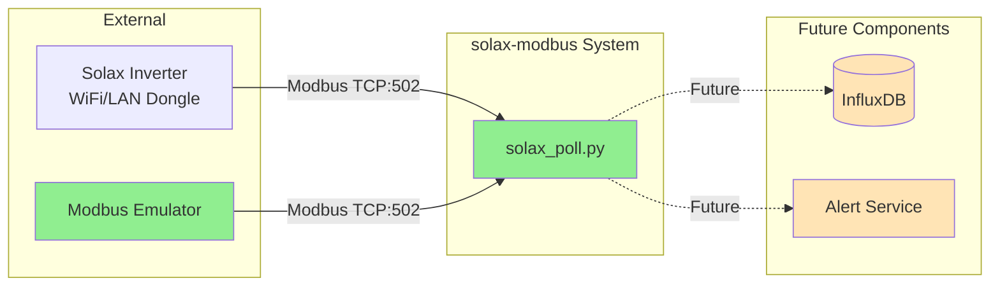
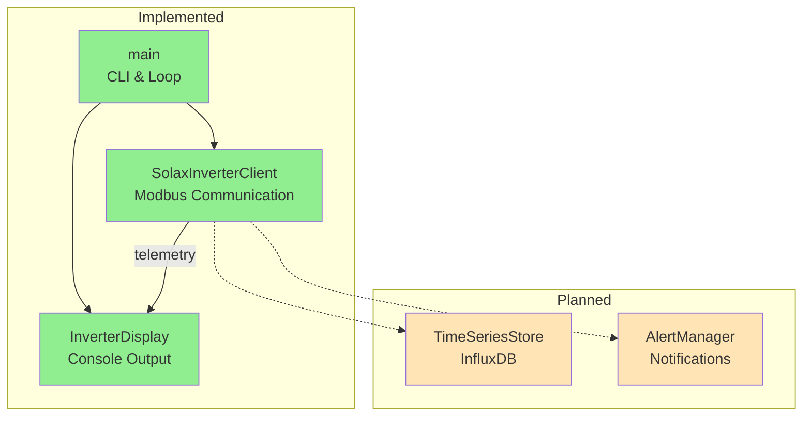
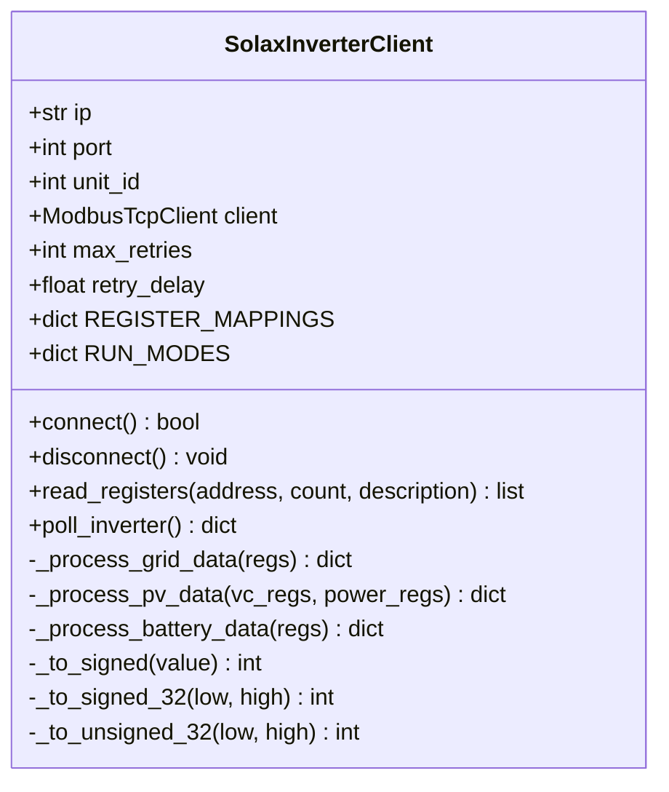
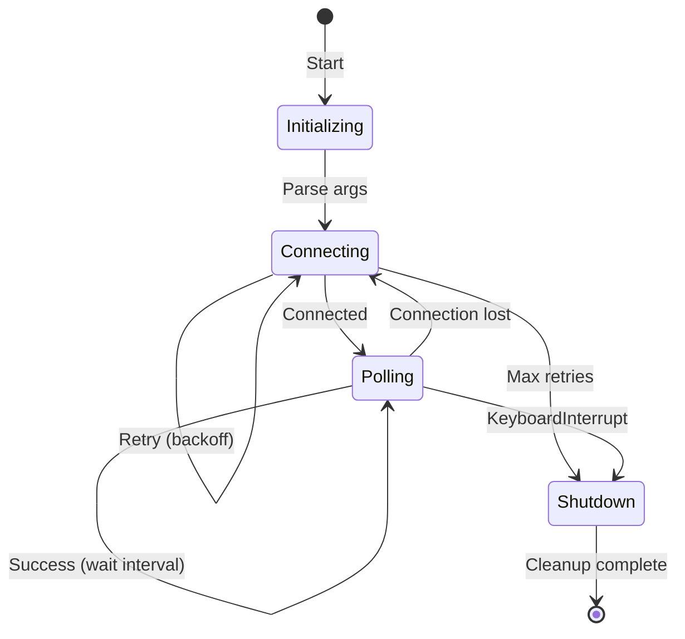

# Master Design Document
# Solax X3 Hybrid Inverter Monitoring System

Created: 2025 December 30

**Document Type:** Tier 1 Master Design  
**Status:** Active  

---

## Table of Contents

- [Project Information](<#project information>)
- [Scope](<#scope>)
- [System Overview](<#system overview>)
- [Architecture](<#architecture>)
- [Implementation Status](<#implementation status>)
- [Components](<#components>)
- [Data Design](<#data design>)
- [Interfaces](<#interfaces>)
- [Error Handling](<#error handling>)
- [Non-Functional Requirements](<#non-functional requirements>)
- [Design Element Cross-References](<#design element cross-references>)
- [Version History](<#version history>)

---

## Project Information

```yaml
project_info:
  name: "solax-modbus"
  version: "0.1.0"
  date: "2025-12-30"
```

[Return to Table of Contents](<#table of contents>)

---

## Scope

### Purpose

Real-time monitoring system for Solax X3 Hybrid 6.0-D solar inverters using Modbus TCP protocol. Eliminates cloud service dependencies and provides local data ownership.

### In Scope

- Data acquisition via Modbus TCP protocol
- Register reading with scaling and type conversion
- Console-based telemetry display
- Modbus TCP emulator for development testing
- Future: Time-series data storage (InfluxDB)
- Future: Monitoring and alerting

### Out of Scope

- Hardware selection and procurement
- Physical network infrastructure
- Web-based user interface
- Cloud integration
- Battery Management System direct interface

### Terminology

| Term | Definition |
|------|------------|
| MPPT | Maximum Power Point Tracking - solar charge optimization |
| SOC | State of Charge - battery capacity percentage |
| Modbus TCP | Ethernet variant of Modbus protocol using TCP/IP |
| Register | 16-bit data storage location in Modbus device |
| Unit ID | Modbus device identifier (slave address) |
| Feed-in | Export of excess solar generation to grid |

[Return to Table of Contents](<#table of contents>)

---

## System Overview

### Description

Modular Python application implementing direct Modbus TCP communication with Solax inverters. Current implementation provides polling and console display. Architecture supports future expansion to storage, monitoring, and control capabilities.

### Context Diagram



**Legend:**
- Green: Implemented
- Orange: Planned

### Primary Functions

| Function | Status | Description |
|----------|--------|-------------|
| Modbus TCP polling | ✓ Implemented | Read inverter registers at configurable intervals |
| Data scaling/conversion | ✓ Implemented | Apply scaling factors, handle signed integers |
| Console display | ✓ Implemented | Formatted statistics output |
| Emulator | ✓ Implemented | Test server with dynamic state simulation |
| Data persistence | ○ Planned | InfluxDB time-series storage |
| Alerting | ○ Planned | Threshold monitoring and notifications |


[Return to Table of Contents](<#table of contents>)

---

## Architecture

### Pattern

Layered architecture with modular separation of concerns.

### Component Relationships



### Technology Stack

```yaml
technology_stack:
  language: "Python 3.9+"
  libraries:
    implemented:
      - "pymodbus 3.5.0+ (Modbus TCP client/server)"
    planned:
      - "influxdb-client 1.38.0+ (time-series database)"
      - "pyyaml 6.0+ (configuration)"
      - "requests (webhook notifications)"
  data_store: "InfluxDB 2.7+ (planned)"
```

### Directory Structure

```
solax-modbus/
├── ai/                       # Governance framework
│   ├── governance.md
│   └── templates/
├── workspace/                # Development artifacts
│   ├── design/
│   ├── change/
│   ├── issues/
│   ├── test/
│   └── trace/
├── docs/                     # Reference documentation
├── src/                      # Source code
│   ├── solax_poll.py         # Main polling client
│   ├── emulator/
│   │   └── solax_emulator.py # Test server
│   └── tests/
│       └── test_solax_poll.py
└── tests/                    # Root test directory
```

### Development Environment

```yaml
development_environment:
  platform: "macOS / Linux"
  python_version: "3.9+"
  toolchain:
    - pytest
    - pymodbus
```

### Target Platform

```yaml
target_platform:
  type: "embedded"
  os: "Debian 12 (Bookworm)"
  architecture: "ARM64 (Raspberry Pi 4)"
  constraints:
    - "Memory: ≤512MB"
    - "CPU: ≤10% sustained"
    - "Network: Local LAN access to inverter"
```

[Return to Table of Contents](<#table of contents>)

---

## Implementation Status

### Implemented Components

| Component | File | Lines | Test Coverage |
|-----------|------|-------|---------------|
| SolaxInverterClient | src/solax_poll.py | 1-218 | Yes |
| InverterDisplay | src/solax_poll.py | 221-310 | Yes |
| main() | src/solax_poll.py | 313-395 | Partial |
| SolaxEmulatorState | src/emulator/solax_emulator.py | Full | No |
| DynamicModbusDataBlock | src/emulator/solax_emulator.py | Full | No |

### Planned Components

| Component | Priority | Dependencies |
|-----------|----------|--------------|
| TimeSeriesStore | High | influxdb-client |
| DataValidator | High | None |
| AlertManager | Medium | smtplib, requests |

[Return to Table of Contents](<#table of contents>)

---

## Components

### SolaxInverterClient (Implemented)

**File:** `src/solax_poll.py`

**Purpose:** Modbus TCP client for inverter communication with retry logic and register processing.

**Responsibilities:**
- Establish TCP connection with exponential backoff retry
- Read input registers via function code 0x04
- Apply scaling factors to raw register values
- Convert signed/unsigned integers
- Process grid, PV, battery, and system telemetry

**Class Diagram:**



**Register Mappings:**

| Name | Address | Count | Description |
|------|---------|-------|-------------|
| grid_data | 0x006A | 12 | Three-phase grid metrics |
| pv_voltage_current | 0x0003 | 4 | PV voltage and current |
| pv_power | 0x000A | 2 | PV power per MPPT |
| battery_data | 0x0014 | 9 | Battery system metrics |
| feed_in_power | 0x0046 | 2 | Grid import/export |
| energy_today | 0x0050 | 1 | Daily generation |
| energy_total | 0x0052 | 2 | Cumulative generation |
| inverter_status | 0x0008 | 2 | Temperature and run mode |

**Error Handling:**
- Connection timeout: Exponential backoff (1s, 2s, 4s), max 3 attempts
- Modbus error: Log and return None
- Exception: Log with traceback, return None

---

### InverterDisplay (Implemented)

**File:** `src/solax_poll.py`

**Purpose:** Format and display inverter telemetry to console.

**Responsibilities:**
- Format multi-section display output
- Calculate derived values (total power)
- Display power flow direction (import/export)
- Handle missing data gracefully

**Output Sections:**
1. System Status (run mode)
2. Grid (three-phase voltage, current, power, frequency)
3. Solar PV Generation (per string and total)
4. Battery System (voltage, current, power, SOC, temperature)
5. Power Flow (grid import/export)
6. Energy Totals (daily and cumulative)
7. Inverter (temperature)

---

### main() (Implemented)

**File:** `src/solax_poll.py`

**Purpose:** Application entry point with CLI and monitoring loop.

**Arguments:**

| Argument | Type | Default | Description |
|----------|------|---------|-------------|
| ip | positional | required | Inverter IP address |
| --port | int | 502 | Modbus TCP port |
| --unit-id | int | 1 | Modbus unit ID |
| --interval | int | 5 | Polling interval (seconds) |
| --debug | flag | false | Enable debug logging |

**State Machine:**



---

### SolaxEmulatorState (Implemented)

**File:** `src/emulator/solax_emulator.py`

**Purpose:** Modbus TCP server emulating Solax X3 Hybrid inverter for testing.

**Responsibilities:**
- Simulate time-based PV power curve (sine wave, peak at noon)
- Model battery charge/discharge behavior
- Update register values dynamically
- Provide holding registers for configuration

**Simulation Parameters:**

| Parameter | Value | Description |
|-----------|-------|-------------|
| PV1_MAX_POWER | 3300W | Peak PV string 1 |
| PV2_MAX_POWER | 3300W | Peak PV string 2 |
| BATTERY_CAPACITY | 10000Wh | Battery capacity |
| BATTERY_VOLTAGE | 51.2V | Nominal voltage |
| GRID_VOLTAGE_NOMINAL | 230V | Grid voltage |
| UPDATE_INTERVAL | 1.0s | State update frequency |

---

### TimeSeriesStore (Planned)

**Purpose:** Persist telemetry to InfluxDB with buffering during outages.

**Responsibilities:**
- Write measurements with nanosecond timestamps
- Buffer data during database unavailability (max 1 hour)
- Enforce retention policies
- Provide query interface for historical data

**Retention Policies:**
- Raw data: 30 days at 1-second resolution
- Aggregated: 1 year at 1-minute resolution
- Statistical: 10 years at 1-hour resolution

---

### AlertManager (Planned)

**Purpose:** Threshold monitoring and notification dispatch.

**Alert Conditions:**

| Condition | Threshold | Severity |
|-----------|-----------|----------|
| Communication failure | >5 timeouts | Critical |
| Battery low | SOC <10% | Warning |
| Battery critical | SOC <5% | Critical |
| Battery over-temp | >50°C | Critical |
| Grid fault | run_mode=3 | Critical |
| Inverter over-temp | >75°C | Warning |

**Notification Channels:**
- Email (SMTP)
- SMS (Twilio API)
- Webhook (HTTP POST)
- Local syslog


[Return to Table of Contents](<#table of contents>)

---

## Data Design

### Entities

#### Measurement

```yaml
Measurement:
  purpose: "Telemetry snapshot from single inverter"
  attributes:
    - timestamp: datetime (UTC, nanosecond precision)
    - inverter_id: string
    - grid_voltage_r: float (V)
    - grid_voltage_s: float (V)
    - grid_voltage_t: float (V)
    - grid_current_r: float (A)
    - grid_current_s: float (A)
    - grid_current_t: float (A)
    - grid_power_r: int (W)
    - grid_power_s: int (W)
    - grid_power_t: int (W)
    - grid_frequency: float (Hz)
    - pv1_voltage: float (V)
    - pv1_current: float (A)
    - pv1_power: int (W)
    - pv2_voltage: float (V)
    - pv2_current: float (A)
    - pv2_power: int (W)
    - battery_voltage: float (V)
    - battery_current: float (A)
    - battery_power: int (W)
    - battery_soc: int (%)
    - battery_temperature: int (°C)
    - feed_in_power: int (W)
    - energy_today: float (kWh)
    - energy_total: float (kWh)
    - inverter_temperature: int (°C)
    - run_mode: string
```

### Validation Rules

| Field | Constraint |
|-------|------------|
| Grid voltage | 180-260V |
| Grid frequency | 45-55Hz |
| PV voltage | 0-600V |
| PV current | 0-20A |
| Battery voltage | 40-60V |
| Battery current | -100 to +100A |
| Battery SOC | 0-100% |
| Temperature | -20 to +80°C |

[Return to Table of Contents](<#table of contents>)

---

## Interfaces

### Internal Interfaces

#### poll_inverter()

```python
def poll_inverter(self) -> Dict[str, Any]:
    """
    Poll all inverter registers and return processed data.
    
    Returns:
        Dictionary containing all inverter metrics with timestamp.
        
    Raises:
        No exceptions raised; errors logged and partial data returned.
    """
```

#### read_registers()

```python
def read_registers(
    self, 
    address: int, 
    count: int, 
    description: str
) -> Optional[list]:
    """
    Read input registers with error handling.
    
    Args:
        address: Starting register address (hex)
        count: Number of registers to read
        description: Description for logging
        
    Returns:
        List of register values or None on error.
    """
```

### External Interfaces

#### Modbus TCP

| Attribute | Value |
|-----------|-------|
| Protocol | Modbus TCP/IP |
| Port | 502 (default) |
| Function codes | 0x04 (read input registers) |
| Timeout | 3 seconds |
| Data format | Big-endian, 16-bit registers |

[Return to Table of Contents](<#table of contents>)

---

## Error Handling

### Exception Strategy

```yaml
strategy:
  connection_errors: "Exponential backoff retry (1s, 2s, 4s), max 3 attempts"
  modbus_errors: "Log error, return None, continue polling"
  runtime_errors: "Log with traceback, attempt recovery"
```

### Logging Configuration

```yaml
logging:
  format: "%(asctime)s - %(name)s - %(levelname)s - %(message)s"
  handlers:
    - StreamHandler (console)
    - FileHandler (solax_poll.log)
  levels:
    default: INFO
    debug_mode: DEBUG
```

[Return to Table of Contents](<#table of contents>)

---

## Non-Functional Requirements

### Performance

| Metric | Target | Current |
|--------|--------|---------|
| Polling interval | ≥1 second | Configurable (default 5s) |
| Modbus latency | <1 second | Achieved |
| Memory footprint | ≤512MB | ~50MB (single inverter) |
| CPU utilization | ≤10% | <5% |

### Reliability

| Requirement | Implementation |
|-------------|----------------|
| Connection retry | Exponential backoff, 3 attempts |
| Graceful shutdown | KeyboardInterrupt handler |
| Partial data handling | Continue with available data |

### Maintainability

| Requirement | Status |
|-------------|--------|
| Type hints | Partial |
| Docstrings | Yes |
| Unit tests | Yes (src/tests/) |
| Logging | Comprehensive |

[Return to Table of Contents](<#table of contents>)

---

## Design Element Cross-References

### Tier 2 Domain Documents

| Domain | Document | Status |
|--------|----------|--------|
| Protocol | [design-8f3a1b2c-domain_protocol.md](<design-8f3a1b2c-domain_protocol.md>) | Active |
| Data | [design-9e4b2c3d-domain_data.md](<design-9e4b2c3d-domain_data.md>) | Active |
| Presentation | [design-af5c3d4e-domain_presentation.md](<design-af5c3d4e-domain_presentation.md>) | Active |
| Application | [design-bf6d4e5f-domain_application.md](<design-bf6d4e5f-domain_application.md>) | Active |

### Tier 3 Component Documents

| Component | Domain | Document | Status |
|-----------|--------|----------|--------|
| SolaxInverterClient | Protocol | [design-c1a2b3d4-component_protocol_client.md](<design-c1a2b3d4-component_protocol_client.md>) | Active |
| SolaxEmulator | Protocol | [design-c2b3c4d5-component_protocol_emulator.md](<design-c2b3c4d5-component_protocol_emulator.md>) | Active |

| DataValidator | Data | [design-a6b7c8d9-component_data_validator.md](<design-a6b7c8d9-component_data_validator.md>) | Active |
| TimeSeriesStore | Data | [design-b7c8d9e0-component_data_storage.md](<design-b7c8d9e0-component_data_storage.md>) | Active |
| DataBuffer | Data | [design-c8d9e0f1-component_data_buffer.md](<design-c8d9e0f1-component_data_buffer.md>) | Active |
| InverterDisplay | Presentation | [design-d3c4d5e6-component_presentation_console.md](<design-d3c4d5e6-component_presentation_console.md>) | Active |
| HTMLRenderer | Presentation | [design-d9e0f1a2-component_presentation_html.md](<design-d9e0f1a2-component_presentation_html.md>) | Active |
| main | Application | [design-e4d5e6f7-component_application_main.md](<design-e4d5e6f7-component_application_main.md>) | Active |
| AlertManager | Application | [design-e0f1a2b3-component_application_alerting.md](<design-e0f1a2b3-component_application_alerting.md>) | Active |
| NotificationDispatcher | Application | design-XXXX-component_application_notifications.md | Planned |

### Source Code Mapping

| Component | File |
|-----------|------|
| SolaxInverterClient | src/solax_poll.py |
| InverterDisplay | src/solax_poll.py |
| main | src/solax_poll.py |
| SolaxEmulatorState | src/emulator/solax_emulator.py |
| DynamicModbusDataBlock | src/emulator/solax_emulator.py |
| Unit tests | src/tests/test_solax_poll.py |

### Reference Documents

| Document | Location |
|----------|----------|
| Solax Protocol V3.21 | docs/ |
| Software Design Specification | docs/solax-modbus-software-design-specification.md |

[Return to Table of Contents](<#table of contents>)

---

## Version History

| Version | Date | Changes |
|---------|---------|---------|
| 1.0 | 2025-12-30 | Initial master design reverse-engineered from source code. Distinguishes implemented vs planned components. |
| 1.1 | 2025-12-30 | Added Tier 2 domain document references: Protocol, Data, Presentation, Application. Updated planned Tier 3 component list. |
| 1.2 | 2025-12-30 | Added Tier 3 component document references for implemented components: SolaxInverterClient, SolaxEmulator, InverterDisplay, main. |
| 1.3 | 2025-12-30 | Added Tier 3 component document references for planned components: InverterController, DataValidator, TimeSeriesStore, DataBuffer, HTMLRenderer, AlertManager, InverterPool. Added NotificationDispatcher and PollingCoordinator as planned. |
| 1.4 | 2026-01-08 | Removed multi-inverter support from scope. Removed InverterPool and PollingCoordinator components. Removed InverterPool section. Updated component diagrams and tables. |
| 1.5 | 2026-01-09 | Removed all control/write operations. System is read-only monitoring only. Removed InverterController component and references. Updated scope, architecture diagrams, and component tables. |

---

Copyright (c) 2025 William Watson. This work is licensed under the MIT License.
