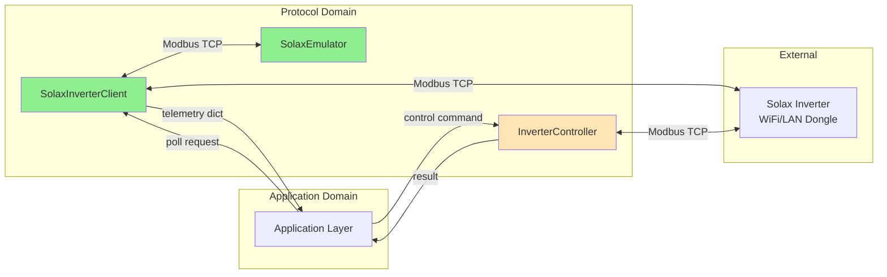
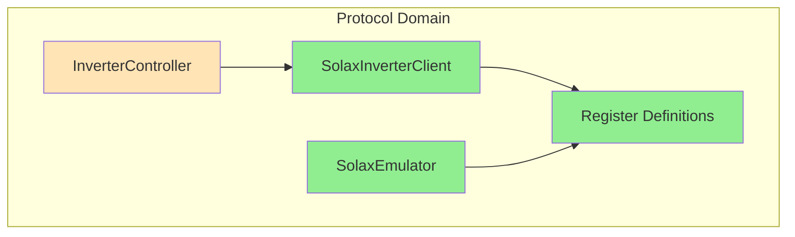
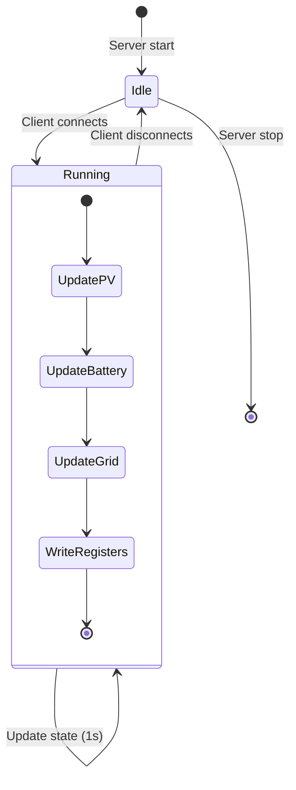

# Domain Design: Protocol

Created: 2025 December 30

**Document Type:** Tier 2 Domain Design  
**Document ID:** design-8f3a1b2c-domain_protocol  
**Parent:** [design-0000-master_solax-modbus](<design-0000-master_solax-modbus.md>)  
**Status:** Active  

---

## Table of Contents

- [Domain Information](<#domain information>)
- [Scope](<#scope>)
- [Domain Overview](<#domain overview>)
- [Architecture](<#architecture>)
- [Components](<#components>)
- [Interfaces](<#interfaces>)
- [Error Handling](<#error handling>)
- [Design Element Cross-References](<#design element cross-references>)
- [Version History](<#version history>)

---

## Domain Information

```yaml
domain_info:
  name: "Protocol"
  version: "1.0"
  date: "2025-12-30"
  parent_document: "design-0000-master_solax-modbus.md"
```

[Return to Table of Contents](<#table of contents>)

---

## Scope

### Purpose

Encapsulate all Modbus TCP communication with Solax inverters. Provides abstraction layer between application logic and protocol-specific implementation details.

### Boundaries

**Owns:**
- Modbus TCP client connection management
- Register read/write operations
- Protocol-level error handling and retry logic
- Data type conversion (signed/unsigned, scaling)
- Emulator for development testing

**Does Not Own:**
- Business logic interpretation of data
- Data persistence
- User interface rendering
- Alerting decisions

### Domain Responsibilities

| Responsibility | Description |
|----------------|-------------|
| Connection lifecycle | Establish, maintain, and terminate TCP connections |
| Register operations | Read input registers, write holding registers |
| Data conversion | Apply scaling factors, handle signed integers |
| Error recovery | Retry with exponential backoff on transient failures |
| Test infrastructure | Provide emulator for offline development |

### Terminology

| Term | Definition |
|------|------------|
| Input Register | Read-only register (function code 0x04) |
| Holding Register | Read-write register (function code 0x03/0x06) |
| Unit ID | Modbus slave address identifier |
| Scaling Factor | Multiplier to convert raw register to engineering units |

[Return to Table of Contents](<#table of contents>)

---

## Domain Overview

### Description

The Protocol domain implements the Modbus TCP client and server (emulator) functionality. It handles all low-level communication with inverter hardware, translating between raw register values and typed Python data structures.

### Context Diagram



**Legend:**
- Green: Implemented
- Orange: Planned

### Primary Functions

| Function | Status | Description |
|----------|--------|-------------|
| Read input registers | ✓ Implemented | Function code 0x04 |
| Connection retry | ✓ Implemented | Exponential backoff |
| Data scaling | ✓ Implemented | Apply register scaling factors |
| Signed conversion | ✓ Implemented | Two's complement handling |
| Emulator server | ✓ Implemented | Dynamic state simulation |
| Write holding registers | ○ Planned | Function code 0x06 |

[Return to Table of Contents](<#table of contents>)

---

## Architecture

### Pattern

Adapter pattern isolating protocol specifics from business logic.

### Component Relationships



### Technology Stack

```yaml
technology_stack:
  language: "Python 3.9+"
  libraries:
    - "pymodbus 3.5.0+ (ModbusTcpClient, StartTcpServer)"
  external_protocol: "Modbus TCP/IP on port 502"
```

### Directory Structure

```
src/
├── solax_poll.py           # SolaxInverterClient
├── emulator/
│   └── solax_emulator.py   # SolaxEmulator
└── controller/             # (planned)
    └── inverter_controller.py
```

[Return to Table of Contents](<#table of contents>)

---

## Components

### Component Summary

| Component | File | Status | Purpose |
|-----------|------|--------|---------|
| SolaxInverterClient | solax_poll.py | Implemented | Modbus TCP client |
| SolaxEmulator | emulator/solax_emulator.py | Implemented | Test server |
| InverterController | controller/inverter_controller.py | Planned | Write operations |

### SolaxInverterClient

**Tier 3 Document:** [design-XXXX-component_protocol_client.md](planned)

**Purpose:** Modbus TCP client with retry logic and register processing.

**Key Responsibilities:**
- TCP connection with exponential backoff
- Read input registers (0x04)
- Apply scaling factors from REGISTER_MAPPINGS
- Convert signed/unsigned 16-bit and 32-bit integers

**Register Groups:**

| Group | Address | Count | Description |
|-------|---------|-------|-------------|
| grid_data | 0x006A | 12 | Three-phase metrics |
| pv_voltage_current | 0x0003 | 4 | PV string data |
| pv_power | 0x000A | 2 | PV power per MPPT |
| battery_data | 0x0014 | 9 | Battery system |
| feed_in_power | 0x0046 | 2 | Grid import/export |
| energy_today | 0x0050 | 1 | Daily generation |
| energy_total | 0x0052 | 2 | Cumulative generation |
| inverter_status | 0x0008 | 2 | Temperature, run mode |

---

### SolaxEmulator

**Tier 3 Document:** [design-XXXX-component_protocol_emulator.md](planned)

**Purpose:** Modbus TCP server emulating Solax X3 Hybrid inverter.

**Key Responsibilities:**
- Serve holding and input registers
- Simulate time-based PV power curve
- Model battery charge/discharge behavior
- Provide realistic test data

**State Machine:**



---

### InverterController (Planned)

**Tier 3 Document:** [design-XXXX-component_protocol_controller.md](planned)

**Purpose:** Execute write operations to inverter holding registers.

**Key Responsibilities:**
- Write holding registers (0x06)
- Validate values against constraints
- Provide audit logging interface
- Support rollback on failure

**Writable Registers:**

| Address | Name | Range | Description |
|---------|------|-------|-------------|
| 0x001F | Operating Mode | 0-3 | Self-use, Feed-in, Backup, Manual |
| 0x0020 | Charge Start Hour | 0-23 | Hour |
| 0x0021 | Charge Start Minute | 0-59 | Minute |
| 0x0022 | Charge End Hour | 0-23 | Hour |
| 0x0023 | Charge End Minute | 0-59 | Minute |
| 0x0028 | Charge Power Limit | 0-6000 | Watts |
| 0x0029 | Discharge Power Limit | 0-6000 | Watts |

[Return to Table of Contents](<#table of contents>)

---

## Interfaces

### Domain Interface

The Protocol domain exposes a single primary interface to other domains:

```python
class ProtocolInterface:
    """Abstract interface for Protocol domain operations."""
    
    def connect(self) -> bool:
        """Establish connection to inverter."""
        
    def disconnect(self) -> None:
        """Close connection."""
        
    def poll_inverter(self) -> Dict[str, Any]:
        """Read all telemetry registers and return processed data."""
        
    def write_register(self, address: int, value: int) -> bool:
        """Write value to holding register (planned)."""
```

### Internal Interfaces

#### read_registers()

```python
def read_registers(
    self, 
    address: int, 
    count: int, 
    description: str
) -> Optional[List[int]]:
    """
    Read input registers from inverter.
    
    Args:
        address: Starting register address
        count: Number of registers to read
        description: Description for logging
        
    Returns:
        List of raw register values, or None on error.
    """
```

#### Scaling Functions

```python
def _to_signed(self, value: int) -> int:
    """Convert unsigned 16-bit to signed."""

def _to_signed_32(self, low: int, high: int) -> int:
    """Convert two registers to signed 32-bit."""

def _to_unsigned_32(self, low: int, high: int) -> int:
    """Convert two registers to unsigned 32-bit."""
```

### External Interface

| Attribute | Value |
|-----------|-------|
| Protocol | Modbus TCP/IP |
| Port | 502 (configurable) |
| Function Codes | 0x04 (read input), 0x03 (read holding), 0x06 (write single) |
| Timeout | 3 seconds |
| Byte Order | Big-endian |
| Word Order | Big-endian |

[Return to Table of Contents](<#table of contents>)

---

## Error Handling

### Exception Strategy

| Error Type | Handling |
|------------|----------|
| Connection timeout | Exponential backoff (1s, 2s, 4s), max 3 attempts |
| Connection refused | Log error, return failure status |
| Modbus exception | Log error code, return None for affected data |
| Invalid response | Log warning, skip processing |

### Modbus Exception Codes

| Code | Name | Handling |
|------|------|----------|
| 0x01 | Illegal Function | Log error, report to caller |
| 0x02 | Illegal Data Address | Log error, check register map |
| 0x03 | Illegal Data Value | Log error, validate input |
| 0x04 | Slave Device Failure | Retry with backoff |

### Logging

```yaml
logging:
  module: "solax_modbus.protocol"
  levels:
    - DEBUG: Register read details, raw values
    - INFO: Connection events, poll cycles
    - WARNING: Retry attempts, partial data
    - ERROR: Connection failures, Modbus exceptions
  format: "%(asctime)s - %(name)s - %(levelname)s - %(message)s"
```

[Return to Table of Contents](<#table of contents>)

---

## Design Element Cross-References

### Parent Document

- [design-0000-master_solax-modbus.md](<design-0000-master_solax-modbus.md>)

### Tier 3 Component Documents

| Component | Document | Status |
|-----------|----------|--------|
| SolaxInverterClient | [design-c1a2b3d4-component_protocol_client.md](<design-c1a2b3d4-component_protocol_client.md>) | Active |
| SolaxEmulator | [design-c2b3c4d5-component_protocol_emulator.md](<design-c2b3c4d5-component_protocol_emulator.md>) | Active |
| InverterController | [design-f5e6f7a8-component_protocol_controller.md](<design-f5e6f7a8-component_protocol_controller.md>) | Active |

### Sibling Domain Documents

| Domain | Document |
|--------|----------|
| Data | [design-9e4b2c3d-domain_data.md](<design-9e4b2c3d-domain_data.md>) |
| Presentation | [design-af5c3d4e-domain_presentation.md](<design-af5c3d4e-domain_presentation.md>) |
| Application | [design-bf6d4e5f-domain_application.md](<design-bf6d4e5f-domain_application.md>) |

### Source Code Mapping

| Component | File |
|-----------|------|
| SolaxInverterClient | src/solax_poll.py |
| SolaxEmulator | src/emulator/solax_emulator.py |
| InverterController | src/controller/inverter_controller.py (planned) |

### Reference Documents

| Document | Location |
|----------|----------|
| Solax Protocol V3.21 | docs/ |

[Return to Table of Contents](<#table of contents>)

---

## Version History

| Version | Date | Changes |
|---------|------|---------|
| 1.0 | 2025-12-30 | Initial domain design |
| 1.1 | 2025-12-30 | Added Tier 3 component document references |
| 1.2 | 2025-12-30 | Added InverterController component document |

---

Copyright (c) 2025 William Watson. This work is licensed under the MIT License.
