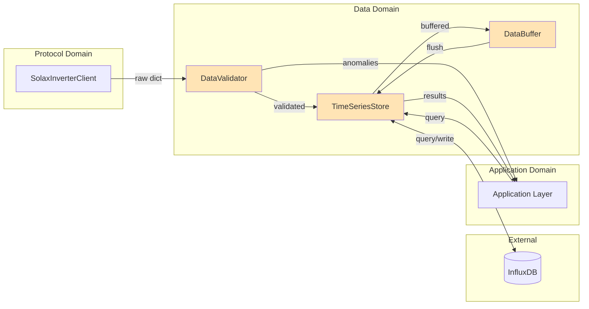
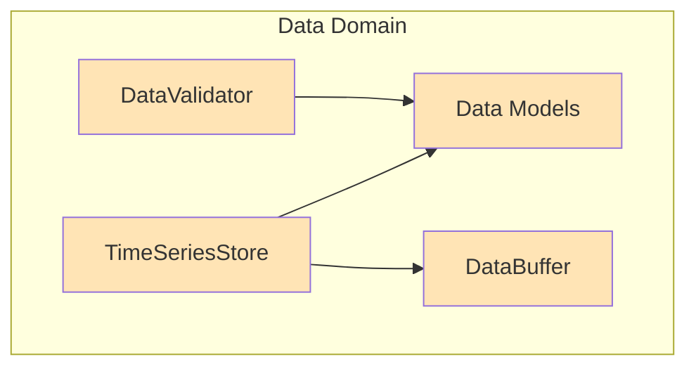
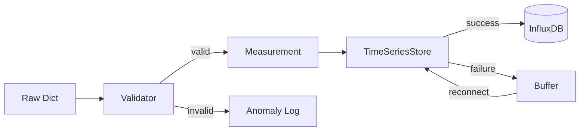

# Domain Design: Data

Created: 2025 December 30

**Document Type:** Tier 2 Domain Design  
**Document ID:** design-9e4b2c3d-domain_data  
**Parent:** [design-0000-master_solax-modbus](<design-0000-master_solax-modbus.md>)  
**Status:** Active  

---

## Table of Contents

- [Domain Information](<#domain information>)
- [Scope](<#scope>)
- [Domain Overview](<#domain overview>)
- [Architecture](<#architecture>)
- [Components](<#components>)
- [Data Design](<#data design>)
- [Interfaces](<#interfaces>)
- [Error Handling](<#error handling>)
- [Design Element Cross-References](<#design element cross-references>)
- [Version History](<#version history>)

---

## Domain Information

```yaml
domain_info:
  name: "Data"
  version: "1.0"
  date: "2025-12-30"
  parent_document: "design-0000-master_solax-modbus.md"
```

[Return to Table of Contents](<#table of contents>)

---

## Scope

### Purpose

Manage data validation, transformation, and persistence. Ensures data quality before storage and provides query interface for historical data retrieval.

### Boundaries

**Owns:**
- Data validation against expected ranges
- Data model definitions
- Time-series database interface
- Data buffering during outages
- Retention policy enforcement
- Derived metric calculations

**Does Not Own:**
- Raw data acquisition (Protocol domain)
- Display formatting (Presentation domain)
- Alert threshold evaluation (Application domain)

### Domain Responsibilities

| Responsibility | Description |
|----------------|-------------|
| Validation | Verify measurements against physical constraints |
| Persistence | Store validated data to InfluxDB |
| Buffering | Queue measurements during database unavailability |
| Queries | Provide interface for historical data retrieval |
| Calculations | Compute derived metrics (totals, efficiencies) |

### Terminology

| Term | Definition |
|------|------------|
| Measurement | Single telemetry snapshot with timestamp |
| Retention Policy | Rules for data aging and deletion |
| Downsampling | Aggregation of fine-grained data to coarser resolution |
| Anomaly | Value outside expected physical range |

[Return to Table of Contents](<#table of contents>)

---

## Domain Overview

### Description

The Data domain provides the data management layer between raw protocol data and application logic. It validates incoming measurements, persists them to time-series storage, and provides query capabilities for historical analysis.

### Context Diagram



**Legend:**
- Orange: Planned

### Primary Functions

| Function | Status | Description |
|----------|--------|-------------|
| Data validation | ○ Planned | Range checks, anomaly detection |
| Database write | ○ Planned | InfluxDB persistence |
| Database query | ○ Planned | Historical data retrieval |
| Data buffering | ○ Planned | Queue during outages |
| Retention enforcement | ○ Planned | Age-based data deletion |

[Return to Table of Contents](<#table of contents>)

---

## Architecture

### Pattern

Repository pattern with data transfer objects.

### Component Relationships



### Technology Stack

```yaml
technology_stack:
  language: "Python 3.9+"
  libraries:
    - "influxdb-client 1.38.0+ (InfluxDB v2 API)"
    - "dataclasses (data models)"
  data_store: "InfluxDB 2.7+"
```

### Directory Structure

```
src/
├── data/
│   ├── __init__.py
│   ├── models.py           # Data models
│   ├── validator.py        # DataValidator
│   ├── storage.py          # TimeSeriesStore
│   └── buffer.py           # DataBuffer
```

[Return to Table of Contents](<#table of contents>)

---

## Components

### Component Summary

| Component | File | Status | Purpose |
|-----------|------|--------|---------|
| DataValidator | data/validator.py | Planned | Range validation |
| TimeSeriesStore | data/storage.py | Planned | InfluxDB interface |
| DataBuffer | data/buffer.py | Planned | Outage buffering |
| Data Models | data/models.py | Planned | Data structures |

### DataValidator

**Tier 3 Document:** [design-XXXX-component_data_validator.md](planned)

**Purpose:** Validate telemetry data against expected physical ranges.

**Key Responsibilities:**
- Validate measurements against physical constraints
- Flag out-of-range values as anomalies
- Detect sensor failures (stuck values)
- Calculate data quality scores

**Validation Rules:**

| Field | Min | Max | Unit |
|-------|-----|-----|------|
| Grid voltage | 180 | 260 | V |
| Grid frequency | 45 | 55 | Hz |
| PV voltage | 0 | 600 | V |
| PV current | 0 | 20 | A |
| Battery voltage | 40 | 60 | V |
| Battery current | -100 | 100 | A |
| Battery SOC | 0 | 100 | % |
| Temperature | -20 | 80 | °C |

---

### TimeSeriesStore

**Tier 3 Document:** [design-XXXX-component_data_storage.md](planned)

**Purpose:** Interface to InfluxDB for data persistence and retrieval.

**Key Responsibilities:**
- Write measurements with nanosecond timestamps
- Execute queries for historical data
- Manage retention policies
- Handle connection failures gracefully

**Retention Policies:**

| Policy | Resolution | Duration |
|--------|------------|----------|
| raw | 1 second | 30 days |
| aggregated_1m | 1 minute | 1 year |
| aggregated_1h | 1 hour | 10 years |

**Database Schema:**

```
measurement: inverter_telemetry
tags:
  - inverter_id: string
  - location: string
fields:
  - pv_power_total: float
  - pv1_voltage: float
  - pv1_current: float
  - pv2_voltage: float
  - pv2_current: float
  - battery_voltage: float
  - battery_current: float
  - battery_power: int
  - battery_soc: int
  - battery_temperature: int
  - grid_voltage_r: float
  - grid_current_r: float
  - grid_power_r: float
  - feedin_power: int
  - run_mode: int
timestamp: nanosecond precision
```

---

### DataBuffer

**Tier 3 Document:** [design-XXXX-component_data_buffer.md](planned)

**Purpose:** In-memory buffer for measurements during database outages.

**Key Responsibilities:**
- Queue measurements when database unavailable
- Flush buffer on reconnection
- Enforce maximum buffer size and age
- Prevent data loss during transient outages

**Constraints:**

| Parameter | Value |
|-----------|-------|
| Max size | 3600 measurements (1 hour at 1s interval) |
| Max age | 1 hour |
| Overflow behavior | Drop oldest |

[Return to Table of Contents](<#table of contents>)

---

## Data Design

### Entities

#### Measurement

```python
@dataclass
class Measurement:
    """Single telemetry snapshot from inverter."""
    timestamp: datetime
    inverter_id: str
    
    # Grid
    grid_voltage_r: float
    grid_voltage_s: float
    grid_voltage_t: float
    grid_current_r: float
    grid_current_s: float
    grid_current_t: float
    grid_power_r: int
    grid_power_s: int
    grid_power_t: int
    grid_frequency: float
    
    # PV
    pv1_voltage: float
    pv1_current: float
    pv1_power: int
    pv2_voltage: float
    pv2_current: float
    pv2_power: int
    
    # Battery
    battery_voltage: float
    battery_current: float
    battery_power: int
    battery_soc: int
    battery_temperature: int
    
    # System
    feed_in_power: int
    energy_today: float
    energy_total: float
    inverter_temperature: int
    run_mode: str
```

#### ValidationResult

```python
@dataclass
class ValidationResult:
    """Result of data validation."""
    is_valid: bool
    anomalies: List[str]
    quality_score: float  # 0.0 to 1.0
```

### Data Flow



[Return to Table of Contents](<#table of contents>)

---

## Interfaces

### Domain Interface

```python
class DataInterface:
    """Abstract interface for Data domain operations."""
    
    def validate(self, data: Dict[str, Any]) -> ValidationResult:
        """Validate raw telemetry data."""
        
    def store(self, measurement: Measurement) -> bool:
        """Persist measurement to database."""
        
    def query(
        self, 
        inverter_id: str,
        start: datetime, 
        end: datetime,
        fields: List[str]
    ) -> List[Measurement]:
        """Query historical measurements."""
        
    def get_latest(self, inverter_id: str) -> Optional[Measurement]:
        """Get most recent measurement."""
```

### Internal Interfaces

#### DataValidator

```python
def validate_metrics(self, data: Dict[str, Any]) -> ValidationResult:
    """
    Validate telemetry data against expected ranges.
    
    Args:
        data: Raw telemetry dictionary from Protocol domain
        
    Returns:
        ValidationResult with validity status and anomaly list.
    """

def check_range(
    self, 
    value: float, 
    min_val: float, 
    max_val: float,
    field_name: str
) -> Optional[str]:
    """
    Check if value is within expected range.
    
    Returns:
        Anomaly description if out of range, None if valid.
    """
```

#### TimeSeriesStore

```python
def write_measurement(self, measurement: Measurement) -> bool:
    """
    Write single measurement to database.
    
    Returns:
        True on success, False on failure (measurement buffered).
    """

def write_batch(self, measurements: List[Measurement]) -> int:
    """
    Write multiple measurements to database.
    
    Returns:
        Count of successfully written measurements.
    """

def query(
    self,
    start: datetime,
    end: datetime,
    inverter_id: str,
    fields: Optional[List[str]] = None
) -> List[Measurement]:
    """
    Query historical measurements.
    
    Args:
        start: Query start time (inclusive)
        end: Query end time (exclusive)
        inverter_id: Filter by inverter
        fields: Specific fields to retrieve (None = all)
        
    Returns:
        List of measurements in chronological order.
    """
```

[Return to Table of Contents](<#table of contents>)

---

## Error Handling

### Exception Strategy

| Error Type | Handling |
|------------|----------|
| Validation failure | Return ValidationResult with anomalies |
| Database unavailable | Buffer measurement, retry on interval |
| Buffer overflow | Drop oldest measurements, log warning |
| Query timeout | Return empty list, log error |

### Logging

```yaml
logging:
  module: "solax_modbus.data"
  levels:
    - DEBUG: Validation details, query execution
    - INFO: Storage events, buffer status
    - WARNING: Validation anomalies, buffer overflow
    - ERROR: Database connection failures
  format: "%(asctime)s - %(name)s - %(levelname)s - %(message)s"
```

[Return to Table of Contents](<#table of contents>)

---

## Design Element Cross-References

### Parent Document

- [design-0000-master_solax-modbus.md](<design-0000-master_solax-modbus.md>)

### Tier 3 Component Documents

| Component | Document | Status |
|-----------|----------|--------|
| DataValidator | [design-a6b7c8d9-component_data_validator.md](<design-a6b7c8d9-component_data_validator.md>) | Active |
| TimeSeriesStore | [design-b7c8d9e0-component_data_storage.md](<design-b7c8d9e0-component_data_storage.md>) | Active |
| DataBuffer | [design-c8d9e0f1-component_data_buffer.md](<design-c8d9e0f1-component_data_buffer.md>) | Active |

### Sibling Domain Documents

| Domain | Document |
|--------|----------|
| Protocol | [design-8f3a1b2c-domain_protocol.md](<design-8f3a1b2c-domain_protocol.md>) |
| Presentation | [design-af5c3d4e-domain_presentation.md](<design-af5c3d4e-domain_presentation.md>) |
| Application | [design-bf6d4e5f-domain_application.md](<design-bf6d4e5f-domain_application.md>) |

### Source Code Mapping

| Component | File |
|-----------|------|
| Data Models | src/data/models.py (planned) |
| DataValidator | src/data/validator.py (planned) |
| TimeSeriesStore | src/data/storage.py (planned) |
| DataBuffer | src/data/buffer.py (planned) |

[Return to Table of Contents](<#table of contents>)

---

## Version History

| Version | Date | Changes |
|---------|------|---------|
| 1.0 | 2025-12-30 | Initial domain design |
| 1.1 | 2025-12-30 | Added Tier 3 component document references |

---

Copyright (c) 2025 William Watson. This work is licensed under the MIT License.
