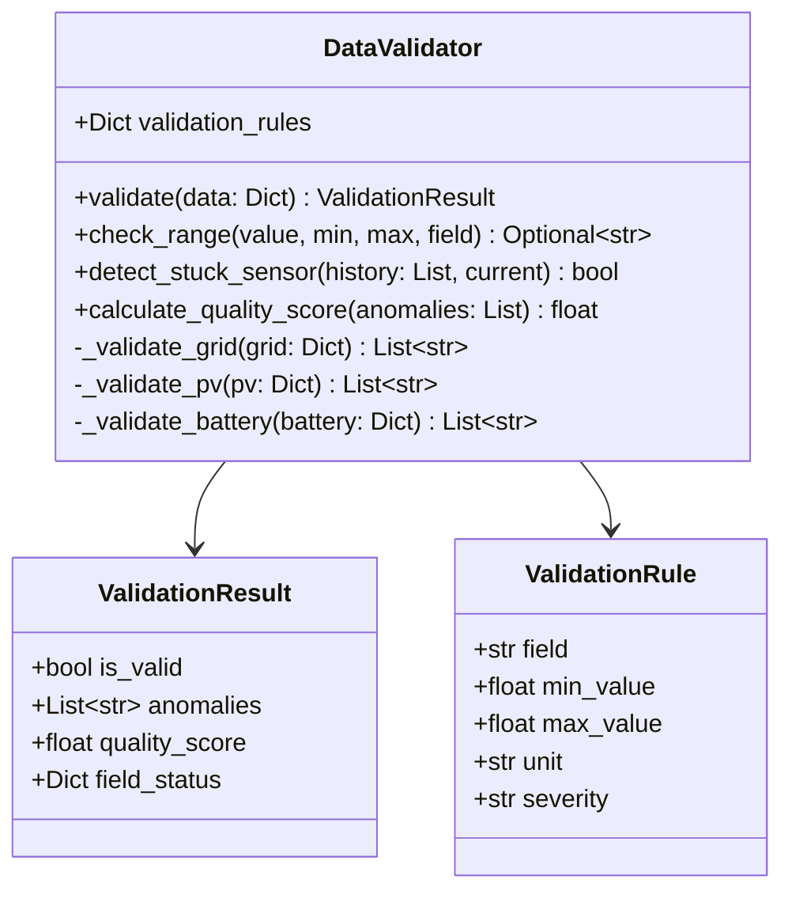

# Component Design: DataValidator

Created: 2025 December 30

**Document Type:** Tier 3 Component Design  
**Document ID:** design-a6b7c8d9-component_data_validator  
**Parent:** [design-9e4b2c3d-domain_data.md](<design-9e4b2c3d-domain_data.md>)  
**Status:** Planned  

---

## Table of Contents

- [Component Information](<#component information>)
- [Purpose](<#purpose>)
- [Implementation](<#implementation>)
- [Class Design](<#class design>)
- [Validation Rules](<#validation rules>)
- [Interfaces](<#interfaces>)
- [Error Handling](<#error handling>)
- [Design Element Cross-References](<#design element cross-references>)
- [Version History](<#version history>)

---

## Component Information

```yaml
component_info:
  name: "DataValidator"
  domain: "Data"
  version: "1.0"
  date: "2025-12-30"
  status: "Planned"
  source_file: "src/data/validator.py"
```

[Return to Table of Contents](<#table of contents>)

---

## Purpose

Validate telemetry data against expected physical ranges. Identifies anomalies, sensor failures, and data quality issues before storage.

### Responsibilities

| Responsibility | Description |
|----------------|-------------|
| Range validation | Check values against physical limits |
| Anomaly detection | Identify out-of-range measurements |
| Quality scoring | Calculate data quality metrics |
| Sensor failure detection | Identify stuck or invalid sensors |

### Design Principles

| Principle | Implementation |
|-----------|----------------|
| Non-destructive | Validation does not modify data |
| Comprehensive | All fields validated |
| Configurable | Thresholds adjustable |

[Return to Table of Contents](<#table of contents>)

---

## Implementation

### File Location

```
src/data/validator.py (planned)
```

### Dependencies

```yaml
dependencies:
  external: []
  internal:
    - "data.models.Measurement"
  standard_library:
    - "logging"
    - "dataclasses"
    - "typing"
```

[Return to Table of Contents](<#table of contents>)

---

## Class Design

### Class Diagram



### ValidationResult Dataclass

```python
@dataclass
class ValidationResult:
    """Result of data validation."""
    is_valid: bool           # True if no critical anomalies
    anomalies: List[str]     # List of anomaly descriptions
    quality_score: float     # 0.0 to 1.0
    field_status: Dict[str, str]  # Per-field status
```

[Return to Table of Contents](<#table of contents>)

---

## Validation Rules

### Physical Range Constraints

#### Grid Parameters

| Field | Min | Max | Unit | Severity |
|-------|-----|-----|------|----------|
| voltage_r/s/t | 180 | 270 | V | Warning |
| current_r/s/t | -100 | 100 | A | Warning |
| power_r/s/t | -10000 | 10000 | W | Warning |
| frequency | 45 | 55 | Hz | Critical |

#### PV Parameters

| Field | Min | Max | Unit | Severity |
|-------|-----|-----|------|----------|
| pv1_voltage | 0 | 600 | V | Warning |
| pv2_voltage | 0 | 600 | V | Warning |
| pv1_current | 0 | 20 | A | Warning |
| pv2_current | 0 | 20 | A | Warning |
| pv1_power | 0 | 6600 | W | Warning |
| pv2_power | 0 | 6600 | W | Warning |

#### Battery Parameters

| Field | Min | Max | Unit | Severity |
|-------|-----|-----|------|----------|
| voltage | 40 | 60 | V | Warning |
| current | -150 | 150 | A | Warning |
| power | -6000 | 6000 | W | Warning |
| soc | 0 | 100 | % | Critical |
| temperature | -20 | 60 | °C | Critical |

#### System Parameters

| Field | Min | Max | Unit | Severity |
|-------|-----|-----|------|----------|
| inverter_temperature | -20 | 85 | °C | Warning |
| feed_in_power | -15000 | 15000 | W | Warning |

### Logical Constraints

| Constraint | Rule | Severity |
|------------|------|----------|
| PV power consistency | power ≈ voltage × current (±10%) | Warning |
| Battery power sign | power sign matches current sign | Warning |
| SOC bounds | If SOC=0, discharge power=0 | Warning |
| Grid balance | Sum of phase powers ≈ total (±5%) | Info |

[Return to Table of Contents](<#table of contents>)

---

## Interfaces

### Public Methods

#### validate()

```python
def validate(self, data: Dict[str, Any]) -> ValidationResult:
    """
    Validate telemetry data against all rules.
    
    Args:
        data: Telemetry dictionary from poll_inverter()
        
    Returns:
        ValidationResult with validity status, anomalies, and score.
    """
```

#### check_range()

```python
def check_range(
    self,
    value: float,
    min_val: float,
    max_val: float,
    field_name: str
) -> Optional[str]:
    """
    Check if value is within expected range.
    
    Args:
        value: Value to check
        min_val: Minimum allowed value
        max_val: Maximum allowed value
        field_name: Field name for error message
        
    Returns:
        Anomaly description if out of range, None if valid.
    """
```

#### detect_stuck_sensor()

```python
def detect_stuck_sensor(
    self,
    history: List[float],
    current: float,
    threshold: int = 10
) -> bool:
    """
    Detect if sensor value has not changed.
    
    Args:
        history: Recent historical values
        current: Current value
        threshold: Number of identical readings to flag
        
    Returns:
        True if sensor appears stuck.
    """
```

#### calculate_quality_score()

```python
def calculate_quality_score(
    self,
    anomalies: List[str]
) -> float:
    """
    Calculate overall data quality score.
    
    Args:
        anomalies: List of detected anomalies
        
    Returns:
        Score from 0.0 (all invalid) to 1.0 (all valid).
    """
```

[Return to Table of Contents](<#table of contents>)

---

## Error Handling

### Validation Errors

| Error Type | Handling |
|------------|----------|
| Missing field | Add to anomalies, reduce quality score |
| Out of range | Add to anomalies with severity |
| Type error | Log warning, treat as missing |

### Logging

```python
# Log levels
# DEBUG: Individual field validation results
# INFO: Validation summary
# WARNING: Anomalies detected
# ERROR: Validation failures
```

[Return to Table of Contents](<#table of contents>)

---

## Design Element Cross-References

### Parent Documents

- Domain: [design-9e4b2c3d-domain_data.md](<design-9e4b2c3d-domain_data.md>)
- Master: [design-0000-master_solax-modbus.md](<design-0000-master_solax-modbus.md>)

### Sibling Components (Data Domain)

| Component | Document |
|-----------|----------|
| TimeSeriesStore | [design-b7c8d9e0-component_data_storage.md](<design-b7c8d9e0-component_data_storage.md>) |
| DataBuffer | [design-c8d9e0f1-component_data_buffer.md](<design-c8d9e0f1-component_data_buffer.md>) |

### Source Code

| Item | Location |
|------|----------|
| Module | src/data/validator.py (planned) |

[Return to Table of Contents](<#table of contents>)

---

## Version History

| Version | Date | Changes |
|---------|------|---------|
| 1.0 | 2025-12-30 | Initial component design for planned validator |

---

Copyright (c) 2025 William Watson. This work is licensed under the MIT License.
