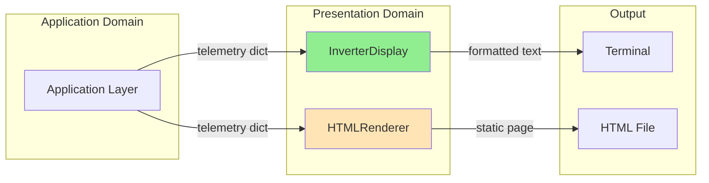
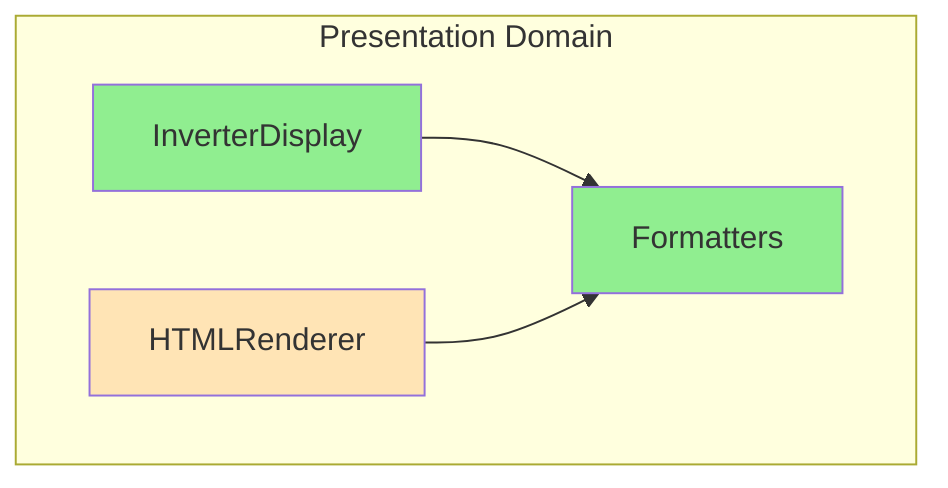

# Domain Design: Presentation

Created: 2025 December 30

**Document Type:** Tier 2 Domain Design  
**Document ID:** design-af5c3d4e-domain_presentation  
**Parent:** [design-0000-master_solax-modbus](<design-0000-master_solax-modbus.md>)  
**Status:** Active  

---

## Table of Contents

- [Domain Information](<#domain information>)
- [Scope](<#scope>)
- [Domain Overview](<#domain overview>)
- [Architecture](<#architecture>)
- [Components](<#components>)
- [Interfaces](<#interfaces>)
- [Error Handling](<#error handling>)
- [Design Element Cross-References](<#design element cross-references>)
- [Version History](<#version history>)

---

## Domain Information

```yaml
domain_info:
  name: "Presentation"
  version: "1.0"
  date: "2025-12-30"
  parent_document: "design-0000-master_solax-modbus.md"
```

[Return to Table of Contents](<#table of contents>)

---

## Scope

### Purpose

Render telemetry data for human consumption. Provides formatted output through console display and planned HTML interface.

### Boundaries

**Owns:**
- Console output formatting
- HTML page generation (planned)
- Display layout and sections
- Unit formatting and labels

**Does Not Own:**
- Data acquisition (Protocol domain)
- Data validation (Data domain)
- Application control flow (Application domain)

### Domain Responsibilities

| Responsibility | Description |
|----------------|-------------|
| Console display | Format and print telemetry to terminal |
| HTML generation | Render data as static HTML page (planned) |
| Value formatting | Apply units, precision, directional indicators |
| Section organization | Group related metrics logically |

### Terminology

| Term | Definition |
|------|------------|
| Display Section | Logical grouping of related metrics |
| Power Flow | Direction indication for grid import/export |
| Run Mode | Human-readable inverter state |

[Return to Table of Contents](<#table of contents>)

---

## Domain Overview

### Description

The Presentation domain transforms raw telemetry dictionaries into formatted human-readable output. Current implementation provides console display; future extension adds HTML rendering for local web access.

### Context Diagram



**Legend:**
- Green: Implemented
- Orange: Planned

### Primary Functions

| Function | Status | Description |
|----------|--------|-------------|
| Console display | ✓ Implemented | Formatted terminal output |
| Value formatting | ✓ Implemented | Units, precision, labels |
| Section grouping | ✓ Implemented | Logical metric organization |
| HTML rendering | ○ Planned | Static web page generation |

[Return to Table of Contents](<#table of contents>)

---

## Architecture

### Pattern

View layer with formatter utilities.

### Component Relationships



### Technology Stack

```yaml
technology_stack:
  language: "Python 3.9+"
  libraries:
    implemented:
      - "Standard library (print, string formatting)"
    planned:
      - "jinja2 (HTML templating)"
```

### Directory Structure

```
src/
├── main.py                 # InverterDisplay (current location)
├── presentation/           # (planned refactor)
│   ├── __init__.py
│   ├── console.py          # InverterDisplay
│   ├── html.py             # HTMLRenderer
│   ├── formatters.py       # Shared formatters
│   └── templates/
│       └── dashboard.html
```

[Return to Table of Contents](<#table of contents>)

---

## Components

### Component Summary

| Component | File | Status | Purpose |
|-----------|------|--------|---------|
| InverterDisplay | main.py | Implemented | Console output |
| HTMLRenderer | presentation/html.py | Planned | Web page generation |
| Formatters | presentation/formatters.py | Partial | Value formatting |

### InverterDisplay

**Tier 3 Document:** [design-XXXX-component_presentation_console.md](planned)

**Purpose:** Format and display inverter telemetry to console.

**Key Responsibilities:**
- Format multi-section display output
- Calculate derived values (total power)
- Display power flow direction (import/export)
- Handle missing data gracefully

**Display Sections:**

| Section | Fields |
|---------|--------|
| System Status | Run mode |
| Grid | Voltage (R/S/T), Current (R/S/T), Power (R/S/T), Frequency |
| Solar PV | String voltages, currents, powers, total |
| Battery | Voltage, current, power, SOC, temperature |
| Power Flow | Grid import/export with direction |
| Energy | Today, cumulative |
| Inverter | Temperature |

**Output Format:**

```
========================================
     SOLAX INVERTER TELEMETRY
     2025-12-30 14:30:45
========================================

SYSTEM STATUS
  Run Mode:          Normal

GRID
  Voltage:           R: 230.1V  S: 229.8V  T: 230.3V
  Current:           R:   5.2A  S:   5.1A  T:   5.3A
  Power:             R: 1200W   S: 1170W   T: 1210W
  Frequency:         50.02 Hz

SOLAR PV GENERATION
  String 1:          385V × 8.5A = 3274W
  String 2:          0V × 0.0A = 0W
  Total PV Power:    3274W

BATTERY SYSTEM
  Voltage:           51.2V
  Current:           -10.5A (Discharging)
  Power:             -538W
  State of Charge:   75%
  Temperature:       22°C

POWER FLOW
  Grid:              Exporting 244W

ENERGY TOTALS
  Today:             12.5 kWh
  Total:             1234.5 kWh

INVERTER
  Temperature:       35°C

========================================
```

---

### HTMLRenderer (Planned)

**Tier 3 Document:** [design-XXXX-component_presentation_html.md](planned)

**Purpose:** Generate static HTML dashboard page.

**Key Responsibilities:**
- Render telemetry to HTML template
- Generate self-contained single-file output
- Support periodic refresh via meta tag
- Provide minimal CSS styling

**Template Structure:**

```html
<!DOCTYPE html>
<html>
<head>
    <title>Solax Inverter Dashboard</title>
    <meta http-equiv="refresh" content="5">
    <style>/* inline CSS */</style>
</head>
<body>
    <h1>Inverter Telemetry</h1>
    <section id="grid">...</section>
    <section id="pv">...</section>
    <section id="battery">...</section>
    <section id="energy">...</section>
    <footer>Last updated: {{ timestamp }}</footer>
</body>
</html>
```

[Return to Table of Contents](<#table of contents>)

---

## Interfaces

### Domain Interface

```python
class PresentationInterface:
    """Abstract interface for Presentation domain operations."""
    
    def display_console(self, data: Dict[str, Any]) -> None:
        """Render telemetry to console."""
        
    def render_html(self, data: Dict[str, Any], output_path: str) -> bool:
        """Render telemetry to HTML file (planned)."""
```

### Internal Interfaces

#### InverterDisplay

```python
def display_statistics(self, data: Dict[str, Any]) -> None:
    """
    Format and print telemetry to console.
    
    Args:
        data: Telemetry dictionary from poll_inverter()
        
    Prints:
        Formatted multi-section display to stdout.
    """
```

#### Formatters

```python
def format_power(value: int, show_direction: bool = False) -> str:
    """Format power value with optional direction indicator."""

def format_voltage(value: float) -> str:
    """Format voltage with unit."""

def format_current(value: float, show_direction: bool = False) -> str:
    """Format current with optional charge/discharge indicator."""

def format_temperature(value: int) -> str:
    """Format temperature with unit."""

def format_percentage(value: int) -> str:
    """Format percentage value."""
```

[Return to Table of Contents](<#table of contents>)

---

## Error Handling

### Exception Strategy

| Error Type | Handling |
|------------|----------|
| Missing data field | Display "N/A" or skip section |
| Invalid value | Display raw value with warning |
| Template error | Log error, skip HTML generation |

### Logging

```yaml
logging:
  module: "solax_modbus.presentation"
  levels:
    - DEBUG: Formatting details
    - INFO: Display events
    - WARNING: Missing data fields
    - ERROR: Template failures
  format: "%(asctime)s - %(name)s - %(levelname)s - %(message)s"
```

[Return to Table of Contents](<#table of contents>)

---

## Design Element Cross-References

### Parent Document

- [design-0000-master_solax-modbus.md](<design-0000-master_solax-modbus.md>)

### Tier 3 Component Documents

| Component | Document | Status |
|-----------|----------|--------|
| InverterDisplay | [design-d3c4d5e6-component_presentation_console.md](<design-d3c4d5e6-component_presentation_console.md>) | Active |
| HTMLRenderer | [design-d9e0f1a2-component_presentation_html.md](<design-d9e0f1a2-component_presentation_html.md>) | Active |

### Sibling Domain Documents

| Domain | Document |
|--------|----------|
| Protocol | [design-8f3a1b2c-domain_protocol.md](<design-8f3a1b2c-domain_protocol.md>) |
| Data | [design-9e4b2c3d-domain_data.md](<design-9e4b2c3d-domain_data.md>) |
| Application | [design-bf6d4e5f-domain_application.md](<design-bf6d4e5f-domain_application.md>) |

### Source Code Mapping

| Component | File |
|-----------|------|
| InverterDisplay | src/solax_modbus/main.py |
| HTMLRenderer | src/presentation/html.py (planned) |
| Formatters | src/presentation/formatters.py (planned) |

[Return to Table of Contents](<#table of contents>)

---

## Version History

| Version | Date | Changes |
|---------|------|---------|
| 1.0 | 2025-12-30 | Initial domain design |
| 1.1 | 2025-12-30 | Added Tier 3 component document reference |
| 1.2 | 2025-12-30 | Added HTMLRenderer component document reference |

---

Copyright (c) 2025 William Watson. This work is licensed under the MIT License.
