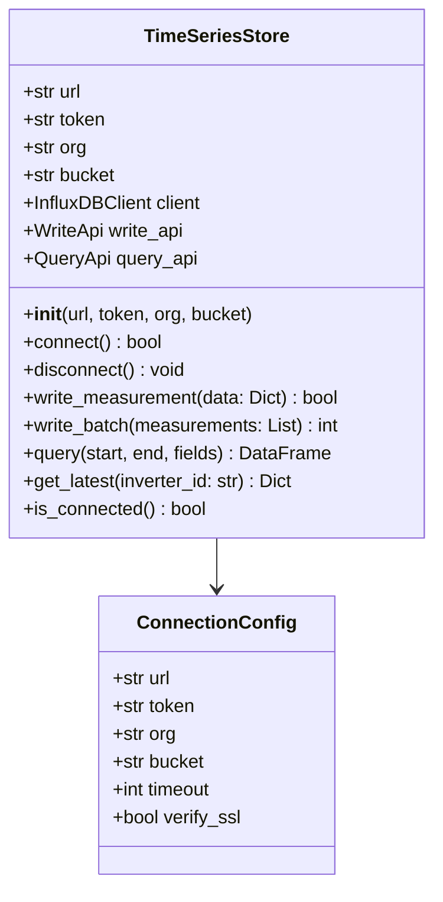

# Component Design: TimeSeriesStore

Created: 2025 December 30

**Document Type:** Tier 3 Component Design  
**Document ID:** design-b7c8d9e0-component_data_storage  
**Parent:** [design-9e4b2c3d-domain_data.md](<design-9e4b2c3d-domain_data.md>)  
**Status:** Planned  

---

## Table of Contents

- [Component Information](<#component information>)
- [Purpose](<#purpose>)
- [Implementation](<#implementation>)
- [Class Design](<#class design>)
- [Database Schema](<#database schema>)
- [Retention Policies](<#retention policies>)
- [Interfaces](<#interfaces>)
- [Error Handling](<#error handling>)
- [Design Element Cross-References](<#design element cross-references>)
- [Version History](<#version history>)

---

## Component Information

```yaml
component_info:
  name: "TimeSeriesStore"
  domain: "Data"
  version: "1.0"
  date: "2025-12-30"
  status: "Planned"
  source_file: "src/data/storage.py"
```

[Return to Table of Contents](<#table of contents>)

---

## Purpose

Interface to InfluxDB for time-series data persistence. Provides write, query, and retention management operations.

### Responsibilities

| Responsibility | Description |
|----------------|-------------|
| Data persistence | Write measurements to InfluxDB |
| Query interface | Retrieve historical data |
| Retention management | Configure and enforce data retention |
| Connection management | Handle database connectivity |

### Design Principles

| Principle | Implementation |
|-----------|----------------|
| Abstraction | Hide InfluxDB specifics from callers |
| Resilience | Handle transient connection failures |
| Efficiency | Batch writes when possible |

[Return to Table of Contents](<#table of contents>)

---

## Implementation

### File Location

```
src/data/storage.py (planned)
```

### Dependencies

```yaml
dependencies:
  external:
    - "influxdb_client"
    - "influxdb_client.client.write_api"
  internal:
    - "data.models.Measurement"
  standard_library:
    - "logging"
    - "datetime"
    - "typing"
```

[Return to Table of Contents](<#table of contents>)

---

## Class Design

### Class Diagram



### Constructor

```python
def __init__(
    self,
    url: str = "http://localhost:8086",
    token: str = None,
    org: str = "solax",
    bucket: str = "solar_monitoring"
):
    """
    Initialize InfluxDB connection.
    
    Args:
        url: InfluxDB server URL
        token: Authentication token
        org: Organization name
        bucket: Default bucket for writes
    """
```

[Return to Table of Contents](<#table of contents>)

---

## Database Schema

### Measurement: inverter_telemetry

```
measurement: inverter_telemetry

tags:
  - inverter_id: string    # Unique inverter identifier
  - location: string       # Physical location label

fields:
  # Grid metrics
  - grid_voltage_r: float
  - grid_voltage_s: float
  - grid_voltage_t: float
  - grid_current_r: float
  - grid_current_s: float
  - grid_current_t: float
  - grid_power_r: integer
  - grid_power_s: integer
  - grid_power_t: integer
  - grid_frequency: float
  
  # PV metrics
  - pv1_voltage: float
  - pv1_current: float
  - pv1_power: integer
  - pv2_voltage: float
  - pv2_current: float
  - pv2_power: integer
  - pv_total_power: integer
  
  # Battery metrics
  - battery_voltage: float
  - battery_current: float
  - battery_power: integer
  - battery_soc: integer
  - battery_temperature: integer
  
  # System metrics
  - feed_in_power: integer
  - inverter_temperature: integer
  - run_mode: integer
  
  # Energy totals
  - energy_today: float
  - energy_total: float

timestamp: nanosecond precision
```

### Data Point Format

```python
{
    "measurement": "inverter_telemetry",
    "tags": {
        "inverter_id": "inv001",
        "location": "home"
    },
    "fields": {
        "pv_total_power": 3274,
        "battery_soc": 75,
        # ... other fields
    },
    "time": "2025-12-30T14:30:45.123456789Z"
}
```

[Return to Table of Contents](<#table of contents>)

---

## Retention Policies

### Policy Configuration

| Policy | Resolution | Duration | Purpose |
|--------|------------|----------|---------|
| raw | 1 second | 30 days | Full resolution data |
| aggregated_1m | 1 minute | 1 year | Medium-term analysis |
| aggregated_1h | 1 hour | 10 years | Long-term trends |

### Downsampling Tasks

```flux
// 1-minute aggregation task
option task = {name: "downsample_1m", every: 1m}

from(bucket: "solar_monitoring")
  |> range(start: -2m)
  |> aggregateWindow(every: 1m, fn: mean)
  |> to(bucket: "solar_monitoring_1m")
```

### Storage Estimates

| Policy | Data Rate | 30-Day Size | 1-Year Size |
|--------|-----------|-------------|-------------|
| raw | ~500 bytes/s | ~1.3 GB | N/A |
| 1m aggregate | ~500 bytes/min | ~22 MB | ~260 MB |
| 1h aggregate | ~500 bytes/hr | ~360 KB | ~4.3 MB |

[Return to Table of Contents](<#table of contents>)

---

## Interfaces

### Public Methods

#### connect()

```python
def connect(self) -> bool:
    """
    Establish connection to InfluxDB.
    
    Returns:
        True if connection successful.
    """
```

#### disconnect()

```python
def disconnect(self) -> None:
    """
    Close InfluxDB connection and flush pending writes.
    """
```

#### write_measurement()

```python
def write_measurement(
    self,
    data: Dict[str, Any],
    inverter_id: str = "default"
) -> bool:
    """
    Write single measurement to database.
    
    Args:
        data: Telemetry dictionary from poll_inverter()
        inverter_id: Inverter identifier tag
        
    Returns:
        True if write successful.
    """
```

#### write_batch()

```python
def write_batch(
    self,
    measurements: List[Dict[str, Any]]
) -> int:
    """
    Write multiple measurements in single operation.
    
    Args:
        measurements: List of telemetry dictionaries
        
    Returns:
        Number of measurements successfully written.
    """
```

#### query()

```python
def query(
    self,
    start: datetime,
    end: datetime,
    fields: List[str] = None,
    inverter_id: str = None
) -> pd.DataFrame:
    """
    Query historical data.
    
    Args:
        start: Query start time
        end: Query end time
        fields: List of fields to retrieve (None = all)
        inverter_id: Filter by inverter (None = all)
        
    Returns:
        DataFrame with requested data.
    """
```

#### get_latest()

```python
def get_latest(self, inverter_id: str) -> Optional[Dict]:
    """
    Get most recent measurement for inverter.
    
    Args:
        inverter_id: Inverter identifier
        
    Returns:
        Latest measurement dictionary or None.
    """
```

[Return to Table of Contents](<#table of contents>)

---

## Error Handling

### Connection Errors

| Error | Handling |
|-------|----------|
| Connection refused | Log error, return False |
| Authentication failure | Log error, raise exception |
| Timeout | Retry once, then fail |

### Write Errors

| Error | Handling |
|-------|----------|
| Write failure | Buffer locally, retry later |
| Invalid data | Log warning, skip record |
| Bucket not found | Create bucket or fail |

### Logging

```python
# Log levels
# DEBUG: Query details, write confirmations
# INFO: Connection events, batch summaries
# WARNING: Retry attempts, skipped records
# ERROR: Connection failures, write failures
```

[Return to Table of Contents](<#table of contents>)

---

## Design Element Cross-References

### Parent Documents

- Domain: [design-9e4b2c3d-domain_data.md](<design-9e4b2c3d-domain_data.md>)
- Master: [design-0000-master_solax-modbus.md](<design-0000-master_solax-modbus.md>)

### Sibling Components (Data Domain)

| Component | Document |
|-----------|----------|
| DataValidator | [design-a6b7c8d9-component_data_validator.md](<design-a6b7c8d9-component_data_validator.md>) |
| DataBuffer | [design-c8d9e0f1-component_data_buffer.md](<design-c8d9e0f1-component_data_buffer.md>) |

### Source Code

| Item | Location |
|------|----------|
| Module | src/data/storage.py (planned) |

[Return to Table of Contents](<#table of contents>)

---

## Version History

| Version | Date | Changes |
|---------|------|---------|
| 1.0 | 2025-12-30 | Initial component design for planned storage |

---

Copyright (c) 2025 William Watson. This work is licensed under the MIT License.
