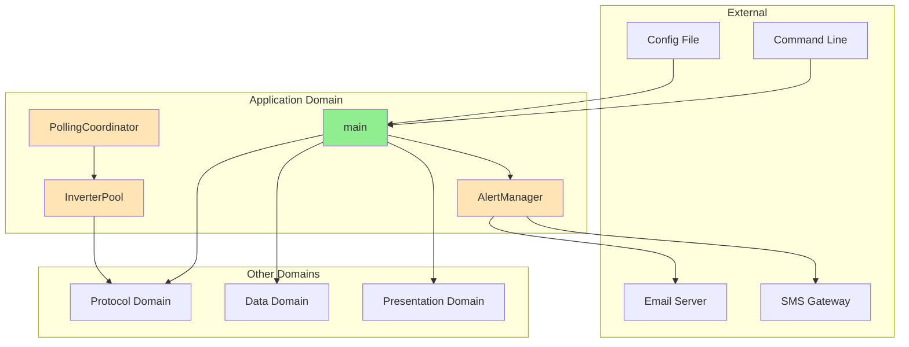
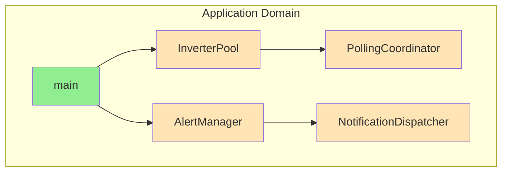
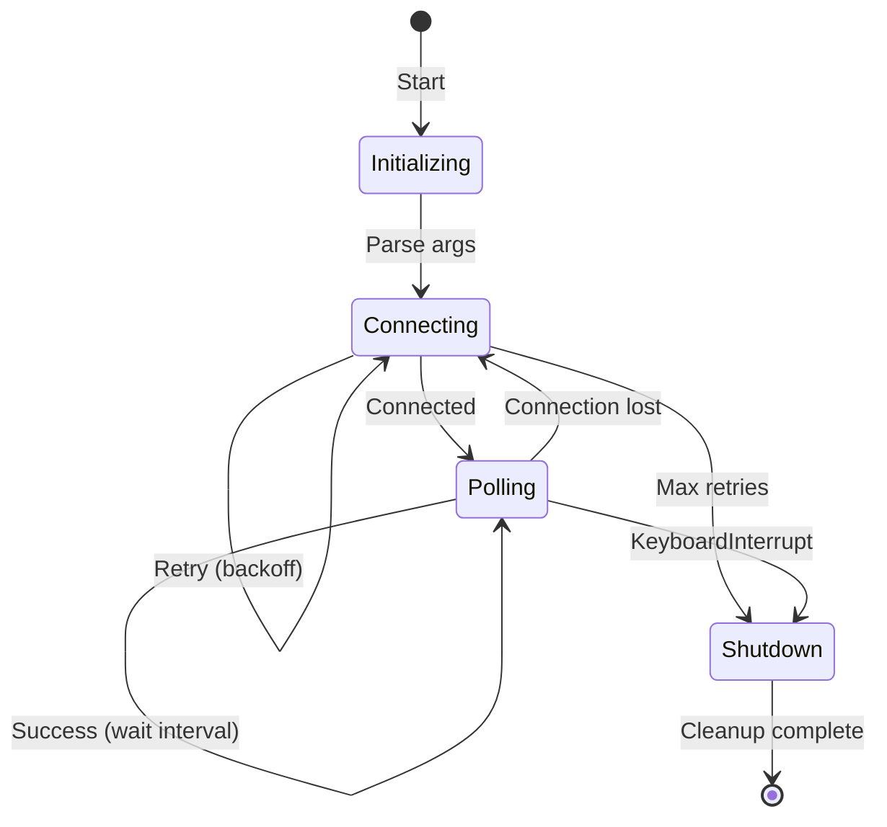
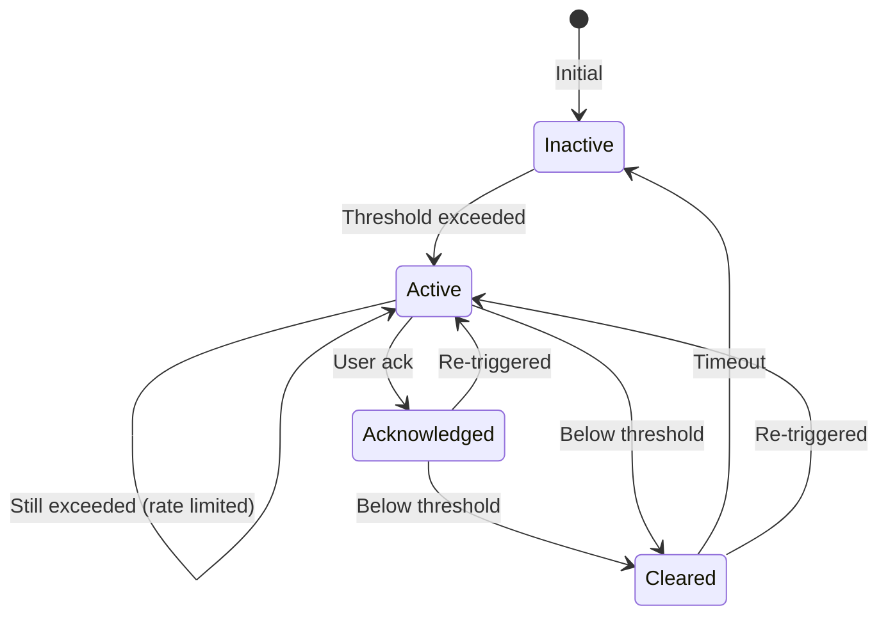

# Domain Design: Application

Created: 2025 December 30

**Document Type:** Tier 2 Domain Design  
**Document ID:** design-bf6d4e5f-domain_application  
**Parent:** [design-0000-master_solax-modbus](<design-0000-master_solax-modbus.md>)  
**Status:** Active  

---

## Table of Contents

- [Domain Information](<#domain information>)
- [Scope](<#scope>)
- [Domain Overview](<#domain overview>)
- [Architecture](<#architecture>)
- [Components](<#components>)
- [Interfaces](<#interfaces>)
- [Error Handling](<#error handling>)
- [Non-Functional Requirements](<#non-functional requirements>)
- [Design Element Cross-References](<#design element cross-references>)
- [Version History](<#version history>)

---

## Domain Information

```yaml
domain_info:
  name: "Application"
  version: "1.0"
  date: "2025-12-30"
  parent_document: "design-0000-master_solax-modbus.md"
```

[Return to Table of Contents](<#table of contents>)

---

## Scope

### Purpose

Orchestrate system operation, coordinate polling cycles, manage alerting, and support multi-inverter deployments. Serves as the entry point and control center for the application.

### Boundaries

**Owns:**
- Application entry point and CLI
- Polling loop control
- Alert threshold evaluation and notification dispatch
- Multi-inverter coordination
- Configuration management
- Graceful shutdown handling

**Does Not Own:**
- Protocol-level communication (Protocol domain)
- Data persistence (Data domain)
- Display rendering (Presentation domain)

### Domain Responsibilities

| Responsibility | Description |
|----------------|-------------|
| Entry point | Parse CLI arguments, initialize components |
| Polling orchestration | Execute timed polling cycles |
| Alert management | Evaluate thresholds, dispatch notifications |
| Multi-inverter | Coordinate polling across multiple devices |
| Lifecycle | Handle startup, shutdown, signal handling |

### Terminology

| Term | Definition |
|------|------------|
| Polling Interval | Time between successive data acquisition cycles |
| Alert Condition | Threshold-based rule triggering notification |
| Notification Channel | Delivery method for alerts (email, SMS, webhook) |
| Fleet | Collection of multiple monitored inverters |

[Return to Table of Contents](<#table of contents>)

---

## Domain Overview

### Description

The Application domain provides the orchestration layer coordinating all other domains. It implements the main execution loop, manages configuration, and handles system-level concerns such as alerting and multi-inverter support.

### Context Diagram



**Legend:**
- Green: Implemented
- Orange: Planned

### Primary Functions

| Function | Status | Description |
|----------|--------|-------------|
| CLI parsing | ✓ Implemented | argparse argument handling |
| Polling loop | ✓ Implemented | Timed data acquisition |
| Signal handling | ✓ Implemented | Graceful KeyboardInterrupt |
| Configuration | ○ Planned | YAML config file support |
| Alerting | ○ Planned | Threshold monitoring |
| Multi-inverter | ○ Planned | Fleet coordination |

[Return to Table of Contents](<#table of contents>)

---

## Architecture

### Pattern

Controller/Coordinator pattern with dependency injection.

### Component Relationships



### Technology Stack

```yaml
technology_stack:
  language: "Python 3.9+"
  libraries:
    implemented:
      - "argparse (CLI)"
      - "logging (diagnostics)"
      - "time (polling intervals)"
    planned:
      - "pyyaml 6.0+ (configuration)"
      - "smtplib (email alerts)"
      - "requests (webhooks)"
      - "asyncio (multi-inverter)"
```

### Directory Structure

```
src/
├── solax_poll.py           # main() entry point
├── application/            # (planned)
│   ├── __init__.py
│   ├── config.py           # Configuration management
│   ├── alerting.py         # AlertManager
│   ├── notifications.py    # NotificationDispatcher
│   └── coordinator.py      # InverterPool, PollingCoordinator
```

[Return to Table of Contents](<#table of contents>)

---

## Components

### Component Summary

| Component | File | Status | Purpose |
|-----------|------|--------|---------|
| main | solax_poll.py | Implemented | Entry point |
| AlertManager | application/alerting.py | Planned | Threshold monitoring |
| NotificationDispatcher | application/notifications.py | Planned | Alert delivery |
| InverterPool | application/coordinator.py | Planned | Multi-inverter |
| PollingCoordinator | application/coordinator.py | Planned | Scheduling |

### main (Implemented)

**Tier 3 Document:** [design-XXXX-component_application_main.md](planned)

**Purpose:** Application entry point with CLI and monitoring loop.

**Key Responsibilities:**
- Parse command-line arguments
- Initialize Protocol and Presentation components
- Execute polling loop with configurable interval
- Handle graceful shutdown on interrupt

**CLI Arguments:**

| Argument | Type | Default | Description |
|----------|------|---------|-------------|
| ip | positional | required | Inverter IP address |
| --port | int | 502 | Modbus TCP port |
| --unit-id | int | 1 | Modbus unit ID |
| --interval | int | 5 | Polling interval (seconds) |
| --debug | flag | false | Enable debug logging |

**State Machine:**



---

### AlertManager (Planned)

**Tier 3 Document:** [design-XXXX-component_application_alerting.md](planned)

**Purpose:** Evaluate alert conditions and trigger notifications.

**Key Responsibilities:**
- Evaluate measurements against threshold conditions
- Manage alert state (active, acknowledged, cleared)
- Rate-limit notifications to prevent storms
- Maintain alert history

**Alert Conditions:**

| Condition | Threshold | Severity | Channels |
|-----------|-----------|----------|----------|
| Communication failure | >5 consecutive timeouts | Critical | Email, SMS |
| Battery low | SOC <10% | Warning | Email |
| Battery critical | SOC <5% | Critical | Email, SMS |
| Battery over-temp | >50°C | Critical | Email, SMS |
| Grid fault | run_mode = "Fault" | Critical | Email, SMS |
| Inverter over-temp | >75°C | Warning | Email |

**Alert State Machine:**



---

### NotificationDispatcher (Planned)

**Tier 3 Document:** [design-XXXX-component_application_notifications.md](planned)

**Purpose:** Deliver alert notifications via multiple channels.

**Key Responsibilities:**
- Send email via SMTP
- Send SMS via Twilio API (or similar)
- POST to webhooks
- Log to local syslog

**Channel Configuration:**

```yaml
notifications:
  email:
    smtp_host: "smtp.gmail.com"
    smtp_port: 587
    smtp_user: "alerts@example.com"
    recipients:
      - "admin@example.com"
  sms:
    provider: "twilio"
    from_number: "+1234567890"
    to_numbers:
      - "+0987654321"
  webhook:
    url: "https://hooks.slack.com/services/..."
```

---

### InverterPool (Planned)

**Tier 3 Document:** [design-XXXX-component_application_pool.md](planned)

**Purpose:** Manage collection of inverter connections.

**Key Responsibilities:**
- Instantiate multiple SolaxInverterClient instances
- Track per-inverter connection state
- Aggregate fleet-wide metrics
- Isolate individual inverter failures

**Fleet Aggregation:**

| Metric | Aggregation |
|--------|-------------|
| Total PV power | Sum across all inverters |
| Total battery capacity | Sum across all inverters |
| Net grid power | Sum across all inverters |
| System status | Worst-case (any fault = fleet fault) |

---

### PollingCoordinator (Planned)

**Tier 3 Document:** [design-XXXX-component_application_coordinator.md](planned)

**Purpose:** Schedule and coordinate polling across inverters.

**Key Responsibilities:**
- Stagger polling to prevent network congestion
- Enforce maximum concurrent connections
- Handle backpressure when processing is slow
- Provide polling metrics

**Scheduling Strategy:**

```
For N inverters with interval I and max_concurrent M:
  - Stagger offset = I / N
  - Inverter 0: poll at t=0, I, 2I, ...
  - Inverter 1: poll at t=offset, I+offset, ...
  - Inverter N-1: poll at t=(N-1)*offset, ...
  - Limit concurrent polls to M
```

[Return to Table of Contents](<#table of contents>)

---

## Interfaces

### Domain Interface

```python
class ApplicationInterface:
    """Abstract interface for Application domain operations."""
    
    def run(self) -> int:
        """Execute main application loop. Returns exit code."""
        
    def shutdown(self) -> None:
        """Initiate graceful shutdown."""
        
    def get_status(self) -> Dict[str, Any]:
        """Return application health status."""
```

### Internal Interfaces

#### main

```python
def main() -> None:
    """
    Application entry point.
    
    Parses CLI arguments, initializes components, and runs
    polling loop until interrupted.
    
    Exit codes:
        0: Normal shutdown
        1: Connection failure (max retries exceeded)
        2: Configuration error
    """
```

#### AlertManager

```python
def evaluate_conditions(
    self, 
    measurement: Dict[str, Any]
) -> List[Alert]:
    """
    Evaluate measurement against alert conditions.
    
    Returns:
        List of newly triggered alerts.
    """

def acknowledge_alert(self, alert_id: str) -> bool:
    """Mark alert as acknowledged by user."""

def get_active_alerts(self) -> List[Alert]:
    """Return list of currently active alerts."""
```

#### InverterPool

```python
def add_inverter(self, config: InverterConfig) -> str:
    """
    Add inverter to pool.
    
    Returns:
        Assigned inverter ID.
    """

def remove_inverter(self, inverter_id: str) -> bool:
    """Remove inverter from pool."""

def poll_all(self) -> Dict[str, Dict[str, Any]]:
    """
    Poll all inverters.
    
    Returns:
        Dictionary mapping inverter_id to telemetry dict.
    """

def get_aggregate_metrics(self) -> Dict[str, Any]:
    """Return fleet-wide aggregated metrics."""
```

[Return to Table of Contents](<#table of contents>)

---

## Error Handling

### Exception Strategy

| Error Type | Handling |
|------------|----------|
| CLI argument error | Print usage, exit code 2 |
| Configuration error | Log error, exit code 2 |
| Connection failure | Retry with backoff, exit code 1 if exhausted |
| Runtime exception | Log with traceback, attempt recovery |
| Keyboard interrupt | Graceful shutdown, exit code 0 |

### Logging

```yaml
logging:
  module: "solax_modbus.application"
  levels:
    - DEBUG: Component initialization, poll timing
    - INFO: Application events, alert triggers
    - WARNING: Retry attempts, degraded operation
    - ERROR: Connection failures, notification failures
    - CRITICAL: Unrecoverable errors
  format: "%(asctime)s - %(name)s - %(levelname)s - %(message)s"
```

[Return to Table of Contents](<#table of contents>)

---

## Non-Functional Requirements

### Performance

| Metric | Target |
|--------|--------|
| Startup time | <5 seconds |
| Polling overhead | <100ms per inverter |
| Alert evaluation | <10ms per measurement |
| Memory (10 inverters) | ≤512MB |
| CPU (10 inverters) | ≤10% |

### Reliability

| Requirement | Implementation |
|-------------|----------------|
| Graceful shutdown | Signal handler for SIGINT, SIGTERM |
| Connection recovery | Automatic reconnect with backoff |
| Partial failure | Continue with available inverters |
| Alert persistence | State survives restart (planned) |

### Configuration

**Planned Configuration File:**

```yaml
# /etc/solax-monitor/config.yaml
system:
  log_level: INFO
  log_file: /var/log/solax-monitor/app.log

inverters:
  - id: inv001
    name: "Main Inverter"
    host: 192.168.1.100
    port: 502
    unit_id: 1
    poll_interval: 5
    enabled: true

database:
  type: influxdb
  host: localhost
  port: 8086
  database: solar_monitoring

alerts:
  enabled: true
  conditions:
    - name: battery_low
      field: battery_soc
      operator: "<"
      threshold: 10
      severity: warning
      channels: [email]
```

[Return to Table of Contents](<#table of contents>)

---

## Design Element Cross-References

### Parent Document

- [design-0000-master_solax-modbus.md](<design-0000-master_solax-modbus.md>)

### Tier 3 Component Documents

| Component | Document | Status |
|-----------|----------|--------|
| main | [design-e4d5e6f7-component_application_main.md](<design-e4d5e6f7-component_application_main.md>) | Active |
| AlertManager | [design-e0f1a2b3-component_application_alerting.md](<design-e0f1a2b3-component_application_alerting.md>) | Active |
| NotificationDispatcher | design-XXXX-component_application_notifications.md | Planned |
| InverterPool | [design-f1a2b3c4-component_application_pool.md](<design-f1a2b3c4-component_application_pool.md>) | Active |
| PollingCoordinator | design-XXXX-component_application_coordinator.md | Planned |

### Sibling Domain Documents

| Domain | Document |
|--------|----------|
| Protocol | [design-8f3a1b2c-domain_protocol.md](<design-8f3a1b2c-domain_protocol.md>) |
| Data | [design-9e4b2c3d-domain_data.md](<design-9e4b2c3d-domain_data.md>) |
| Presentation | [design-af5c3d4e-domain_presentation.md](<design-af5c3d4e-domain_presentation.md>) |

### Source Code Mapping

| Component | File |
|-----------|------|
| main | src/solax_poll.py |
| AlertManager | src/application/alerting.py (planned) |
| NotificationDispatcher | src/application/notifications.py (planned) |
| InverterPool | src/application/coordinator.py (planned) |
| PollingCoordinator | src/application/coordinator.py (planned) |

[Return to Table of Contents](<#table of contents>)

---

## Version History

| Version | Date | Changes |
|---------|------|---------|
| 1.0 | 2025-12-30 | Initial domain design |
| 1.1 | 2025-12-30 | Added Tier 3 component document reference |
| 1.2 | 2025-12-30 | Added AlertManager and InverterPool component document references |

---

Copyright (c) 2025 William Watson. This work is licensed under the MIT License.
