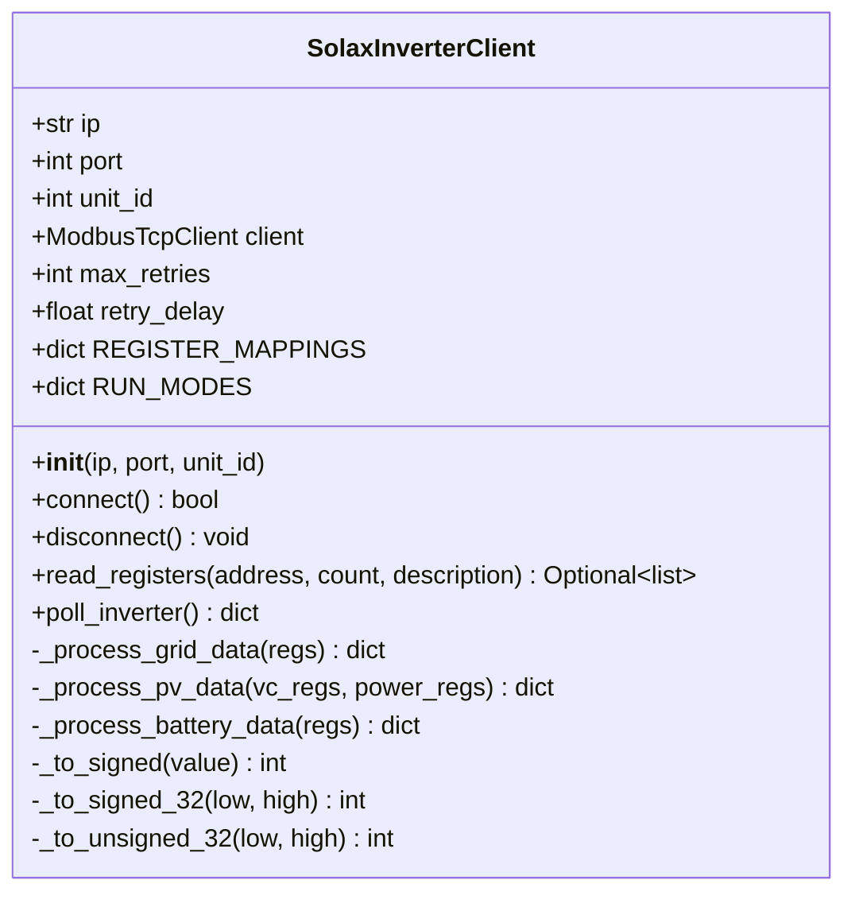
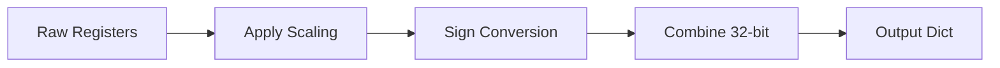

# Component Design: SolaxInverterClient

Created: 2025 December 30

**Document Type:** Tier 3 Component Design  
**Document ID:** design-c1a2b3d4-component_protocol_client  
**Parent:** [design-8f3a1b2c-domain_protocol.md](<design-8f3a1b2c-domain_protocol.md>)  
**Status:** Implemented  

---

## Table of Contents

- [Component Information](<#component information>)
- [Purpose](<#purpose>)
- [Implementation](<#implementation>)
- [Class Design](<#class design>)
- [Register Mappings](<#register mappings>)
- [Data Processing](<#data processing>)
- [Interfaces](<#interfaces>)
- [Error Handling](<#error handling>)
- [Usage](<#usage>)
- [Design Element Cross-References](<#design element cross-references>)
- [Version History](<#version history>)

---

## Component Information

```yaml
component_info:
  name: "SolaxInverterClient"
  domain: "Protocol"
  version: "1.0"
  date: "2025-12-30"
  status: "Implemented"
  source_file: "src/solax_poll.py"
```

[Return to Table of Contents](<#table of contents>)

---

## Purpose

Modbus TCP client for Solax X3 Hybrid inverter communication. Provides connection management with retry logic, register reading operations, and data type conversion.

### Responsibilities

| Responsibility | Description |
|----------------|-------------|
| Connection management | Establish TCP connection with exponential backoff retry |
| Register reading | Read input registers via function code 0x04 |
| Data conversion | Apply scaling factors, handle signed/unsigned integers |
| Error recovery | Graceful handling of communication failures |

### Constraints

| Constraint | Value |
|------------|-------|
| Protocol | Modbus TCP/IP |
| Default port | 502 |
| Timeout | 3 seconds |
| Max retries | 3 |
| Retry delay | Exponential (1s, 2s, 4s) |

[Return to Table of Contents](<#table of contents>)

---

## Implementation

### File Location

```
src/solax_poll.py (lines 1-218)
```

### Dependencies

```yaml
dependencies:
  external:
    - "pymodbus.client.ModbusTcpClient"
  internal: []
  standard_library:
    - "logging"
    - "time"
    - "typing"
```

[Return to Table of Contents](<#table of contents>)

---

## Class Design

### Class Diagram



### Constructor

```python
def __init__(self, ip: str, port: int = 502, unit_id: int = 1):
    """
    Initialize Solax inverter client.
    
    Args:
        ip: Inverter IP address (or WiFi/LAN dongle IP)
        port: Modbus TCP port (default 502)
        unit_id: Modbus unit identifier (default 1)
    """
```

### Class Constants

#### REGISTER_MAPPINGS

```python
REGISTER_MAPPINGS = {
    'grid_data': {'address': 0x006A, 'count': 12},
    'pv_voltage_current': {'address': 0x0003, 'count': 4},
    'pv_power': {'address': 0x000A, 'count': 2},
    'battery_data': {'address': 0x0014, 'count': 9},
    'feed_in_power': {'address': 0x0046, 'count': 2},
    'energy_today': {'address': 0x0050, 'count': 1},
    'energy_total': {'address': 0x0052, 'count': 2},
    'inverter_status': {'address': 0x0008, 'count': 2},
}
```

#### RUN_MODES

```python
RUN_MODES = {
    0: "Waiting",
    1: "Checking",
    2: "Normal",
    3: "Fault",
    4: "Permanent Fault",
    5: "Update",
    6: "Off-grid Waiting",
    7: "Off-grid",
    8: "Self Test",
    9: "Idle",
    10: "Standby",
}
```

[Return to Table of Contents](<#table of contents>)

---

## Register Mappings

### Input Registers (Function Code 0x04)

#### Grid Data (0x006A, 12 registers)

| Offset | Field | Type | Scale | Unit |
|--------|-------|------|-------|------|
| 0 | Grid Voltage R | uint16 | 0.1 | V |
| 1 | Grid Voltage S | uint16 | 0.1 | V |
| 2 | Grid Voltage T | uint16 | 0.1 | V |
| 3 | Grid Current R | int16 | 0.1 | A |
| 4 | Grid Current S | int16 | 0.1 | A |
| 5 | Grid Current T | int16 | 0.1 | A |
| 6 | Grid Power R | int16 | 1 | W |
| 7 | Grid Power S | int16 | 1 | W |
| 8 | Grid Power T | int16 | 1 | W |
| 9 | Grid Frequency | uint16 | 0.01 | Hz |

#### PV Voltage/Current (0x0003, 4 registers)

| Offset | Field | Type | Scale | Unit |
|--------|-------|------|-------|------|
| 0 | PV1 Voltage | uint16 | 0.1 | V |
| 1 | PV2 Voltage | uint16 | 0.1 | V |
| 2 | PV1 Current | uint16 | 0.1 | A |
| 3 | PV2 Current | uint16 | 0.1 | A |

#### PV Power (0x000A, 2 registers)

| Offset | Field | Type | Scale | Unit |
|--------|-------|------|-------|------|
| 0 | PV1 Power | uint16 | 1 | W |
| 1 | PV2 Power | uint16 | 1 | W |

#### Battery Data (0x0014, 9 registers)

| Offset | Field | Type | Scale | Unit |
|--------|-------|------|-------|------|
| 0 | Battery Voltage | uint16 | 0.1 | V |
| 1 | Battery Current | int16 | 0.1 | A |
| 2 | Battery Power | int16 | 1 | W |
| 3 | Battery Temperature | int16 | 1 | °C |
| 4 | Battery SOC | uint16 | 1 | % |

#### Feed-in Power (0x0046, 2 registers)

| Offset | Field | Type | Scale | Unit |
|--------|-------|------|-------|------|
| 0-1 | Feed-in Power | int32 | 1 | W |

#### Energy Today (0x0050, 1 register)

| Offset | Field | Type | Scale | Unit |
|--------|-------|------|-------|------|
| 0 | Energy Today | uint16 | 0.1 | kWh |

#### Energy Total (0x0052, 2 registers)

| Offset | Field | Type | Scale | Unit |
|--------|-------|------|-------|------|
| 0-1 | Energy Total | uint32 | 0.1 | kWh |

#### Inverter Status (0x0008, 2 registers)

| Offset | Field | Type | Scale | Unit |
|--------|-------|------|-------|------|
| 0 | Inverter Temperature | int16 | 1 | °C |
| 1 | Run Mode | uint16 | 1 | enum |

[Return to Table of Contents](<#table of contents>)

---

## Data Processing

### Signed Integer Conversion

```python
def _to_signed(self, value: int) -> int:
    """
    Convert unsigned 16-bit to signed using two's complement.
    
    Args:
        value: Unsigned 16-bit integer (0-65535)
        
    Returns:
        Signed integer (-32768 to 32767)
    """
    if value >= 0x8000:
        return value - 0x10000
    return value
```

### 32-bit Integer Handling

```python
def _to_signed_32(self, low: int, high: int) -> int:
    """
    Combine two registers into signed 32-bit integer.
    
    Args:
        low: Low word (register N)
        high: High word (register N+1)
        
    Returns:
        Signed 32-bit integer
    """
    value = (high << 16) | low
    if value >= 0x80000000:
        return value - 0x100000000
    return value

def _to_unsigned_32(self, low: int, high: int) -> int:
    """
    Combine two registers into unsigned 32-bit integer.
    """
    return (high << 16) | low
```

### Processing Pipeline



[Return to Table of Contents](<#table of contents>)

---

## Interfaces

### Public Methods

#### connect()

```python
def connect(self) -> bool:
    """
    Establish connection to inverter with retry logic.
    
    Implements exponential backoff: 1s, 2s, 4s between attempts.
    
    Returns:
        True if connection successful, False if all retries exhausted.
        
    Side Effects:
        - Logs connection attempts and results
        - Updates internal client state
    """
```

#### disconnect()

```python
def disconnect(self) -> None:
    """
    Close connection to inverter.
    
    Safe to call even if not connected.
    """
```

#### read_registers()

```python
def read_registers(
    self, 
    address: int, 
    count: int, 
    description: str
) -> Optional[List[int]]:
    """
    Read input registers from inverter.
    
    Args:
        address: Starting register address (hex)
        count: Number of consecutive registers to read
        description: Human-readable description for logging
        
    Returns:
        List of register values as unsigned integers, or None on error.
        
    Raises:
        No exceptions raised; errors logged and None returned.
    """
```

#### poll_inverter()

```python
def poll_inverter(self) -> Dict[str, Any]:
    """
    Poll all inverter registers and return processed data.
    
    Reads all register groups defined in REGISTER_MAPPINGS,
    processes raw values, and returns structured dictionary.
    
    Returns:
        Dictionary containing:
        - timestamp: ISO format datetime string
        - grid: {voltage_r/s/t, current_r/s/t, power_r/s/t, frequency}
        - pv: {pv1_voltage, pv1_current, pv1_power, pv2_*, total_power}
        - battery: {voltage, current, power, soc, temperature}
        - feed_in_power: int (positive=export, negative=import)
        - energy_today: float (kWh)
        - energy_total: float (kWh)
        - inverter_temperature: int (°C)
        - run_mode: str
        
    Note:
        Missing data sections contain None values.
        Partial data returned on communication errors.
    """
```

### Output Data Structure

```python
{
    'timestamp': '2025-12-30T14:30:45.123456',
    'grid': {
        'voltage_r': 230.1,
        'voltage_s': 229.8,
        'voltage_t': 230.3,
        'current_r': 5.2,
        'current_s': 5.1,
        'current_t': 5.3,
        'power_r': 1200,
        'power_s': 1170,
        'power_t': 1210,
        'frequency': 50.02
    },
    'pv': {
        'pv1_voltage': 385.2,
        'pv1_current': 8.5,
        'pv1_power': 3274,
        'pv2_voltage': 0.0,
        'pv2_current': 0.0,
        'pv2_power': 0,
        'total_power': 3274
    },
    'battery': {
        'voltage': 51.2,
        'current': -10.5,
        'power': -538,
        'soc': 75,
        'temperature': 22
    },
    'feed_in_power': -244,
    'energy_today': 12.5,
    'energy_total': 1234.5,
    'inverter_temperature': 35,
    'run_mode': 'Normal'
}
```

[Return to Table of Contents](<#table of contents>)

---

## Error Handling

### Connection Errors

| Error | Handling |
|-------|----------|
| Connection refused | Retry with exponential backoff |
| Connection timeout | Retry with exponential backoff |
| Max retries exceeded | Return False, log error |

### Communication Errors

| Error | Handling |
|-------|----------|
| Modbus exception | Log error, return None for affected registers |
| Invalid response | Log warning, skip processing |
| Timeout during read | Log error, return None |

### Logging

```python
# Logger configuration
logger = logging.getLogger('solax_modbus.protocol.client')

# Log levels used:
# DEBUG: Register read details, raw values
# INFO: Connection events, successful polls
# WARNING: Retry attempts
# ERROR: Connection failures, Modbus exceptions
```

[Return to Table of Contents](<#table of contents>)

---

## Usage

### Basic Example

```python
from solax_poll import SolaxInverterClient

# Create client
client = SolaxInverterClient(
    ip='192.168.1.100',
    port=502,
    unit_id=1
)

# Connect with retry
if client.connect():
    # Poll telemetry
    data = client.poll_inverter()
    
    if data:
        print(f"PV Power: {data['pv']['total_power']}W")
        print(f"Battery SOC: {data['battery']['soc']}%")
    
    # Cleanup
    client.disconnect()
```

### Polling Loop Example

```python
import time

client = SolaxInverterClient(ip='192.168.1.100')

if client.connect():
    try:
        while True:
            data = client.poll_inverter()
            if data:
                process_data(data)
            time.sleep(5)
    except KeyboardInterrupt:
        pass
    finally:
        client.disconnect()
```

[Return to Table of Contents](<#table of contents>)

---

## Design Element Cross-References

### Parent Documents

- Domain: [design-8f3a1b2c-domain_protocol.md](<design-8f3a1b2c-domain_protocol.md>)
- Master: [design-0000-master_solax-modbus.md](<design-0000-master_solax-modbus.md>)

### Sibling Components (Protocol Domain)

| Component | Document |
|-----------|----------|
| SolaxEmulator | [design-c2b3c4d5-component_protocol_emulator.md](<design-c2b3c4d5-component_protocol_emulator.md>) |
| InverterController | design-XXXX-component_protocol_controller.md (planned) |

### Dependent Components

| Component | Dependency Type |
|-----------|-----------------|
| main | Uses for polling |
| InverterDisplay | Consumes output dict |
| InverterPool | Manages multiple instances |

### Source Code

| Item | Location |
|------|----------|
| Class | src/solax_poll.py:1-218 |
| Unit tests | src/tests/test_solax_poll.py |

### Reference Documents

| Document | Location |
|----------|----------|
| Solax Protocol V3.21 | docs/ |

[Return to Table of Contents](<#table of contents>)

---

## Version History

| Version | Date | Changes |
|---------|------|---------|
| 1.0 | 2025-12-30 | Initial component design documenting implemented class |

---

Copyright (c) 2025 William Watson. This work is licensed under the MIT License.
