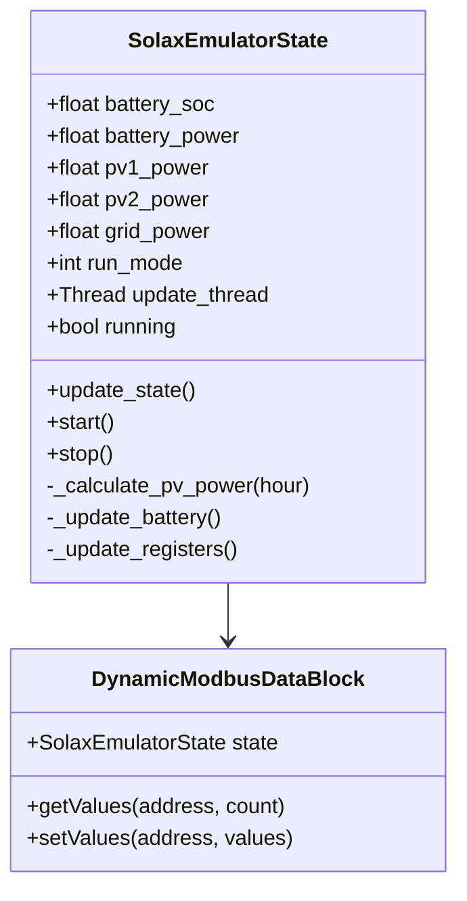
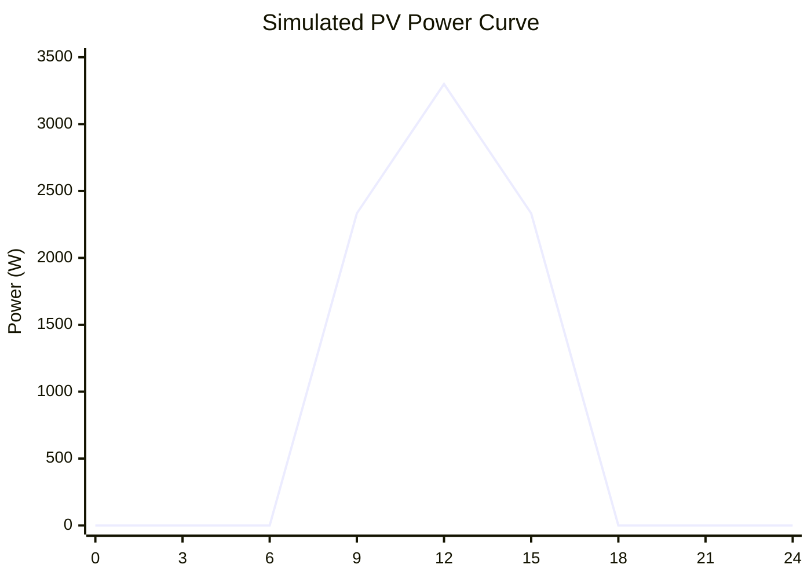
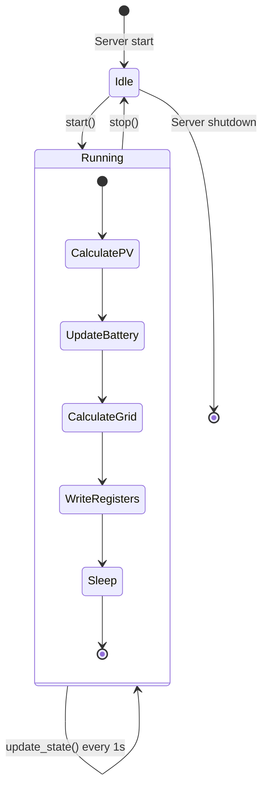

# Component Design: SolaxEmulator

Created: 2025 December 30

**Document Type:** Tier 3 Component Design  
**Document ID:** design-c2b3c4d5-component_protocol_emulator  
**Parent:** [design-8f3a1b2c-domain_protocol.md](<design-8f3a1b2c-domain_protocol.md>)  
**Status:** Implemented  

---

## Table of Contents

- [Component Information](<#component information>)
- [Purpose](<#purpose>)
- [Implementation](<#implementation>)
- [Class Design](<#class design>)
- [State Simulation](<#state simulation>)
- [Interfaces](<#interfaces>)
- [Usage](<#usage>)
- [Design Element Cross-References](<#design element cross-references>)
- [Version History](<#version history>)

---

## Component Information

```yaml
component_info:
  name: "SolaxEmulator"
  domain: "Protocol"
  version: "1.0"
  date: "2025-12-30"
  status: "Implemented"
  source_file: "src/emulator/solax_emulator.py"
```

[Return to Table of Contents](<#table of contents>)

---

## Purpose

Modbus TCP server emulating a Solax X3 Hybrid 6.0-D inverter for development and testing. Provides dynamic state simulation including time-based PV power curves and battery behavior.

### Responsibilities

| Responsibility | Description |
|----------------|-------------|
| Modbus server | Serve input and holding registers via TCP |
| PV simulation | Time-based power curve (peak at noon) |
| Battery simulation | Charge/discharge behavior modeling |
| State updates | Periodic register value updates |

### Use Cases

| Use Case | Description |
|----------|-------------|
| Offline development | Test client code without physical inverter |
| Integration testing | Automated test scenarios |
| Demonstration | Show system capabilities |
| Protocol validation | Verify register mappings |

[Return to Table of Contents](<#table of contents>)

---

## Implementation

### File Location

```
src/emulator/solax_emulator.py
```

### Dependencies

```yaml
dependencies:
  external:
    - "pymodbus.server.StartTcpServer"
    - "pymodbus.datastore.ModbusSlaveContext"
    - "pymodbus.datastore.ModbusServerContext"
  internal: []
  standard_library:
    - "logging"
    - "threading"
    - "time"
    - "math"
    - "datetime"
```

[Return to Table of Contents](<#table of contents>)

---

## Class Design

### Class Diagram



### SolaxEmulatorState

Maintains simulated inverter state and updates registers periodically.

### DynamicModbusDataBlock

Custom Modbus data block that returns dynamically calculated values from emulator state.

[Return to Table of Contents](<#table of contents>)

---

## State Simulation

### Simulation Parameters

```python
SIMULATION_PARAMS = {
    'PV1_MAX_POWER': 3300,      # W - Peak PV string 1
    'PV2_MAX_POWER': 3300,      # W - Peak PV string 2
    'BATTERY_CAPACITY': 10000,   # Wh
    'BATTERY_VOLTAGE': 51.2,     # V nominal
    'GRID_VOLTAGE_NOMINAL': 230, # V
    'UPDATE_INTERVAL': 1.0,      # seconds
}
```

### PV Power Simulation

Time-based sine curve simulating solar production:

```python
def _calculate_pv_power(self, hour: float) -> float:
    """
    Calculate PV power based on time of day.
    
    Uses sine curve with peak at solar noon (12:00).
    Zero output before 6:00 and after 18:00.
    
    Args:
        hour: Current hour (0-24, fractional)
        
    Returns:
        Power in watts (0 to MAX_POWER)
    """
    if hour < 6 or hour > 18:
        return 0
    
    # Sine curve: 0 at 6:00, peak at 12:00, 0 at 18:00
    angle = (hour - 6) / 12 * math.pi
    return self.PV_MAX_POWER * math.sin(angle)
```

### PV Power Curve



### Battery Simulation

```python
def _update_battery(self):
    """
    Update battery state based on power balance.
    
    Logic:
    - If PV > load: charge battery (up to 100% SOC)
    - If PV < load: discharge battery (down to 10% SOC)
    - Battery power limited to ±3000W
    """
```

### State Machine



[Return to Table of Contents](<#table of contents>)

---

## Interfaces

### Register Interface

The emulator serves the same registers as the physical inverter:

| Register Group | Address | Count | Description |
|----------------|---------|-------|-------------|
| Grid Data | 0x006A | 12 | Simulated grid metrics |
| PV Voltage/Current | 0x0003 | 4 | Calculated from power |
| PV Power | 0x000A | 2 | Time-based simulation |
| Battery Data | 0x0014 | 9 | State-based simulation |
| Feed-in Power | 0x0046 | 2 | Calculated balance |
| Energy Today | 0x0050 | 1 | Accumulated |
| Energy Total | 0x0052 | 2 | Accumulated |
| Inverter Status | 0x0008 | 2 | Fixed + run mode |

### Server Configuration

```python
def create_server_context():
    """
    Create Modbus server context with emulator data blocks.
    
    Returns:
        ModbusServerContext configured for single slave (unit_id=1)
    """
```

### Starting the Server

```python
def run_emulator(host: str = '0.0.0.0', port: int = 502):
    """
    Start the emulator server.
    
    Args:
        host: Bind address (default all interfaces)
        port: TCP port (default 502)
        
    Note:
        Blocks until interrupted. Use Ctrl+C to stop.
    """
```

[Return to Table of Contents](<#table of contents>)

---

## Usage

### Command Line

```bash
# Start emulator on default port 502
python src/emulator/solax_emulator.py

# Start on alternate port
python src/emulator/solax_emulator.py --port 5020
```

### Testing with Client

```bash
# Terminal 1: Start emulator
python src/emulator/solax_emulator.py --port 5020

# Terminal 2: Connect client
python src/solax_poll.py localhost --port 5020
```

### Programmatic Usage

```python
from emulator.solax_emulator import run_emulator
import threading

# Start emulator in background thread
emulator_thread = threading.Thread(
    target=run_emulator,
    kwargs={'port': 5020}
)
emulator_thread.daemon = True
emulator_thread.start()

# Use client against emulator
client = SolaxInverterClient(ip='localhost', port=5020)
```

[Return to Table of Contents](<#table of contents>)

---

## Design Element Cross-References

### Parent Documents

- Domain: [design-8f3a1b2c-domain_protocol.md](<design-8f3a1b2c-domain_protocol.md>)
- Master: [design-0000-master_solax-modbus.md](<design-0000-master_solax-modbus.md>)

### Sibling Components (Protocol Domain)

| Component | Document |
|-----------|----------|
| SolaxInverterClient | [design-c1a2b3d4-component_protocol_client.md](<design-c1a2b3d4-component_protocol_client.md>) |
| InverterController | design-XXXX-component_protocol_controller.md (planned) |

### Source Code

| Item | Location |
|------|----------|
| Module | src/emulator/solax_emulator.py |

[Return to Table of Contents](<#table of contents>)

---

## Version History

| Version | Date | Changes |
|---------|------|---------|
| 1.0 | 2025-12-30 | Initial component design documenting implemented emulator |

---

Copyright (c) 2025 William Watson. This work is licensed under the MIT License.
