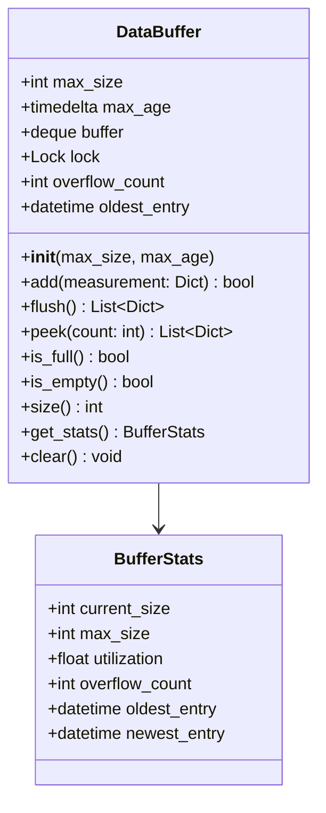
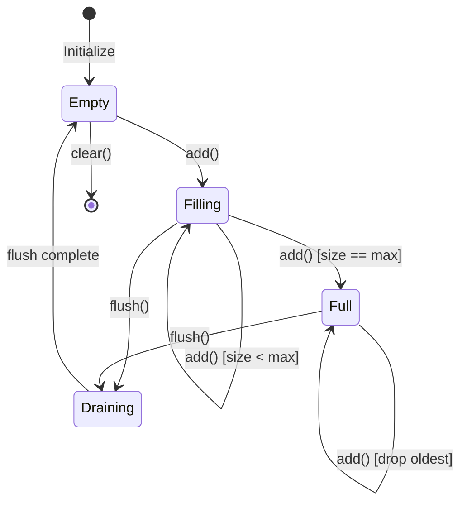

# Component Design: DataBuffer

Created: 2025 December 30

**Document Type:** Tier 3 Component Design  
**Document ID:** design-c8d9e0f1-component_data_buffer  
**Parent:** [design-9e4b2c3d-domain_data.md](<design-9e4b2c3d-domain_data.md>)  
**Status:** Planned  

---

## Table of Contents

- [Component Information](<#component information>)
- [Purpose](<#purpose>)
- [Implementation](<#implementation>)
- [Class Design](<#class design>)
- [Buffer Behavior](<#buffer behavior>)
- [Interfaces](<#interfaces>)
- [Error Handling](<#error handling>)
- [Design Element Cross-References](<#design element cross-references>)
- [Version History](<#version history>)

---

## Component Information

```yaml
component_info:
  name: "DataBuffer"
  domain: "Data"
  version: "1.0"
  date: "2025-12-30"
  status: "Planned"
  source_file: "src/data/buffer.py"
```

[Return to Table of Contents](<#table of contents>)

---

## Purpose

In-memory circular buffer for measurements during database outages. Prevents data loss when InfluxDB is temporarily unavailable.

### Responsibilities

| Responsibility | Description |
|----------------|-------------|
| Buffering | Store measurements when database unavailable |
| Overflow handling | Drop oldest data when buffer full |
| Flush management | Drain buffer when database reconnects |
| Statistics | Track buffer utilization and overflow |

### Design Principles

| Principle | Implementation |
|-----------|----------------|
| Bounded memory | Fixed maximum size |
| FIFO ordering | Oldest data flushed first |
| Thread-safe | Concurrent access supported |

[Return to Table of Contents](<#table of contents>)

---

## Implementation

### File Location

```
src/data/buffer.py (planned)
```

### Dependencies

```yaml
dependencies:
  external: []
  internal: []
  standard_library:
    - "collections.deque"
    - "threading"
    - "logging"
    - "datetime"
    - "dataclasses"
```

[Return to Table of Contents](<#table of contents>)

---

## Class Design

### Class Diagram



### Constructor

```python
def __init__(
    self,
    max_size: int = 3600,
    max_age: timedelta = timedelta(hours=1)
):
    """
    Initialize data buffer.
    
    Args:
        max_size: Maximum number of measurements to buffer
        max_age: Maximum age of buffered data before discard
        
    Note:
        Default 3600 = 1 hour at 1-second polling interval.
    """
```

### BufferStats Dataclass

```python
@dataclass
class BufferStats:
    """Buffer utilization statistics."""
    current_size: int
    max_size: int
    utilization: float      # 0.0 to 1.0
    overflow_count: int     # Total dropped measurements
    oldest_entry: Optional[datetime]
    newest_entry: Optional[datetime]
```

[Return to Table of Contents](<#table of contents>)

---

## Buffer Behavior

### State Diagram



### Overflow Policy

When buffer reaches max_size:
1. Log warning with overflow count
2. Remove oldest measurement
3. Add new measurement
4. Increment overflow counter

### Age-Based Expiry

On each add():
1. Check oldest entry timestamp
2. If older than max_age, remove expired entries
3. Log discarded count if any

### Thread Safety

```python
# All public methods use lock
with self.lock:
    # Buffer operations
```

[Return to Table of Contents](<#table of contents>)

---

## Interfaces

### Public Methods

#### add()

```python
def add(self, measurement: Dict[str, Any]) -> bool:
    """
    Add measurement to buffer.
    
    Args:
        measurement: Telemetry dictionary with timestamp
        
    Returns:
        True if added successfully.
        
    Note:
        May drop oldest entry if buffer full.
    """
```

#### flush()

```python
def flush(self) -> List[Dict[str, Any]]:
    """
    Remove and return all buffered measurements.
    
    Returns:
        List of measurements in FIFO order (oldest first).
        
    Note:
        Buffer is empty after flush.
        Returns empty list if buffer was empty.
    """
```

#### peek()

```python
def peek(self, count: int = None) -> List[Dict[str, Any]]:
    """
    View buffered measurements without removing.
    
    Args:
        count: Number of entries to return (None = all)
        
    Returns:
        List of measurements (oldest first).
    """
```

#### is_full()

```python
def is_full(self) -> bool:
    """Check if buffer is at capacity."""
```

#### is_empty()

```python
def is_empty(self) -> bool:
    """Check if buffer is empty."""
```

#### size()

```python
def size(self) -> int:
    """Return current number of buffered measurements."""
```

#### get_stats()

```python
def get_stats(self) -> BufferStats:
    """
    Get buffer utilization statistics.
    
    Returns:
        BufferStats with current state information.
    """
```

#### clear()

```python
def clear(self) -> None:
    """
    Discard all buffered measurements.
    
    Note:
        Use with caution - data will be lost.
    """
```

[Return to Table of Contents](<#table of contents>)

---

## Error Handling

### Buffer Errors

| Error | Handling |
|-------|----------|
| Invalid measurement | Log warning, reject entry |
| Memory exhaustion | Should not occur (bounded size) |

### Logging

```python
# Log levels
# DEBUG: Add/flush operations
# INFO: Buffer state changes (empty/full transitions)
# WARNING: Overflow events, age expiry
# ERROR: Invalid data rejected
```

### Metrics

| Metric | Description |
|--------|-------------|
| buffer_size | Current entries |
| buffer_utilization | Percentage full |
| overflow_total | Cumulative dropped entries |
| flush_count | Number of flush operations |

[Return to Table of Contents](<#table of contents>)

---

## Design Element Cross-References

### Parent Documents

- Domain: [design-9e4b2c3d-domain_data.md](<design-9e4b2c3d-domain_data.md>)
- Master: [design-0000-master_solax-modbus.md](<design-0000-master_solax-modbus.md>)

### Sibling Components (Data Domain)

| Component | Document |
|-----------|----------|
| DataValidator | [design-a6b7c8d9-component_data_validator.md](<design-a6b7c8d9-component_data_validator.md>) |
| TimeSeriesStore | [design-b7c8d9e0-component_data_storage.md](<design-b7c8d9e0-component_data_storage.md>) |

### Source Code

| Item | Location |
|------|----------|
| Module | src/data/buffer.py (planned) |

[Return to Table of Contents](<#table of contents>)

---

## Version History

| Version | Date | Changes |
|---------|------|---------|
| 1.0 | 2025-12-30 | Initial component design for planned buffer |

---

Copyright (c) 2025 William Watson. This work is licensed under the MIT License.
