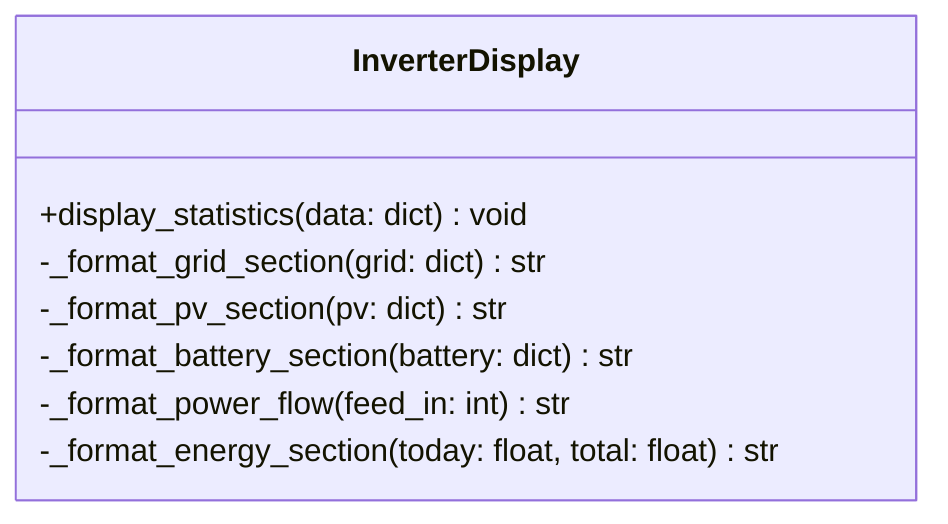

# Component Design: InverterDisplay

Created: 2025 December 30

**Document Type:** Tier 3 Component Design  
**Document ID:** design-d3c4d5e6-component_presentation_console  
**Parent:** [design-af5c3d4e-domain_presentation.md](<design-af5c3d4e-domain_presentation.md>)  
**Status:** Implemented  

---

## Table of Contents

- [Component Information](<#component information>)
- [Purpose](<#purpose>)
- [Implementation](<#implementation>)
- [Class Design](<#class design>)
- [Display Sections](<#display sections>)
- [Interfaces](<#interfaces>)
- [Usage](<#usage>)
- [Design Element Cross-References](<#design element cross-references>)
- [Version History](<#version history>)

---

## Component Information

```yaml
component_info:
  name: "InverterDisplay"
  domain: "Presentation"
  version: "1.0"
  date: "2025-12-30"
  status: "Implemented"
  source_file: "src/solax_modbus/main.py"
```

[Return to Table of Contents](<#table of contents>)

---

## Purpose

Format and display inverter telemetry to console output. Provides structured, human-readable presentation of polling data.

### Responsibilities

| Responsibility | Description |
|----------------|-------------|
| Data formatting | Apply units, precision, labels |
| Section organization | Group related metrics logically |
| Direction indicators | Show charge/discharge, import/export |
| Missing data handling | Display gracefully when data unavailable |

### Design Principles

| Principle | Implementation |
|-----------|----------------|
| Clarity | Clear section headers, aligned values |
| Completeness | All available metrics displayed |
| Robustness | Handle None values without crashing |

[Return to Table of Contents](<#table of contents>)

---

## Implementation

### File Location

```
src/solax_modbus/main.py (lines 221-310)
```

### Dependencies

```yaml
dependencies:
  external: []
  internal: []
  standard_library:
    - "datetime"
```

[Return to Table of Contents](<#table of contents>)

---

## Class Design

### Class Diagram



### Method Overview

| Method | Purpose |
|--------|---------|
| display_statistics | Main entry point, orchestrates display |
| _format_grid_section | Format three-phase grid data |
| _format_pv_section | Format PV string data with totals |
| _format_battery_section | Format battery with direction |
| _format_power_flow | Format grid import/export |
| _format_energy_section | Format energy totals |

[Return to Table of Contents](<#table of contents>)

---

## Display Sections

### Output Structure

```
========================================
     SOLAX INVERTER TELEMETRY
     2025-12-30 14:30:45
========================================

SYSTEM STATUS
  Run Mode:          Normal

GRID
  Voltage:           R: 230.1V  S: 229.8V  T: 230.3V
  Current:           R:   5.2A  S:   5.1A  T:   5.3A
  Power:             R: 1200W   S: 1170W   T: 1210W
  Frequency:         50.02 Hz

SOLAR PV GENERATION
  String 1:          385.2V × 8.5A = 3274W
  String 2:          0.0V × 0.0A = 0W
  Total PV Power:    3274W

BATTERY SYSTEM
  Voltage:           51.2V
  Current:           -10.5A (Discharging)
  Power:             -538W
  State of Charge:   75%
  Temperature:       22°C

POWER FLOW
  Grid:              Exporting 244W

ENERGY TOTALS
  Today:             12.5 kWh
  Total:             1234.5 kWh

INVERTER
  Temperature:       35°C

========================================
```

### Section Details

#### Header

| Field | Format | Source |
|-------|--------|--------|
| Title | Centered, uppercase | Static |
| Timestamp | YYYY-MM-DD HH:MM:SS | data['timestamp'] |

#### System Status

| Field | Format | Source |
|-------|--------|--------|
| Run Mode | String | data['run_mode'] |

#### Grid Section

| Field | Format | Source |
|-------|--------|--------|
| Voltage R/S/T | ###.#V | data['grid']['voltage_r/s/t'] |
| Current R/S/T | ##.#A | data['grid']['current_r/s/t'] |
| Power R/S/T | ####W | data['grid']['power_r/s/t'] |
| Frequency | ##.## Hz | data['grid']['frequency'] |

#### Solar PV Section

| Field | Format | Source |
|-------|--------|--------|
| String 1 | V × A = W | pv1_voltage, pv1_current, pv1_power |
| String 2 | V × A = W | pv2_voltage, pv2_current, pv2_power |
| Total | ####W | Calculated sum |

#### Battery Section

| Field | Format | Source |
|-------|--------|--------|
| Voltage | ##.#V | data['battery']['voltage'] |
| Current | ##.#A + direction | data['battery']['current'] |
| Power | ####W | data['battery']['power'] |
| SOC | ###% | data['battery']['soc'] |
| Temperature | ##°C | data['battery']['temperature'] |

#### Power Flow Section

| Field | Format | Source |
|-------|--------|--------|
| Grid | "Importing/Exporting ###W" | data['feed_in_power'] |

#### Energy Section

| Field | Format | Source |
|-------|--------|--------|
| Today | ###.# kWh | data['energy_today'] |
| Total | #####.# kWh | data['energy_total'] |

#### Inverter Section

| Field | Format | Source |
|-------|--------|--------|
| Temperature | ##°C | data['inverter_temperature'] |

[Return to Table of Contents](<#table of contents>)

---

## Interfaces

### Public Methods

#### display_statistics()

```python
def display_statistics(self, data: Dict[str, Any]) -> None:
    """
    Format and print inverter telemetry to console.
    
    Args:
        data: Telemetry dictionary from SolaxInverterClient.poll_inverter()
              Expected keys: timestamp, grid, pv, battery, feed_in_power,
              energy_today, energy_total, inverter_temperature, run_mode
              
    Prints:
        Formatted multi-section display to stdout.
        
    Note:
        Handles missing/None values gracefully by displaying "N/A".
        Clears screen before display (optional).
    """
```

### Input Data Contract

```python
# Expected input structure
{
    'timestamp': str,           # ISO format datetime
    'run_mode': str,            # Human-readable mode name
    'grid': {
        'voltage_r': float,     # Volts
        'voltage_s': float,
        'voltage_t': float,
        'current_r': float,     # Amperes
        'current_s': float,
        'current_t': float,
        'power_r': int,         # Watts
        'power_s': int,
        'power_t': int,
        'frequency': float,     # Hz
    },
    'pv': {
        'pv1_voltage': float,
        'pv1_current': float,
        'pv1_power': int,
        'pv2_voltage': float,
        'pv2_current': float,
        'pv2_power': int,
        'total_power': int,
    },
    'battery': {
        'voltage': float,
        'current': float,       # Positive=charge, negative=discharge
        'power': int,
        'soc': int,             # 0-100%
        'temperature': int,     # Celsius
    },
    'feed_in_power': int,       # Positive=export, negative=import
    'energy_today': float,      # kWh
    'energy_total': float,      # kWh
    'inverter_temperature': int,
}
```

[Return to Table of Contents](<#table of contents>)

---

## Usage

### Basic Usage

```python
from solax_poll import InverterDisplay, SolaxInverterClient

client = SolaxInverterClient(ip='192.168.1.100')
display = InverterDisplay()

if client.connect():
    data = client.poll_inverter()
    if data:
        display.display_statistics(data)
    client.disconnect()
```

### Polling Loop

```python
import time

while True:
    data = client.poll_inverter()
    if data:
        # Clear screen (optional)
        print('\033[2J\033[H', end='')
        display.display_statistics(data)
    time.sleep(5)
```

[Return to Table of Contents](<#table of contents>)

---

## Design Element Cross-References

### Parent Documents

- Domain: [design-af5c3d4e-domain_presentation.md](<design-af5c3d4e-domain_presentation.md>)
- Master: [design-0000-master_solax-modbus.md](<design-0000-master_solax-modbus.md>)

### Sibling Components (Presentation Domain)

| Component | Document |
|-----------|----------|
| HTMLRenderer | design-XXXX-component_presentation_html.md (planned) |

### Dependencies

| Component | Dependency Type |
|-----------|-----------------|
| SolaxInverterClient | Provides input data |
| main | Orchestrates display calls |

### Source Code

| Item | Location |
|------|----------|
| Class | src/solax_modbus/main.py:221-310 |

[Return to Table of Contents](<#table of contents>)

---

## Version History

| Version | Date | Changes |
|---------|------|---------|
| 1.0 | 2025-12-30 | Initial component design documenting implemented class |

---

Copyright (c) 2025 William Watson. This work is licensed under the MIT License.
