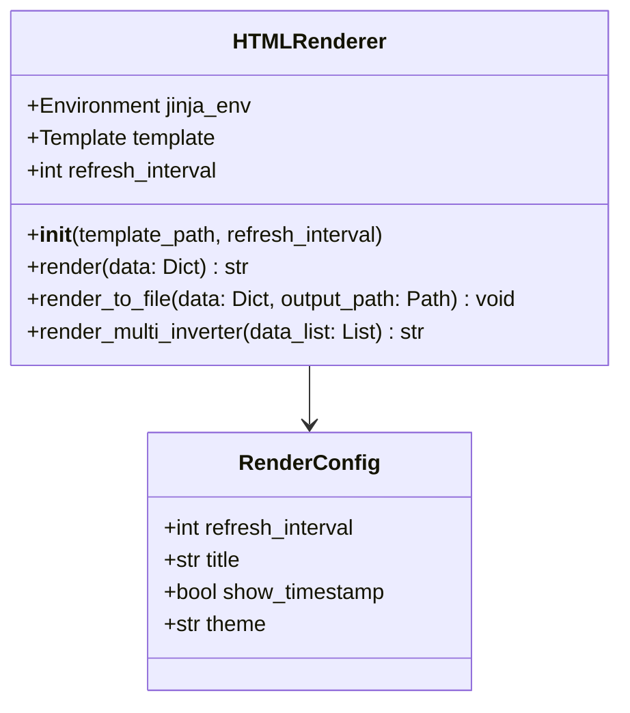

# Component Design: HTMLRenderer

Created: 2025 December 30

**Document Type:** Tier 3 Component Design  
**Document ID:** design-d9e0f1a2-component_presentation_html  
**Parent:** [design-af5c3d4e-domain_presentation.md](<design-af5c3d4e-domain_presentation.md>)  
**Status:** Planned  

---

## Table of Contents

- [Component Information](<#component information>)
- [Purpose](<#purpose>)
- [Implementation](<#implementation>)
- [Class Design](<#class design>)
- [Template Structure](<#template structure>)
- [Interfaces](<#interfaces>)
- [Output Format](<#output format>)
- [Design Element Cross-References](<#design element cross-references>)
- [Version History](<#version history>)

---

## Component Information

```yaml
component_info:
  name: "HTMLRenderer"
  domain: "Presentation"
  version: "1.0"
  date: "2025-12-30"
  status: "Planned"
  source_file: "src/presentation/html_renderer.py"
```

[Return to Table of Contents](<#table of contents>)

---

## Purpose

Generate self-contained HTML pages displaying inverter telemetry. Supports auto-refresh for live monitoring dashboards.

### Responsibilities

| Responsibility | Description |
|----------------|-------------|
| HTML generation | Render telemetry as HTML page |
| Template management | Use Jinja2 templates |
| Auto-refresh | Support configurable refresh interval |
| Self-contained output | Embed CSS, no external dependencies |

### Design Principles

| Principle | Implementation |
|-----------|----------------|
| Self-contained | Single HTML file with embedded CSS |
| Responsive | Mobile-friendly layout |
| Accessible | Semantic HTML, ARIA labels |

[Return to Table of Contents](<#table of contents>)

---

## Implementation

### File Location

```
src/presentation/html_renderer.py (planned)
src/presentation/templates/dashboard.html (planned)
```

### Dependencies

```yaml
dependencies:
  external:
    - "jinja2"
  internal:
    - "presentation.display.InverterDisplay"
  standard_library:
    - "datetime"
    - "pathlib"
```

[Return to Table of Contents](<#table of contents>)

---

## Class Design

### Class Diagram



### Constructor

```python
def __init__(
    self,
    template_path: Path = None,
    refresh_interval: int = 5
):
    """
    Initialize HTML renderer.
    
    Args:
        template_path: Path to Jinja2 template (None = default)
        refresh_interval: Auto-refresh interval in seconds (0 = disabled)
    """
```

[Return to Table of Contents](<#table of contents>)

---

## Template Structure

### Default Template Sections

```html
<!DOCTYPE html>
<html lang="en">
<head>
    <meta charset="UTF-8">
    <meta name="viewport" content="width=device-width, initial-scale=1.0">
    
    <meta http-equiv="refresh" content="{{ refresh_interval }}">
    
    <title>Solax Inverter Dashboard</title>
    <style>
        /* Embedded CSS */
    </style>
</head>
<body>
    <header>
        <h1>Solax Inverter Telemetry</h1>
        <time>{{ timestamp }}</time>
    </header>
    
    <main>
        <section id="status"><!-- System status --></section>
        <section id="grid"><!-- Grid metrics --></section>
        <section id="pv"><!-- PV generation --></section>
        <section id="battery"><!-- Battery status --></section>
        <section id="power-flow"><!-- Power flow --></section>
        <section id="energy"><!-- Energy totals --></section>
    </main>
    
    <footer>
        <p>Last updated: {{ timestamp }}</p>
    </footer>
</body>
</html>
```

### CSS Framework

```css
/* Embedded CSS - no external dependencies */
:root {
    --color-primary: #2563eb;
    --color-success: #16a34a;
    --color-warning: #ca8a04;
    --color-danger: #dc2626;
    --color-bg: #f8fafc;
    --color-card: #ffffff;
}

/* Responsive grid layout */
.dashboard {
    display: grid;
    grid-template-columns: repeat(auto-fit, minmax(300px, 1fr));
    gap: 1rem;
}

/* Card styling */
.card {
    background: var(--color-card);
    border-radius: 0.5rem;
    padding: 1rem;
    box-shadow: 0 1px 3px rgba(0,0,0,0.1);
}
```

### Template Variables

| Variable | Type | Description |
|----------|------|-------------|
| timestamp | str | ISO format datetime |
| refresh_interval | int | Refresh seconds |
| run_mode | str | Operating mode |
| grid | dict | Grid metrics |
| pv | dict | PV metrics |
| battery | dict | Battery metrics |
| feed_in_power | int | Grid power flow |
| energy_today | float | Daily generation |
| energy_total | float | Lifetime generation |

[Return to Table of Contents](<#table of contents>)

---

## Interfaces

### Public Methods

#### render()

```python
def render(self, data: Dict[str, Any]) -> str:
    """
    Render telemetry data to HTML string.
    
    Args:
        data: Telemetry dictionary from poll_inverter()
        
    Returns:
        Complete HTML document as string.
    """
```

#### render_to_file()

```python
def render_to_file(
    self,
    data: Dict[str, Any],
    output_path: Path
) -> None:
    """
    Render telemetry and write to file.
    
    Args:
        data: Telemetry dictionary
        output_path: Destination file path
        
    Note:
        Creates parent directories if needed.
        Overwrites existing file.
    """
```

#### render_multi_inverter()

```python
def render_multi_inverter(
    self,
    data_list: List[Dict[str, Any]]
) -> str:
    """
    Render multiple inverters to single dashboard.
    
    Args:
        data_list: List of telemetry dictionaries
        
    Returns:
        HTML document with all inverters.
    """
```

[Return to Table of Contents](<#table of contents>)

---

## Output Format

### Single Inverter Dashboard

```
+------------------------------------------+
|        Solax Inverter Dashboard          |
|        2025-12-30 14:30:45               |
+------------------------------------------+
|                                          |
|  +----------------+  +----------------+  |
|  | System Status  |  | Grid           |  |
|  | Mode: Normal   |  | V: 230V        |  |
|  +----------------+  | P: 3580W       |  |
|                      +----------------+  |
|  +----------------+  +----------------+  |
|  | Solar PV       |  | Battery        |  |
|  | 3274W          |  | 75% | -538W    |  |
|  +----------------+  +----------------+  |
|                                          |
|  +-----------------------------------+   |
|  | Power Flow: Exporting 244W        |   |
|  +-----------------------------------+   |
|                                          |
|  +----------------+  +----------------+  |
|  | Today: 12.5kWh |  | Total: 1234kWh |  |
|  +----------------+  +----------------+  |
|                                          |
+------------------------------------------+
```

### Multi-Inverter Layout

```
+------------------------------------------+
|      Fleet Dashboard (3 Inverters)       |
+------------------------------------------+
| INV001        | INV002        | INV003   |
| 3274W PV      | 2890W PV      | 0W PV    |
| 75% Battery   | 82% Battery   | 65% Bat  |
| Normal        | Normal        | Standby  |
+------------------------------------------+
| Total: 6164W PV | 74% Avg SOC            |
+------------------------------------------+
```

[Return to Table of Contents](<#table of contents>)

---

## Design Element Cross-References

### Parent Documents

- Domain: [design-af5c3d4e-domain_presentation.md](<design-af5c3d4e-domain_presentation.md>)
- Master: [design-0000-master_solax-modbus.md](<design-0000-master_solax-modbus.md>)

### Sibling Components (Presentation Domain)

| Component | Document |
|-----------|----------|
| InverterDisplay | [design-d3c4d5e6-component_presentation_console.md](<design-d3c4d5e6-component_presentation_console.md>) |

### Source Code

| Item | Location |
|------|----------|
| Module | src/presentation/html_renderer.py (planned) |
| Template | src/presentation/templates/dashboard.html (planned) |

[Return to Table of Contents](<#table of contents>)

---

## Version History

| Version | Date | Changes |
|---------|------|---------|
| 1.0 | 2025-12-30 | Initial component design for planned HTML renderer |

---

Copyright (c) 2025 William Watson. This work is licensed under the MIT License.
