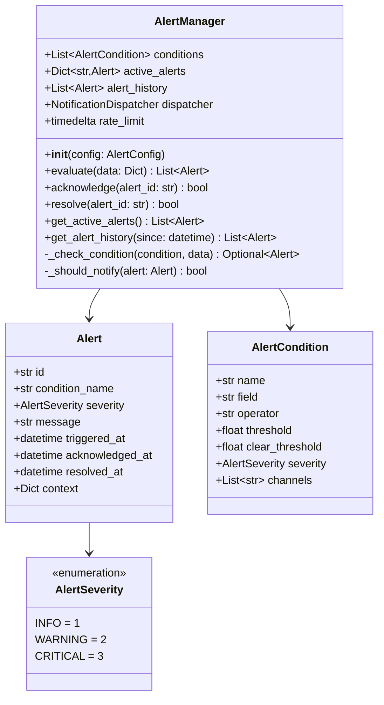

# Component Design: AlertManager

Created: 2025 December 30

**Document Type:** Tier 3 Component Design  
**Document ID:** design-e0f1a2b3-component_application_alerting  
**Parent:** [design-bf6d4e5f-domain_application.md](<design-bf6d4e5f-domain_application.md>)  
**Status:** Planned  

---

## Table of Contents

- [Component Information](<#component information>)
- [Purpose](<#purpose>)
- [Implementation](<#implementation>)
- [Class Design](<#class design>)
- [Alert Conditions](<#alert conditions>)
- [Interfaces](<#interfaces>)
- [Notification Integration](<#notification integration>)
- [Error Handling](<#error handling>)
- [Design Element Cross-References](<#design element cross-references>)
- [Version History](<#version history>)

---

## Component Information

```yaml
component_info:
  name: "AlertManager"
  domain: "Application"
  version: "1.0"
  date: "2025-12-30"
  status: "Planned"
  source_file: "src/alerting/alert_manager.py"
```

[Return to Table of Contents](<#table of contents>)

---

## Purpose

Evaluate telemetry against threshold conditions and manage alert lifecycle. Coordinates notification dispatch and maintains alert history.

### Responsibilities

| Responsibility | Description |
|----------------|-------------|
| Condition evaluation | Check telemetry against thresholds |
| Alert lifecycle | Create, acknowledge, resolve alerts |
| Rate limiting | Prevent notification storms |
| History tracking | Maintain alert audit trail |

### Design Principles

| Principle | Implementation |
|-----------|----------------|
| Configurable | Thresholds defined in config |
| Deduplication | No repeated alerts for same condition |
| Hysteresis | Clear threshold different from trigger |

[Return to Table of Contents](<#table of contents>)

---

## Implementation

### File Location

```
src/alerting/alert_manager.py (planned)
```

### Dependencies

```yaml
dependencies:
  external: []
  internal:
    - "alerting.notification_dispatcher"
  standard_library:
    - "logging"
    - "datetime"
    - "enum"
    - "dataclasses"
    - "typing"
```

[Return to Table of Contents](<#table of contents>)

---

## Class Design

### Class Diagram



### Alert Dataclass

```python
@dataclass
class Alert:
    """Represents an alert instance."""
    id: str                           # UUID
    condition_name: str               # Reference to condition
    severity: AlertSeverity
    message: str
    triggered_at: datetime
    acknowledged_at: Optional[datetime] = None
    resolved_at: Optional[datetime] = None
    context: Dict[str, Any] = field(default_factory=dict)
```

### AlertCondition Dataclass

```python
@dataclass
class AlertCondition:
    """Defines an alert trigger condition."""
    name: str                         # Unique identifier
    field: str                        # Data field to check
    operator: str                     # Comparison operator
    threshold: float                  # Trigger threshold
    clear_threshold: float            # Clear threshold (hysteresis)
    severity: AlertSeverity
    channels: List[str]               # Notification channels
```

[Return to Table of Contents](<#table of contents>)

---

## Alert Conditions

### Predefined Conditions

| Name | Field | Operator | Trigger | Clear | Severity |
|------|-------|----------|---------|-------|----------|
| communication_failure | consecutive_failures | >= | 5 | 0 | Critical |
| battery_low | battery.soc | < | 10 | 15 | Warning |
| battery_critical | battery.soc | < | 5 | 10 | Critical |
| battery_overtemp | battery.temperature | > | 50 | 45 | Critical |
| inverter_overtemp | inverter_temperature | > | 75 | 70 | Warning |
| grid_fault | run_mode | == | "Fault" | "Normal" | Critical |
| pv_underperform | pv.total_power | < | expected*0.5 | expected*0.7 | Info |

### Condition Operators

| Operator | Description |
|----------|-------------|
| < | Less than |
| <= | Less than or equal |
| > | Greater than |
| >= | Greater than or equal |
| == | Equal |
| != | Not equal |

### Hysteresis Example

```
Battery SOC:
  Trigger: SOC < 10%  → Alert "battery_low"
  Clear: SOC >= 15%   → Resolve alert
  
This prevents alert flapping when SOC oscillates around 10%.
```

[Return to Table of Contents](<#table of contents>)

---

## Interfaces

### Public Methods

#### evaluate()

```python
def evaluate(self, data: Dict[str, Any]) -> List[Alert]:
    """
    Evaluate telemetry against all conditions.
    
    Args:
        data: Telemetry dictionary from poll_inverter()
        
    Returns:
        List of newly triggered alerts.
        
    Note:
        Also checks for condition clears and resolves alerts.
    """
```

#### acknowledge()

```python
def acknowledge(self, alert_id: str) -> bool:
    """
    Mark alert as acknowledged.
    
    Args:
        alert_id: Alert UUID
        
    Returns:
        True if alert found and acknowledged.
    """
```

#### resolve()

```python
def resolve(self, alert_id: str) -> bool:
    """
    Manually resolve an alert.
    
    Args:
        alert_id: Alert UUID
        
    Returns:
        True if alert found and resolved.
    """
```

#### get_active_alerts()

```python
def get_active_alerts(self) -> List[Alert]:
    """
    Get all unresolved alerts.
    
    Returns:
        List of active Alert objects.
    """
```

#### get_alert_history()

```python
def get_alert_history(
    self,
    since: datetime = None
) -> List[Alert]:
    """
    Get alert history.
    
    Args:
        since: Only return alerts after this time
        
    Returns:
        List of historical alerts (including resolved).
    """
```

[Return to Table of Contents](<#table of contents>)

---

## Notification Integration

### Dispatcher Interface

```python
# AlertManager uses NotificationDispatcher
self.dispatcher.send(alert, channels=['email', 'sms'])
```

### Rate Limiting

| Setting | Default | Description |
|---------|---------|-------------|
| rate_limit | 5 minutes | Min time between repeated alerts |
| max_per_hour | 20 | Maximum notifications per hour |
| quiet_hours | None | Optional notification blackout |

### Channel Selection

| Severity | Default Channels |
|----------|------------------|
| Info | syslog |
| Warning | email |
| Critical | email, sms |

[Return to Table of Contents](<#table of contents>)

---

## Error Handling

### Evaluation Errors

| Error | Handling |
|-------|----------|
| Missing field | Skip condition, log warning |
| Type error | Skip condition, log warning |
| Dispatcher failure | Log error, alert still tracked |

### Logging

```python
# Log levels
# DEBUG: Condition evaluation details
# INFO: Alert triggers, resolves, acknowledges
# WARNING: Rate limiting applied
# ERROR: Dispatcher failures
```

[Return to Table of Contents](<#table of contents>)

---

## Design Element Cross-References

### Parent Documents

- Domain: [design-bf6d4e5f-domain_application.md](<design-bf6d4e5f-domain_application.md>)
- Master: [design-0000-master_solax-modbus.md](<design-0000-master_solax-modbus.md>)

### Sibling Components (Application Domain)

| Component | Document |
|-----------|----------|
| main | [design-e4d5e6f7-component_application_main.md](<design-e4d5e6f7-component_application_main.md>) |
| InverterPool | [design-f1a2b3c4-component_application_pool.md](<design-f1a2b3c4-component_application_pool.md>) |

### Related Components

| Component | Relationship |
|-----------|--------------|
| NotificationDispatcher | Used for alert delivery |

### Source Code

| Item | Location |
|------|----------|
| Module | src/alerting/alert_manager.py (planned) |

[Return to Table of Contents](<#table of contents>)

---

## Version History

| Version | Date | Changes |
|---------|------|---------|
| 1.0 | 2025-12-30 | Initial component design for planned alert manager |

---

Copyright (c) 2025 William Watson. This work is licensed under the MIT License.
