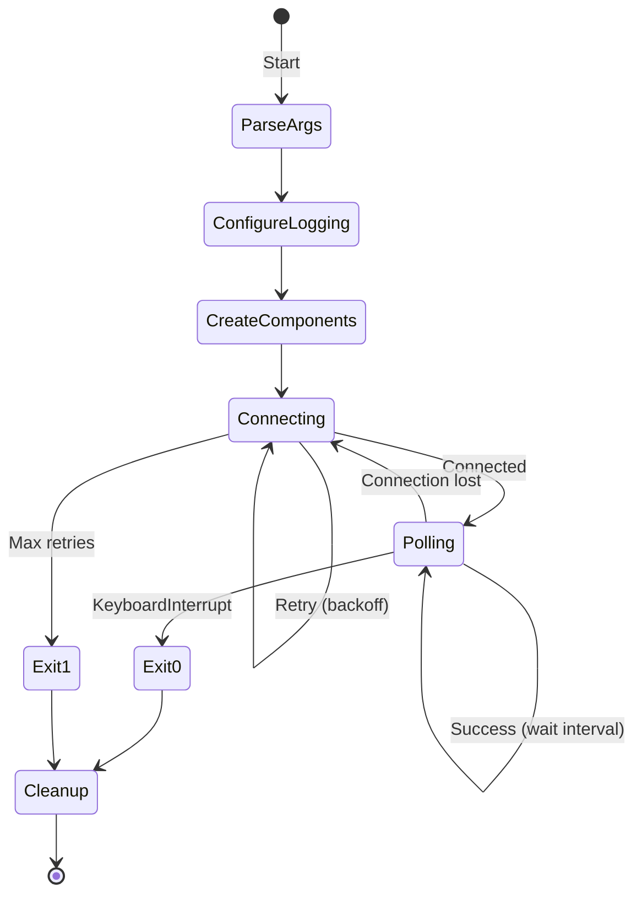
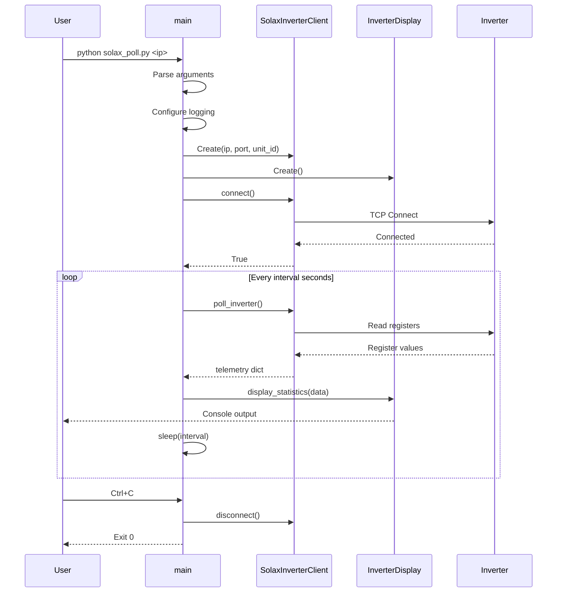

# Component Design: main

Created: 2025 December 30

**Document Type:** Tier 3 Component Design  
**Document ID:** design-e4d5e6f7-component_application_main  
**Parent:** [design-bf6d4e5f-domain_application.md](<design-bf6d4e5f-domain_application.md>)  
**Status:** Implemented  

---

## Table of Contents

- [Component Information](<#component information>)
- [Purpose](<#purpose>)
- [Implementation](<#implementation>)
- [Function Design](<#function design>)
- [CLI Interface](<#cli interface>)
- [Execution Flow](<#execution flow>)
- [Error Handling](<#error handling>)
- [Usage](<#usage>)
- [Design Element Cross-References](<#design element cross-references>)
- [Version History](<#version history>)

---

## Component Information

```yaml
component_info:
  name: "main"
  domain: "Application"
  version: "1.0"
  date: "2025-12-30"
  status: "Implemented"
  source_file: "src/solax_poll.py"
```

[Return to Table of Contents](<#table of contents>)

---

## Purpose

Application entry point providing CLI argument parsing and polling loop orchestration. Coordinates Protocol and Presentation domain components.

### Responsibilities

| Responsibility | Description |
|----------------|-------------|
| CLI parsing | Parse command-line arguments |
| Logging setup | Configure logging based on debug flag |
| Component init | Instantiate client and display |
| Polling loop | Execute timed data acquisition |
| Signal handling | Graceful shutdown on interrupt |

### Exit Codes

| Code | Meaning |
|------|---------|
| 0 | Normal shutdown (Ctrl+C) |
| 1 | Connection failure (max retries exceeded) |

[Return to Table of Contents](<#table of contents>)

---

## Implementation

### File Location

```
src/solax_poll.py (lines 313-395)
```

### Dependencies

```yaml
dependencies:
  external: []
  internal:
    - "SolaxInverterClient"
    - "InverterDisplay"
  standard_library:
    - "argparse"
    - "logging"
    - "time"
    - "sys"
```

[Return to Table of Contents](<#table of contents>)

---

## Function Design

### Function Signature

```python
def main() -> None:
    """
    Application entry point.
    
    Parses CLI arguments, initializes components, and runs
    polling loop until interrupted.
    
    Returns:
        None (exits via sys.exit on error)
        
    Side Effects:
        - Configures logging
        - Establishes network connections
        - Prints to stdout
    """
```

### Pseudocode

```
1. Parse CLI arguments
2. Configure logging (DEBUG if --debug, else INFO)
3. Create SolaxInverterClient(ip, port, unit_id)
4. Create InverterDisplay()
5. Attempt connection with retry
   - If failed: log error, exit(1)
6. Enter polling loop:
   - Poll inverter
   - Display statistics
   - Sleep for interval
   - Handle KeyboardInterrupt → exit(0)
7. Cleanup: disconnect client
```

[Return to Table of Contents](<#table of contents>)

---

## CLI Interface

### Arguments

| Argument | Type | Default | Required | Description |
|----------|------|---------|----------|-------------|
| ip | positional | - | Yes | Inverter IP address |
| --port | int | 502 | No | Modbus TCP port |
| --unit-id | int | 1 | No | Modbus unit identifier |
| --interval | int | 5 | No | Polling interval (seconds) |
| --debug | flag | False | No | Enable debug logging |

### Argument Parser Configuration

```python
parser = argparse.ArgumentParser(
    description='Poll Solax X3 Hybrid inverter via Modbus TCP'
)
parser.add_argument('ip', help='Inverter IP address')
parser.add_argument('--port', type=int, default=502,
                    help='Modbus TCP port (default: 502)')
parser.add_argument('--unit-id', type=int, default=1,
                    help='Modbus unit ID (default: 1)')
parser.add_argument('--interval', type=int, default=5,
                    help='Polling interval in seconds (default: 5)')
parser.add_argument('--debug', action='store_true',
                    help='Enable debug logging')
```

### Usage Examples

```bash
# Basic usage
python solax_poll.py 192.168.1.100

# Custom port and interval
python solax_poll.py 192.168.1.100 --port 5020 --interval 10

# Debug mode
python solax_poll.py 192.168.1.100 --debug

# All options
python solax_poll.py 192.168.1.100 --port 502 --unit-id 1 --interval 5 --debug
```

[Return to Table of Contents](<#table of contents>)

---

## Execution Flow

### State Machine



### Sequence Diagram



[Return to Table of Contents](<#table of contents>)

---

## Error Handling

### Connection Failure

```python
if not client.connect():
    logger.error("Failed to connect after retries")
    sys.exit(1)
```

### Poll Failure

```python
data = client.poll_inverter()
if data is None:
    logger.warning("Poll returned no data, retrying...")
    # Continue loop, don't exit
```

### Keyboard Interrupt

```python
try:
    while True:
        # polling loop
except KeyboardInterrupt:
    logger.info("Shutdown requested")
finally:
    client.disconnect()
```

### Logging Configuration

```python
logging.basicConfig(
    level=logging.DEBUG if args.debug else logging.INFO,
    format='%(asctime)s - %(name)s - %(levelname)s - %(message)s'
)
```

[Return to Table of Contents](<#table of contents>)

---

## Usage

### Normal Operation

```bash
$ python src/solax_poll.py 192.168.1.100 --interval 5

========================================
     SOLAX INVERTER TELEMETRY
     2025-12-30 14:30:45
========================================

SYSTEM STATUS
  Run Mode:          Normal
...

^C
2025-12-30 14:31:00 - solax_modbus - INFO - Shutdown requested
```

### Debug Mode

```bash
$ python src/solax_poll.py 192.168.1.100 --debug

2025-12-30 14:30:40 - solax_modbus - DEBUG - Connecting to 192.168.1.100:502
2025-12-30 14:30:40 - solax_modbus - DEBUG - Reading registers at 0x006A (12)
2025-12-30 14:30:40 - solax_modbus - DEBUG - Raw values: [2301, 2298, 2303, ...]
...
```

### With Emulator

```bash
# Terminal 1
$ python src/emulator/solax_emulator.py --port 5020

# Terminal 2
$ python src/solax_poll.py localhost --port 5020
```

[Return to Table of Contents](<#table of contents>)

---

## Design Element Cross-References

### Parent Documents

- Domain: [design-bf6d4e5f-domain_application.md](<design-bf6d4e5f-domain_application.md>)
- Master: [design-0000-master_solax-modbus.md](<design-0000-master_solax-modbus.md>)

### Sibling Components (Application Domain)

| Component | Document |
|-----------|----------|
| AlertManager | design-XXXX-component_application_alerting.md (planned) |

### Dependencies

| Component | Dependency Type |
|-----------|-----------------|
| SolaxInverterClient | Used for polling |
| InverterDisplay | Used for output |

### Source Code

| Item | Location |
|------|----------|
| Function | src/solax_poll.py:313-395 |
| Unit tests | src/tests/test_solax_poll.py |

[Return to Table of Contents](<#table of contents>)

---

## Version History

| Version | Date | Changes |
|---------|------|---------|
| 1.0 | 2025-12-30 | Initial component design documenting implemented function |

---

Copyright (c) 2025 William Watson. This work is licensed under the MIT License.
