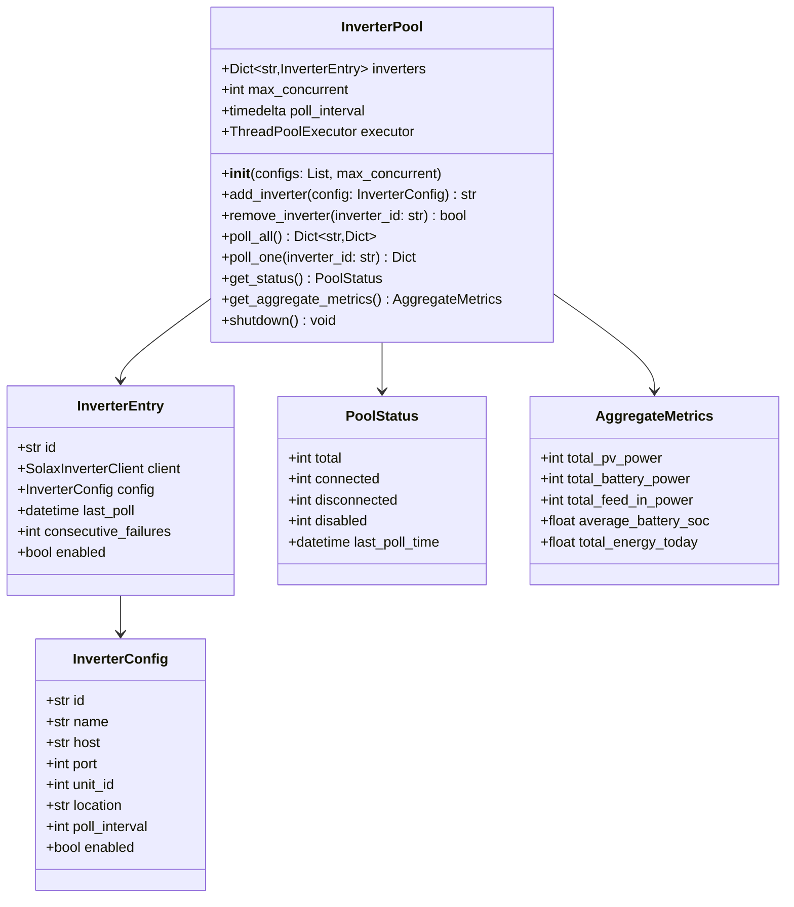
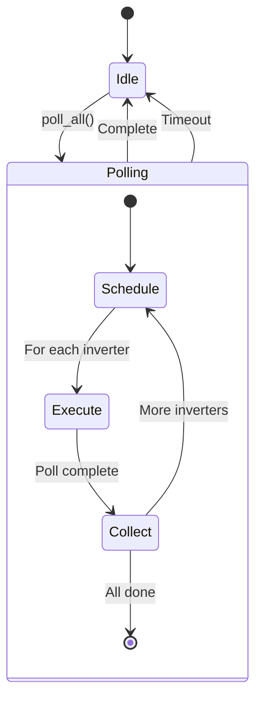

# Component Design: InverterPool

Created: 2025 December 30

**Document Type:** Tier 3 Component Design  
**Document ID:** design-f1a2b3c4-component_application_pool  
**Parent:** [design-bf6d4e5f-domain_application.md](<design-bf6d4e5f-domain_application.md>)  
**Status:** Planned  

---

## Table of Contents

- [Component Information](<#component information>)
- [Purpose](<#purpose>)
- [Implementation](<#implementation>)
- [Class Design](<#class design>)
- [Polling Coordination](<#polling coordination>)
- [Interfaces](<#interfaces>)
- [Aggregation](<#aggregation>)
- [Error Handling](<#error handling>)
- [Design Element Cross-References](<#design element cross-references>)
- [Version History](<#version history>)

---

## Component Information

```yaml
component_info:
  name: "InverterPool"
  domain: "Application"
  version: "1.0"
  date: "2025-12-30"
  status: "Planned"
  source_file: "src/pool/inverter_pool.py"
```

[Return to Table of Contents](<#table of contents>)

---

## Purpose

Manage collection of inverter connections for multi-inverter deployments. Provides coordinated polling, failure isolation, and aggregated metrics.

### Responsibilities

| Responsibility | Description |
|----------------|-------------|
| Connection management | Maintain multiple inverter clients |
| Coordinated polling | Stagger polls to prevent network congestion |
| Failure isolation | Individual inverter failures don't affect others |
| Aggregation | Combine metrics across fleet |

### Design Principles

| Principle | Implementation |
|-----------|----------------|
| Isolation | Per-inverter failure domains |
| Scalability | Support up to 100 inverters |
| Efficiency | Minimize network contention |

[Return to Table of Contents](<#table of contents>)

---

## Implementation

### File Location

```
src/pool/inverter_pool.py (planned)
```

### Dependencies

```yaml
dependencies:
  external:
    - "concurrent.futures"
  internal:
    - "protocol.solax_inverter_client"
  standard_library:
    - "logging"
    - "threading"
    - "datetime"
    - "dataclasses"
    - "typing"
```

[Return to Table of Contents](<#table of contents>)

---

## Class Design

### Class Diagram



### InverterConfig Dataclass

```python
@dataclass
class InverterConfig:
    """Configuration for single inverter."""
    id: str
    name: str
    host: str
    port: int = 502
    unit_id: int = 1
    location: str = ""
    poll_interval: int = 5
    enabled: bool = True
```

### PoolStatus Dataclass

```python
@dataclass
class PoolStatus:
    """Current pool status summary."""
    total: int
    connected: int
    disconnected: int
    disabled: int
    last_poll_time: datetime
```

### AggregateMetrics Dataclass

```python
@dataclass
class AggregateMetrics:
    """Aggregated metrics across all inverters."""
    total_pv_power: int          # Sum of PV generation
    total_battery_power: int     # Sum of battery power
    total_feed_in_power: int     # Sum of grid power
    average_battery_soc: float   # Mean SOC
    total_energy_today: float    # Sum of daily energy
```

[Return to Table of Contents](<#table of contents>)

---

## Polling Coordination

### Staggered Polling

```python
def _calculate_poll_offset(self, index: int, total: int) -> float:
    """
    Calculate poll offset to stagger requests.
    
    For N inverters with interval I:
    Inverter 0 polls at t=0
    Inverter 1 polls at t=I/N
    Inverter 2 polls at t=2*I/N
    ...
    """
    return (self.poll_interval.total_seconds() / total) * index
```

### Concurrency Control

| Setting | Default | Description |
|---------|---------|-------------|
| max_concurrent | 10 | Maximum simultaneous polls |
| poll_timeout | 5s | Per-inverter poll timeout |
| connection_timeout | 3s | TCP connection timeout |

### Polling State Machine



[Return to Table of Contents](<#table of contents>)

---

## Interfaces

### Public Methods

#### add_inverter()

```python
def add_inverter(self, config: InverterConfig) -> str:
    """
    Add inverter to pool.
    
    Args:
        config: Inverter configuration
        
    Returns:
        Inverter ID (generated if not provided).
    """
```

#### remove_inverter()

```python
def remove_inverter(self, inverter_id: str) -> bool:
    """
    Remove inverter from pool.
    
    Args:
        inverter_id: Inverter identifier
        
    Returns:
        True if inverter found and removed.
    """
```

#### poll_all()

```python
def poll_all(self) -> Dict[str, Dict[str, Any]]:
    """
    Poll all enabled inverters.
    
    Returns:
        Dictionary mapping inverter_id to telemetry data.
        Failed polls return None for that inverter.
    """
```

#### poll_one()

```python
def poll_one(self, inverter_id: str) -> Optional[Dict[str, Any]]:
    """
    Poll single inverter.
    
    Args:
        inverter_id: Inverter identifier
        
    Returns:
        Telemetry dictionary or None on failure.
    """
```

#### get_status()

```python
def get_status(self) -> PoolStatus:
    """
    Get current pool status.
    
    Returns:
        PoolStatus with connection counts.
    """
```

#### get_aggregate_metrics()

```python
def get_aggregate_metrics(self) -> AggregateMetrics:
    """
    Calculate aggregate metrics across fleet.
    
    Returns:
        AggregateMetrics with combined values.
        
    Note:
        Only includes data from connected inverters.
    """
```

#### shutdown()

```python
def shutdown(self) -> None:
    """
    Gracefully shutdown pool.
    
    Disconnects all inverters and stops executor.
    """
```

[Return to Table of Contents](<#table of contents>)

---

## Aggregation

### Metric Calculations

| Metric | Calculation |
|--------|-------------|
| total_pv_power | Sum of pv.total_power |
| total_battery_power | Sum of battery.power |
| total_feed_in_power | Sum of feed_in_power |
| average_battery_soc | Mean of battery.soc |
| total_energy_today | Sum of energy_today |

### Aggregation Rules

| Rule | Description |
|------|-------------|
| Exclude disconnected | Only aggregate connected inverters |
| Handle None | Skip inverters with missing data |
| Weighted average | SOC weighted by battery capacity (if known) |

[Return to Table of Contents](<#table of contents>)

---

## Error Handling

### Per-Inverter Failures

| Error | Handling |
|-------|----------|
| Connection failure | Increment failure count, continue others |
| Poll timeout | Mark as disconnected, retry next cycle |
| Invalid data | Log warning, exclude from aggregation |

### Failure Tracking

```python
# After 5 consecutive failures, mark inverter as disconnected
# Automatic reconnection attempted each poll cycle
if entry.consecutive_failures >= 5:
    entry.connected = False
    logger.warning(f"Inverter {entry.id} marked disconnected")
```

### Logging

```python
# Log levels
# DEBUG: Individual poll results
# INFO: Pool status changes, aggregate metrics
# WARNING: Inverter failures, reconnection attempts
# ERROR: Pool-level failures
```

[Return to Table of Contents](<#table of contents>)

---

## Design Element Cross-References

### Parent Documents

- Domain: [design-bf6d4e5f-domain_application.md](<design-bf6d4e5f-domain_application.md>)
- Master: [design-0000-master_solax-modbus.md](<design-0000-master_solax-modbus.md>)

### Sibling Components (Application Domain)

| Component | Document |
|-----------|----------|
| main | [design-e4d5e6f7-component_application_main.md](<design-e4d5e6f7-component_application_main.md>) |
| AlertManager | [design-e0f1a2b3-component_application_alerting.md](<design-e0f1a2b3-component_application_alerting.md>) |

### Dependencies

| Component | Relationship |
|-----------|--------------|
| SolaxInverterClient | Managed instances |

### Source Code

| Item | Location |
|------|----------|
| Module | src/pool/inverter_pool.py (planned) |

[Return to Table of Contents](<#table of contents>)

---

## Version History

| Version | Date | Changes |
|---------|------|---------|
| 1.0 | 2025-12-30 | Initial component design for planned inverter pool |

---

Copyright (c) 2025 William Watson. This work is licensed under the MIT License.
