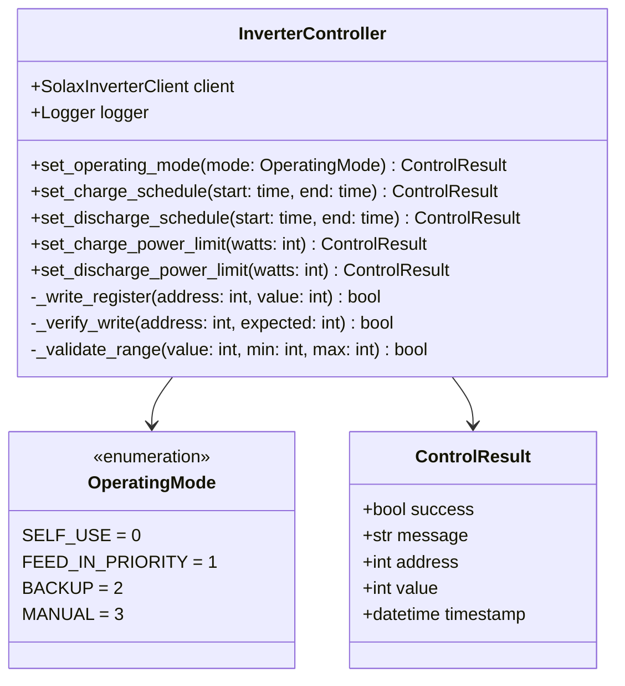

# Component Design: InverterController

Created: 2025 December 30

**Document Type:** Tier 3 Component Design  
**Document ID:** design-f5e6f7a8-component_protocol_controller  
**Parent:** [design-8f3a1b2c-domain_protocol.md](<design-8f3a1b2c-domain_protocol.md>)  
**Status:** Planned  

---

## Table of Contents

- [Component Information](<#component information>)
- [Purpose](<#purpose>)
- [Implementation](<#implementation>)
- [Class Design](<#class design>)
- [Writable Registers](<#writable registers>)
- [Interfaces](<#interfaces>)
- [Error Handling](<#error handling>)
- [Design Element Cross-References](<#design element cross-references>)
- [Version History](<#version history>)

---

## Component Information

```yaml
component_info:
  name: "InverterController"
  domain: "Protocol"
  version: "1.0"
  date: "2025-12-30"
  status: "Planned"
  source_file: "src/controller/inverter_controller.py"
```

[Return to Table of Contents](<#table of contents>)

---

## Purpose

Execute write operations to inverter holding registers for configuration and control. Provides validated, auditable interface for modifying inverter settings.

### Responsibilities

| Responsibility | Description |
|----------------|-------------|
| Write operations | Write to holding registers via function code 0x06 |
| Validation | Verify values against register constraints |
| Verification | Read-back confirmation after write |
| Audit interface | Provide hooks for audit logging |

### Constraints

| Constraint | Value |
|------------|-------|
| Write function code | 0x06 (Write Single Register) |
| Verification delay | 100ms between write and read-back |
| Retry on mismatch | 2 attempts |

[Return to Table of Contents](<#table of contents>)

---

## Implementation

### File Location

```
src/controller/inverter_controller.py (planned)
```

### Dependencies

```yaml
dependencies:
  external:
    - "pymodbus.client.ModbusTcpClient"
  internal:
    - "SolaxInverterClient"
  standard_library:
    - "logging"
    - "time"
    - "enum"
    - "dataclasses"
```

[Return to Table of Contents](<#table of contents>)

---

## Class Design

### Class Diagram



### OperatingMode Enumeration

```python
class OperatingMode(Enum):
    """Inverter operating modes."""
    SELF_USE = 0          # Maximize self-consumption
    FEED_IN_PRIORITY = 1  # Prioritize grid export
    BACKUP = 2            # Reserve battery for backup
    MANUAL = 3            # Manual control mode
```

### ControlResult Dataclass

```python
@dataclass
class ControlResult:
    """Result of a control operation."""
    success: bool
    message: str
    address: int
    value: int
    timestamp: datetime
```

[Return to Table of Contents](<#table of contents>)

---

## Writable Registers

### Holding Registers (Function Code 0x03/0x06)

| Address | Name | Type | Range | Unit | Description |
|---------|------|------|-------|------|-------------|
| 0x001F | Operating Mode | uint16 | 0-3 | enum | System operating mode |
| 0x0020 | Charge Start Hour | uint16 | 0-23 | hour | Forced charge start |
| 0x0021 | Charge Start Minute | uint16 | 0-59 | minute | Forced charge start |
| 0x0022 | Charge End Hour | uint16 | 0-23 | hour | Forced charge end |
| 0x0023 | Charge End Minute | uint16 | 0-59 | minute | Forced charge end |
| 0x0024 | Discharge Start Hour | uint16 | 0-23 | hour | Forced discharge start |
| 0x0025 | Discharge Start Minute | uint16 | 0-59 | minute | Forced discharge start |
| 0x0026 | Discharge End Hour | uint16 | 0-23 | hour | Forced discharge end |
| 0x0027 | Discharge End Minute | uint16 | 0-59 | minute | Forced discharge end |
| 0x0028 | Charge Power Limit | uint16 | 0-6000 | W | Max charge rate |
| 0x0029 | Discharge Power Limit | uint16 | 0-6000 | W | Max discharge rate |

### Validation Rules

| Register | Validation |
|----------|------------|
| Operating Mode | Must be 0, 1, 2, or 3 |
| Hour values | 0 ≤ value ≤ 23 |
| Minute values | 0 ≤ value ≤ 59 |
| Power limits | 0 ≤ value ≤ 6000 |
| Schedule logic | End time > Start time (or wrap midnight) |

[Return to Table of Contents](<#table of contents>)

---

## Interfaces

### Public Methods

#### set_operating_mode()

```python
def set_operating_mode(self, mode: OperatingMode) -> ControlResult:
    """
    Set inverter operating mode.
    
    Args:
        mode: Target operating mode
        
    Returns:
        ControlResult with success status and details.
    """
```

#### set_charge_schedule()

```python
def set_charge_schedule(
    self, 
    start: time, 
    end: time
) -> ControlResult:
    """
    Set forced charge time window.
    
    Args:
        start: Charge period start time
        end: Charge period end time
        
    Returns:
        ControlResult with success status and details.
        
    Note:
        Writes to registers 0x0020-0x0023.
    """
```

#### set_discharge_schedule()

```python
def set_discharge_schedule(
    self, 
    start: time, 
    end: time
) -> ControlResult:
    """
    Set forced discharge time window.
    
    Args:
        start: Discharge period start time
        end: Discharge period end time
        
    Returns:
        ControlResult with success status and details.
        
    Note:
        Writes to registers 0x0024-0x0027.
    """
```

#### set_charge_power_limit()

```python
def set_charge_power_limit(self, watts: int) -> ControlResult:
    """
    Set maximum battery charge rate.
    
    Args:
        watts: Power limit in watts (0-6000)
        
    Returns:
        ControlResult with success status and details.
    """
```

#### set_discharge_power_limit()

```python
def set_discharge_power_limit(self, watts: int) -> ControlResult:
    """
    Set maximum battery discharge rate.
    
    Args:
        watts: Power limit in watts (0-6000)
        
    Returns:
        ControlResult with success status and details.
    """
```

### Private Methods

#### _write_register()

```python
def _write_register(self, address: int, value: int) -> bool:
    """
    Write single holding register with verification.
    
    Args:
        address: Register address
        value: Value to write
        
    Returns:
        True if write successful and verified.
    """
```

[Return to Table of Contents](<#table of contents>)

---

## Error Handling

### Error Types

| Error | Handling |
|-------|----------|
| Validation failure | Return ControlResult with success=False |
| Write failure | Retry once, then return failure |
| Verification mismatch | Retry write, then return failure |
| Connection error | Propagate to caller |

### Logging

```python
# Log levels
# INFO: Successful control operations
# WARNING: Verification retries
# ERROR: Failed operations
```

[Return to Table of Contents](<#table of contents>)

---

## Design Element Cross-References

### Parent Documents

- Domain: [design-8f3a1b2c-domain_protocol.md](<design-8f3a1b2c-domain_protocol.md>)
- Master: [design-0000-master_solax-modbus.md](<design-0000-master_solax-modbus.md>)

### Sibling Components (Protocol Domain)

| Component | Document |
|-----------|----------|
| SolaxInverterClient | [design-c1a2b3d4-component_protocol_client.md](<design-c1a2b3d4-component_protocol_client.md>) |
| SolaxEmulator | [design-c2b3c4d5-component_protocol_emulator.md](<design-c2b3c4d5-component_protocol_emulator.md>) |

### Source Code

| Item | Location |
|------|----------|
| Module | src/controller/inverter_controller.py (planned) |

[Return to Table of Contents](<#table of contents>)

---

## Version History

| Version | Date | Changes |
|---------|------|---------|
| 1.0 | 2025-12-30 | Initial component design for planned controller |

---

Copyright (c) 2025 William Watson. This work is licensed under the MIT License.
